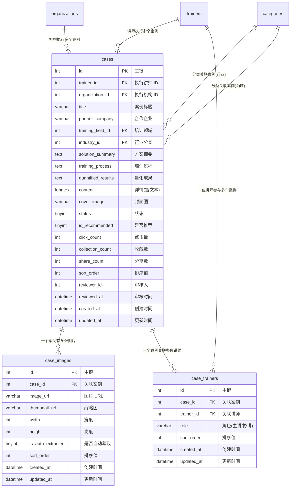

# 企业案例模块 需求文档

> 模块编码：`case`
> 版本：v1.0
> 最后更新：2026-03-19

---

## 1. 模块概述

### 1.1 核心定位

企业案例是平台的 **B 端企业培训参考展示专区**，以「真实案例 + 量化成果」的方式呈现平台培训价值，吸引企业合作。案例由平台运营团队审核把控质量，面向所有访客（含未登录用户）公开展示，是平台获客与品牌建设的核心内容资产。

### 1.2 核心业务目标

- 展示高质量的企业培训案例，以量化成果增强说服力，促进企业合作意向
- 支持按行业、培训领域等维度筛选案例，帮助企业快速找到贴合自身场景的参考方案
- 在案例详情中关联执行讲师/机构，形成「案例 → 讲师/机构」的引流闭环
- 通过「定制类似方案」入口承接企业的定制化培训需求，推动需求转化

### 1.3 典型用户行为路径

```
访客浏览案例列表（按行业/领域筛选）→ 查看案例详情（方案、流程、效果）
    → 收藏/分享案例（需登录）
    → 点击"定制类似方案"发起定制需求（需企业账号登录）→ 需求同步至客服+外部业务系统
```

---

## 2. 功能描述

### 2.1 案例列表

| 功能点 | 说明 |
|--------|------|
| 列表展示 | 展示平台精选企业培训案例，包含案例名称、合作企业、培训领域、核心效果摘要、封面图 |
| 筛选条件 | 支持按行业、培训领域筛选；支持关键词搜索 |
| 排序规则 | 默认按推荐权重 + 更新时间降序；支持按点击量排序 |
| 访问权限 | 未登录用户可完整浏览案例列表，无需注册/登录 |
| 推荐标记 | 后台标记为推荐的案例在列表中优先展示，并显示推荐标识 |

### 2.2 案例详情

| 功能点 | 说明 |
|--------|------|
| 完整内容 | 展示完整培训方案（solution_summary）、培训过程（training_process）、量化成果（quantified_results）、富文本详情（content） |
| 执行方信息 | 展示执行讲师/机构信息，支持跳转至讲师/机构主页 |
| 案例图片 | 展示案例相关图片（授课现场、合影等），支持大图预览 |
| 自动萃取图片 | 系统自动从案例富文本或上传资料中识别带人物形象的图片（与讲师案例萃取逻辑一致），需满足基础尺寸要求（具体尺寸待后续确定） |
| 收藏功能 | 登录用户可收藏案例，收藏状态实时同步；未登录点击收藏引导登录 |
| 分享功能 | 登录用户可分享案例（生成分享链接/分享至微信），分享计数实时更新 |
| 浏览统计 | 每次访问案例详情页更新点击量（click_count），防刷策略：同一用户/IP 短时间内重复访问不重复计数 |

### 2.3 案例定制需求

#### 2.3.1 入口

- 案例详情页展示「定制类似方案」按钮，企业用户可直接发起定制需求

#### 2.3.2 第一阶段：留言模式

| 功能点 | 说明 |
|--------|------|
| 触发条件 | 企业账号登录后方可操作，未登录用户点击引导登录 |
| 提交内容 | 企业填写定制需求描述（培训主题、期望效果、预算范围等） |
| 需求流转 | 需求提交后，平台推送至匹配讲师 + 后台客服工作台 |
| 实时同步 | 需求数据实时同步至客服工作台 + 外部业务系统 |
| 响应方式 | 由平台运营人员实时响应和对接，不直通讲师 |

#### 2.3.3 第二阶段：专家直达

| 功能点 | 说明 |
|--------|------|
| 开放范围 | 仅对标记为「信得过专家」（trainers.is_trusted=1）的讲师开放直达通道 |
| 对接方式 | 虚拟号码通话，初期由人工介入协调 |

---

## 3. 实体属性（字段设计）

### 3.1 cases — 案例主表

> 存储平台企业培训案例的核心信息，支持按行业、培训领域筛选。

| 字段名 | 类型 | 必填 | 默认值 | 说明 |
|---|---|---|---|---|
| id | int | 是 | 自增 | 主键 |
| trainer_id | int | 否 | NULL | 执行讲师 ID，关联 trainers.id（可为空，如机构独立执行） |
| organization_id | int | 否 | NULL | 执行机构 ID，关联 organizations.id（可为空） |
| title | varchar(200) | 是 | — | 案例标题 |
| partner_company | varchar(200) | 是 | — | 合作企业名称 |
| training_field_id | int | 否 | NULL | 培训领域分类 ID，关联分类表 |
| industry_id | int | 否 | NULL | 行业分类 ID，关联分类表 |
| solution_summary | text | 否 | NULL | 培训方案摘要 |
| training_process | text | 否 | NULL | 培训过程描述 |
| quantified_results | text | 否 | NULL | 量化成果描述 |
| content | longtext | 否 | NULL | 案例详情（富文本） |
| cover_image | varchar(500) | 否 | '' | 封面图 URL |
| status | tinyint | 是 | 0 | 状态：0=草稿(DRAFT), 1=待审核(PENDING), 2=审核通过(APPROVED), 3=审核驳回(REJECTED), 4=已下线(OFFLINE) |
| reject_reason | varchar(500) | 否 | '' | 审核驳回原因 |
| is_recommended | tinyint | 否 | 0 | 是否推荐：0=否, 1=是 |
| click_count | int | 否 | 0 | 点击量 |
| collection_count | int | 否 | 0 | 收藏数（冗余计数） |
| share_count | int | 否 | 0 | 分享数（冗余计数） |
| sort_order | int | 否 | 0 | 自定义排序值，值越大越靠前 |
| reviewer_id | int | 否 | NULL | 审核人 ID |
| reviewed_at | datetime | 否 | NULL | 审核时间 |
| created_at | datetime | 是 | CURRENT_TIMESTAMP | 创建时间 |
| updated_at | datetime | 是 | CURRENT_TIMESTAMP | 更新时间 |

**索引设计：**

| 索引名 | 字段 | 类型 |
|--------|------|------|
| `idx_cases_trainer_id` | `trainer_id` | 普通 |
| `idx_cases_organization_id` | `organization_id` | 普通 |
| `idx_cases_training_field_id` | `training_field_id` | 普通 |
| `idx_cases_industry_id` | `industry_id` | 普通 |
| `idx_cases_status` | `status` | 普通 |
| `idx_cases_is_recommended` | `is_recommended` | 普通 |
| `idx_cases_sort_order` | `sort_order` | 普通 |
| `idx_cases_click_count` | `click_count` | 普通 |

---

### 3.2 case_images — 案例图片表

> 每个案例可关联多张图片，支持自动萃取的授课现场照片与手动上传图片。

| 字段名 | 类型 | 必填 | 默认值 | 说明 |
|---|---|---|---|---|
| id | int | 是 | 自增 | 主键 |
| case_id | int | 是 | — | 关联 cases.id |
| image_url | varchar(500) | 是 | — | 图片 URL |
| thumbnail_url | varchar(500) | 否 | '' | 缩略图 URL |
| width | int | 否 | 0 | 图片宽度（px） |
| height | int | 否 | 0 | 图片高度（px） |
| is_auto_extracted | tinyint | 否 | 0 | 是否系统自动萃取：0=否, 1=是 |
| sort_order | int | 否 | 0 | 排序值，值越小越靠前 |
| created_at | datetime | 是 | CURRENT_TIMESTAMP | 创建时间 |
| updated_at | datetime | 是 | CURRENT_TIMESTAMP | 更新时间 |

**索引设计：**

| 索引名 | 字段 | 类型 |
|--------|------|------|
| `idx_case_images_case_id` | `case_id` | 普通 |
| `idx_case_images_sort_order` | `case_id, sort_order` | 联合 |

---

### 3.3 case_trainers — 案例关联讲师表

> 一个案例可关联多位讲师（主讲、协讲等角色），支持展示案例的讲师团队。

| 字段名 | 类型 | 必填 | 默认值 | 说明 |
|---|---|---|---|---|
| id | int | 是 | 自增 | 主键 |
| case_id | int | 是 | — | 关联 cases.id |
| trainer_id | int | 是 | — | 关联 trainers.id |
| role | varchar(20) | 是 | 'MAIN' | 讲师角色：MAIN=主讲, ASSISTANT=协讲 |
| sort_order | int | 否 | 0 | 排序值 |
| created_at | datetime | 是 | CURRENT_TIMESTAMP | 创建时间 |
| updated_at | datetime | 是 | CURRENT_TIMESTAMP | 更新时间 |

**索引设计：**

| 索引名 | 字段 | 类型 |
|--------|------|------|
| `idx_case_trainers_case_id` | `case_id` | 普通 |
| `idx_case_trainers_trainer_id` | `trainer_id` | 普通 |
| `idx_case_trainers_case_trainer` | `case_id, trainer_id` | UNIQUE |

---

## 4. ER 关系说明



---

## 5. 业务逻辑与规则

### 5.1 案例审核流程

```
运营/客服创建案例 → 保存草稿(status=0)
    → 提交审核(status=1)
        → 后台客服审核
            → 通过(status=2)：案例上线，前台可见
            → 驳回(status=3)：填写驳回原因，可修改后重新提交
    → 审核通过后 → 管理员可操作下线(status=4)
```

### 5.2 状态机

```
[草稿](0) --提交审核--> [待审核](1)
[待审核](1) --审核通过--> [审核通过](2)
[待审核](1) --审核驳回--> [审核驳回](3)
[审核驳回](3) --修改后重新提交--> [待审核](1)
[审核通过](2) --管理员下线--> [已下线](4)
[已下线](4) --管理员重新上线--> [审核通过](2)
```

### 5.3 案例图片自动萃取

1. 案例创建或编辑时上传含图片的资料（富文本中的图片或独立上传图片）
2. 系统异步调用图像识别服务，检测带人物形象的图片（授课现场、合影等）
3. 符合基础尺寸要求（宽度 ≥ 600px、高度 ≥ 400px，具体值待确认）的图片标记为候选
4. 候选图片自动创建 `case_images` 记录（`is_auto_extracted=1`），运营人员可手动确认/删除/调整排序
5. 萃取逻辑与讲师案例萃取保持一致，复用同一 AI 图像识别服务

### 5.4 收藏与分享规则

| 规则 | 说明 |
|------|------|
| 收藏 | 登录用户可收藏，取消收藏；收藏操作通过事件驱动更新 `cases.collection_count` |
| 分享 | 登录用户可生成分享链接，分享操作通过事件驱动更新 `cases.share_count` |
| 未登录 | 点击收藏/分享按钮时弹出登录引导浮层 |

### 5.5 浏览量防刷策略

- 同一登录用户对同一案例，30 分钟内重复访问不重复计数
- 未登录用户按 IP + User-Agent 指纹去重，30 分钟内不重复计数
- `click_count` 通过事件驱动异步更新，不阻塞页面请求

### 5.6 案例列表排序规则

1. 推荐案例（`is_recommended=1`）优先展示
2. 同级别按 `sort_order` 降序
3. 同排序值按 `updated_at` 降序

### 5.7 案例与讲师/机构关联规则

- 一个案例可关联一个执行讲师（`trainer_id`）和/或一个执行机构（`organization_id`），也可都不关联（平台自建案例）
- 通过 `case_trainers` 表支持一个案例关联多位参与讲师（主讲 + 协讲），`trainer_id` 为主要执行讲师的冗余字段
- 案例详情页展示关联讲师/机构信息时，仅展示状态正常（审核通过）的讲师/机构
- 讲师/机构被禁用时，不影响案例本身的展示状态，但隐藏讲师/机构跳转链接

### 5.8 案例定制需求流转

1. 企业用户在案例详情页点击「定制类似方案」
2. 系统创建一条 `demands` 记录（`demand_type=CASE_CUSTOM`），自动关联当前案例 ID
3. 需求实时同步至后台客服工作台 + 外部业务系统
4. 同步失败时触发自动重试（最多 3 次），重试均失败后通知后台客服人工跟进
5. 后续流转逻辑详见「培训需求模块」

---

## 6. 与其他模块的依赖关系

| 依赖模块 | 关系说明 |
|----------|----------|
| **讲师模块 (trainers)** | `cases.trainer_id → trainers.id`，案例关联执行讲师；`case_trainers.trainer_id → trainers.id`，案例关联多位参与讲师 |
| **机构模块 (organizations)** | `cases.organization_id → organizations.id`，案例关联执行机构 |
| **分类模块 (categories)** | `cases.training_field_id` 和 `cases.industry_id` 关联分类表，用于按领域/行业筛选 |
| **培训需求模块 (demands)** | 案例详情「定制类似方案」入口创建需求记录，`demands.demand_type=CASE_CUSTOM` |
| **收藏模块 (collections)** | 用户收藏案例时关联收藏表，收藏数变更通过事件驱动更新 `cases.collection_count` |
| **用户模块 (users)** | 收藏、分享、定制需求等操作需登录用户身份 |
| **消息通知模块 (notifications)** | 定制需求提交后通知后台客服；审核结果通知相关运营人员 |
| **文件存储模块 (attachments)** | 案例封面图、案例图片的上传与存储 |
| **AI 服务（外接）** | 图像识别（自动萃取案例图片），复用讲师案例萃取的 AI 能力 |
| **审核工作台 (admin)** | 后台客服对案例的创建、审核、上下线等管理操作 |

---

## 7. 参考旧表

### 7.1 旧表到新表的映射关系

| 旧表 | 新表 | 说明 |
|------|------|------|
| `tk_cases` | `cases` | 旧案例主表字段拆分重组：`title` → `title`，`descs` → `solution_summary`，`pic` → `cover_image`，新增培训领域/行业/量化成果/审核流程等字段 |
| `tk_case_pic` | `case_images` | 旧案例图片表直接映射，新增尺寸字段、自动萃取标记、缩略图等 |
| —（新增） | `case_trainers` | 旧系统无案例-讲师多对多关系，新增支持主讲/协讲角色 |

### 7.2 旧表关键字段对照

```
tk_cases.title         → cases.title
tk_cases.descs         → cases.solution_summary + cases.content
tk_cases.pic           → cases.cover_image
tk_cases.price         → 移除（案例不涉及成交价展示）
tk_cases.tenderer      → cases.partner_company
tk_cases.bid           → 通过 case_trainers 关联讲师/机构
tk_cases.isopen        → cases.status（状态体系重构）
tk_cases.sort          → cases.sort_order
tk_cases.browse        → cases.click_count
tk_cases.createtime    → cases.created_at（int → datetime）

tk_case_pic.cid        → case_images.case_id
tk_case_pic.pic        → case_images.image_url
tk_case_pic.isdefault  → 通过 sort_order 实现默认图排序
```

### 7.3 关键变更点

1. **内容模型升级**：旧系统案例以招标/中标视角组织内容，新系统以「培训方案 + 过程 + 量化效果」三段式组织，更贴合 B 端企业参考需求
2. **讲师关联重构**：旧系统案例仅记录中标方文本信息，新系统通过 `case_trainers` 建立案例与讲师的结构化多对多关系
3. **审核流程新增**：旧系统仅有 `isopen` 开关，新系统引入完整的草稿 → 审核 → 上线 → 下线状态流转
4. **图片管理增强**：新增自动萃取标记、图片尺寸记录、缩略图支持
5. **互动功能新增**：收藏、分享、定制需求入口为全新功能
6. **时间字段规范化**：旧系统 `createtime` 为 `int` 时间戳，新系统统一使用 `datetime`
