# 课程模块 需求文档

> 模块编码：`course`
> 版本：v1.0
> 最后更新：2026-03-19

---

## 1. 模块概述

### 1.1 核心定位

课程是淘课网平台的**核心业务模块**，承载平台全部培训内容的发布、展示、交易与交付。本模块统一管理四种课程类型：**在线课（ONLINE）**、**线下公开课（OPEN）**、**内训课（INTERNAL）**、**版权课（COPYRIGHT）**，覆盖从课程发布、审核上线、学习/报名/预约，到数据统计的完整业务闭环。

### 1.2 四种课程类型定位

| 课程类型 | 编码 | 定位 | 交易方式 |
|---------|------|------|---------|
| 在线课 | `ONLINE` | 线上录播课程，面向 C 端个人学员为主 | 在线购买，平台直接交付 |
| 线下公开课 | `OPEN` | 线下面授，开放报名，多城市多场次排课 | 在线报名/支付，线下参训 |
| 内训课 | `INTERNAL` | 企业定制化内训，与特定讲师强绑定 | 不支持平台直接交易，仅咨询/预约，客服线下结算 |
| 版权课 | `COPYRIGHT` | 讲师/机构的版权自有课程，平台认证展示 | 平台统一定价，企业合作对接 |

### 1.3 核心业务目标

- 统一课程数据模型，以 `type` 字段区分四种类型，主表共享、扩展表按需拆分
- 支持讲师/机构双主体发布（通过 `publisher_id` + `publisher_type` 关联）
- 在线课提供完整的学习体验：试听、购买、播放、进度同步、笔记、单设备限制
- 公开课支持多城市多场次排课、报名管理、名额控制、状态流转
- 内训课仅作展示与咨询入口，所有对接通过后台客服完成
- 版权课通过审核后获得版权标识，定价由平台控制
- 所有课程类型均需后台客服审核后方可上线

### 1.4 典型用户行为路径

```
讲师/机构发布课程 → 后台客服审核 → 课程上线展示
  ├─ 在线课：用户浏览/试听 → 购买 → 学习（进度/笔记同步）
  ├─ 公开课：用户浏览 → 报名（单人/多人）→ 支付 → 线下参训
  ├─ 内训课：企业浏览 → 在线咨询/预约 → 客服对接 → 线下结算
  └─ 版权课：企业浏览 → 咨询 → 平台定价合作
```

---

## 2. 功能描述

### 2.1 在线课（ONLINE）

#### 2.1.1 课程发布

- 讲师/机构填写：课程名称、定价、课程简介、适用人群、课程目录（章节结构）、课程封面
- 支持分章节发布，每个章节关联一个视频
- 设置免费试听章节（时长限制 1-5 分钟）；试听方式待定：按时间截取 OR 按章节数指定（TBD）
- 视频上传方式：
  - **讲师/机构前台**：支持单个视频上传（文件大小限制待定）
  - **后台客服**：支持批量视频上传
- 支持上传多格式课程资料（PPT、PDF、案例文档等），购买后解锁下载
- 发布后由后台客服审核，审核通过后上线

#### 2.1.2 课程学习

- 用户购买后解锁全部课程内容，**有效期 1 年**
- 视频**不支持下载**，仅支持在线播放
- 播放功能：倍速播放、暂停/继续、进度自动保存
- 学习进度实时同步至用户账号，支持断点续播
- 课程笔记：用户可在学习过程中记录笔记，笔记关联课程+章节
- **单设备播放限制**：同一账号同一时间仅允许 1 台设备播放付费课程，多设备触发冲突提示并踢出先前设备的播放会话

#### 2.1.3 课程列表与搜索

- 列表展示：课程封面、名称、讲师/机构名、价格、学习人数
- 筛选条件：培训领域、价格区间、课程时长、销量排序
- 搜索：关键词模糊搜索，支持按相关度/销量/价格排序
- 课程分类：职场办公、销售技能、领导力、AI 赋能、生产管理 等（关联平台分类体系）

#### 2.1.4 免费试听专区

- 独立展示免费课程/试听内容，吸引用户体验
- 引导免费用户转化为付费用户

#### 2.1.5 消费优惠（仅在线课）

- **充值阶梯折扣**：支持 1000/5000/10000 元充值档位，充值金额越高折扣越大
- **多课购买折扣**：同一用户购买 ≥2 门在线课时，自动触发阶梯折扣
- 折扣规则由后台客服/管理员配置，仅适用于在线课
- 折扣从课程价格中直接抵扣，**余额不可提现**

### 2.2 线下公开课（OPEN）

#### 2.2.1 课程发布

- 讲师/机构填写：课程名称、定价、开课城市/时间/场地、讲师信息、课程大纲、适合人群、报名须知、课程封面
- 设置名额上限、报名截止时间
- 支持一门公开课发布多个排课场次（不同城市/时间/场地），通过 `course_schedules` 表管理
- 发布后由后台客服审核上线

#### 2.2.2 课程列表

- 列表展示：课程名称、讲师/机构名、价格、开课城市/时间、剩余名额
- 筛选条件：培训领域、地区、开课时间、价格区间
- 搜索：关键词模糊搜索

#### 2.2.3 报名管理

- 支持单人报名 / 多人报名（一次填写多名参训人员信息）
- 报名需登录；未登录引导登录后继续
- 后台客服可批量导出报名信息：姓名、手机号、公司名称、报名状态；Excel 格式
- 导出字段支持同步后台自定义核心字段
- 支持批量导入报名数据，跳过错误行并生成 CSV 错误报告

#### 2.2.4 公开课预告

- 展示即将开课的公开课列表
- 用户可预约提醒，开课前通过短信/微信发送提醒通知

#### 2.2.5 公开课状态流转

| 状态 | 编码 | 说明 |
|------|------|------|
| 招生中 | `ENROLLING` | 课程展示中，用户仅可预约/咨询，不可在线支付 |
| 确认开课 | `CONFIRMED` | 确认开课，开放在线支付报名 |
| 已取消 | `CANCELLED` | 关闭报名入口，向已预约用户发送取消通知 |

- 只有"确认开课"状态允许在线支付
- "招生中"状态仅接受预约/咨询
- "已取消"关闭一切报名入口，通知已预约/已报名用户

#### 2.2.6 多人团报折扣

- 企业账号同一场次报名 ≥2 人时，自动触发团报折扣
- 折扣规则由后台客服/管理员配置

#### 2.2.7 报名数据精细化导出

- 导出增加字段：报名渠道、折扣状态、支付状态
- 支持自定义导出列

### 2.3 内训课（INTERNAL）

#### 2.3.1 课程发布

- 讲师填写：课程名称、课程简介、核心模块、适配行业、适配企业规模、授课时长、课程封面
- 上传讲师个人资质及过往企业内训案例
- **允许讲师自行设置定价**（仅参考报价，实际交易由客服线下结算）
- 每门内训课与一名核心讲师**强绑定**
- 发布后由后台客服审核上线，审核重点：讲师资质、案例真实性、内容合规性

#### 2.3.2 展示与咨询

- **不开放平台直接报名与交付入口**，仅作为展示页面引导咨询/预约
- 详情页展示：核心模块、专属讲师简介（美化展示）、适合企业、课程收益、过往企业案例（自动提取图片）
- 关联展示讲师的其他内训课
- 所有联系均通过后台客服中转，**不开放讲师直接联系通道**

#### 2.3.3 咨询与定制预约

- 企业可通过在线留言、电话咨询方式发起需求
- 每门内训课配备专属客服
- 聊天记录保存至企业账号
- 客服须在 24 小时内响应

#### 2.3.4 预约管理

- 企业提交预约表单，同步至后台客服工作台 + 外部业务系统
- 同步失败时自动重试 + 告警通知
- 企业仅可查看自己的预约请求与进度
- 后台客服可批量导出预约数据：企业名称、联系人、联系电话、企业规模、课程名、讲师名、需求详情、服务状态；Excel 格式
- 支持同步后台自定义核心字段
- 支持批量导入，跳过错误行并生成 CSV 错误报告

#### 2.3.5 报名与合同

- 不支持平台在线报名，所有报名与合同签署通过客服线下处理
- 费用线下结算

#### 2.3.6 数据统计

- 统计维度：预约渠道、需求类型、授课方式、进度状态、讲师领域

#### 2.3.7 反馈与评价

- 培训完成后，企业联系人可提交反馈评价
- 评价维度：讲师专业度、课程定制化程度、客服满意度
- 支持上传图片
- 评价由后台客服审核后展示

### 2.4 版权课（COPYRIGHT）

#### 2.4.1 版权课上传

- 讲师/机构上传：课程名称、定价、课程大纲、适用人群、版权证书、课程封面
- 后台客服审核：版权证书真实性、内容匹配度、定价合理性
- 审核通过后：
  - 在讲师/机构个人主页展示，并标注版权徽章
  - 在平台版权课专区独立展示
  - 更新讲师表 `has_copyright_course = 1`

#### 2.4.2 定价规则

- **定价由平台统一设定，讲师/机构不可自行修改**
- 讲师/机构可提交调价申请，经客服审批后生效
- 平台可根据企业合作规模调整定价折扣

#### 2.4.3 版权课专项（内训课模块内）

- 讲师上传版权内训课，需附版权证书 + 课程封面
- 审核通过后获得版权标识
- 版权课在内训课板块中置顶展示
- 平台客服可按曝光/领域热度排序调整

### 2.5 课程管理（通用功能）

#### 2.5.1 编辑/上下架

- 支持对已发布课程的编辑（修改价格/大纲/视频/封面）
- 公开课修改开课信息时，向已报名用户发送变更通知
- 支持下架 / 重新上架
- 操作同步至后台，关键操作需二次确认

#### 2.5.2 课程数据统计

- 统计指标：曝光量、播放量（在线课）/报名量（公开课）/咨询量（内训课）、销量、收益
- 支持按时间维度（日/周/月/年）查看数据趋势

#### 2.5.3 课程评价

- 在线课/公开课购买用户可发表评价
- 内训课由企业联系人在培训完成后提交反馈
- 评价经后台客服审核后展示
- 支持讲师/机构对评价进行回复

---

## 3. 实体属性（字段设计）

### 3.1 courses — 课程主表

> 所有课程类型共用主表，通过 `type` 字段区分。讲师/机构通过 `publisher_id` + `publisher_type` 关联。

| 字段名 | 类型 | 允许 NULL | 默认值 | 说明 |
|--------|------|-----------|--------|------|
| `id` | int | NO | AUTO_INCREMENT | 主键 |
| `title` | varchar(200) | NO | — | 课程名称 |
| `type` | varchar(20) | NO | — | 课程类型：`ONLINE`=在线课，`OPEN`=线下公开课，`INTERNAL`=内训课，`COPYRIGHT`=版权课 |
| `publisher_id` | int | NO | — | 发布者 ID（讲师 ID 或机构 ID） |
| `publisher_type` | varchar(20) | NO | — | 发布者类型：`TRAINER`=讲师，`ORGANIZATION`=机构 |
| `category_id` | int | YES | NULL | 一级分类 ID，关联分类表 |
| `sub_category_id` | int | YES | NULL | 二级分类 ID，关联分类表 |
| `cover_url` | varchar(500) | YES | NULL | 课程封面图 URL |
| `intro` | longtext | YES | NULL | 课程简介（富文本） |
| `syllabus` | longtext | YES | NULL | 课程大纲（富文本），适用于公开课/内训课/版权课 |
| `audience` | text | YES | NULL | 适用人群描述 |
| `highlights` | text | YES | NULL | 课程亮点/收益 |
| `price` | decimal(10,2) | YES | NULL | 课程价格（在线课=总价；公开课=每人价格；内训课=讲师报价；版权课=平台定价） |
| `original_price` | decimal(10,2) | YES | NULL | 原价（用于展示划线价） |
| `duration` | int | YES | NULL | 课程总时长（分钟），在线课=视频总时长；内训课=授课天数×分钟 |
| `duration_unit` | varchar(10) | YES | 'MIN' | 时长单位：`MIN`=分钟，`HOUR`=小时，`DAY`=天 |
| `suitable_industry` | varchar(500) | YES | NULL | 适配行业（内训课），逗号分隔 |
| `suitable_scale` | varchar(200) | YES | NULL | 适配企业规模（内训课），如"中大型企业" |
| `notes` | text | YES | NULL | 报名须知/备注 |
| `keywords` | varchar(500) | YES | NULL | 课程关键词，逗号分隔，用于搜索 |
| `trainer_id` | int | YES | NULL | 关联讲师 ID（内训课必填，强绑定核心讲师；公开课/在线课可选关联） |
| `status` | tinyint | NO | 0 | 课程状态：0=草稿，1=待审核，2=审核通过/已上架，3=审核驳回，4=已下架，5=已删除 |
| `reject_reason` | varchar(500) | YES | NULL | 审核驳回原因 |
| `reviewer_id` | int | YES | NULL | 审核人 ID |
| `reviewed_at` | datetime | YES | NULL | 审核时间 |
| `published_at` | datetime | YES | NULL | 上线时间 |
| `is_free` | tinyint | NO | 0 | 是否免费课程：0=否，1=是 |
| `is_recommended` | tinyint | NO | 0 | 是否推荐课程：0=否，1=是 |
| `sort_order` | int | NO | 0 | 自定义排序值（值越大越靠前） |
| `exposure_weight` | int | NO | 0 | 曝光权重 |
| `view_count` | int | NO | 0 | 累计曝光/浏览量 |
| `play_count` | int | NO | 0 | 累计播放量（在线课） |
| `enrollment_count` | int | NO | 0 | 累计报名/购买人数 |
| `consultation_count` | int | NO | 0 | 累计咨询量（内训课） |
| `comment_count` | int | NO | 0 | 累计评价数 |
| `score` | decimal(3,2) | YES | NULL | 综合评分（1.00-5.00） |
| `sales_count` | int | NO | 0 | 累计销量 |
| `created_at` | datetime | NO | CURRENT_TIMESTAMP | 创建时间 |
| `updated_at` | datetime | NO | CURRENT_TIMESTAMP | 更新时间 |

**索引设计：**
- `idx_type_status` (type, status) — 按类型+状态查询课程列表
- `idx_publisher` (publisher_id, publisher_type) — 按发布者查询
- `idx_category` (category_id, sub_category_id) — 按分类筛选
- `idx_trainer_id` (trainer_id) — 按讲师查询（内训课强关联）
- `idx_status` (status) — 状态筛选
- `idx_price` (price) — 价格排序/筛选
- `idx_sort_order` (sort_order) — 自定义排序
- `idx_published_at` (published_at) — 上线时间排序
- `idx_sales_count` (sales_count) — 销量排序
- `idx_score` (score) — 评分排序
- `FULLTEXT idx_ft_title_keywords` (title, keywords) — 全文搜索

---

### 3.2 course_chapters — 课程章节/目录表

> 课程的章节结构，支持两级目录（章 → 节）。在线课每节关联一个视频。

| 字段名 | 类型 | 允许 NULL | 默认值 | 说明 |
|--------|------|-----------|--------|------|
| `id` | int | NO | AUTO_INCREMENT | 主键 |
| `course_id` | int | NO | — | 关联 courses.id |
| `parent_id` | int | NO | 0 | 父章节 ID（0 表示顶级章） |
| `title` | varchar(200) | NO | — | 章节标题 |
| `description` | text | YES | NULL | 章节描述 |
| `sort_order` | int | NO | 0 | 排序值 |
| `is_free_trial` | tinyint | NO | 0 | 是否免费试听章节：0=否，1=是 |
| `trial_duration` | int | YES | NULL | 试听时长限制（秒），为 NULL 表示整节可试听 |
| `video_id` | int | YES | NULL | 关联 course_videos.id（在线课的叶子节点关联视频） |
| `duration` | int | YES | NULL | 本节时长（秒） |
| `created_at` | datetime | NO | CURRENT_TIMESTAMP | 创建时间 |
| `updated_at` | datetime | NO | CURRENT_TIMESTAMP | 更新时间 |

**索引设计：**
- `idx_course_id` (course_id) — 按课程查询章节列表
- `idx_parent_id` (parent_id) — 按父章节查询子节
- `idx_course_sort` (course_id, sort_order) — 课程内章节排序

---

### 3.3 course_videos — 课程视频表

> 存储在线课的视频文件信息。视频上传后异步转码，转码完成更新状态。

| 字段名 | 类型 | 允许 NULL | 默认值 | 说明 |
|--------|------|-----------|--------|------|
| `id` | int | NO | AUTO_INCREMENT | 主键 |
| `course_id` | int | NO | — | 关联 courses.id |
| `title` | varchar(200) | YES | NULL | 视频标题 |
| `video_url` | varchar(500) | NO | — | 视频文件 URL（转码后地址） |
| `original_url` | varchar(500) | YES | NULL | 原始上传文件 URL |
| `cover_url` | varchar(500) | YES | NULL | 视频封面图 URL |
| `duration` | int | YES | NULL | 视频时长（秒） |
| `file_size` | bigint | YES | NULL | 文件大小（字节） |
| `format` | varchar(20) | YES | NULL | 视频格式（如 mp4、m3u8） |
| `resolution` | varchar(20) | YES | NULL | 分辨率（如 1920x1080） |
| `transcode_status` | tinyint | NO | 0 | 转码状态：0=待转码，1=转码中，2=转码完成，3=转码失败 |
| `uploader_type` | varchar(20) | YES | NULL | 上传者类型：`PUBLISHER`=讲师/机构前台上传，`CS`=后台客服上传 |
| `uploader_id` | int | YES | NULL | 上传者 ID |
| `sort_order` | int | NO | 0 | 排序值 |
| `created_at` | datetime | NO | CURRENT_TIMESTAMP | 创建时间 |
| `updated_at` | datetime | NO | CURRENT_TIMESTAMP | 更新时间 |

**索引设计：**
- `idx_course_id` (course_id) — 按课程查询视频列表
- `idx_transcode_status` (transcode_status) — 转码任务查询

---

### 3.4 course_materials — 课程资料表

> 课程配套资料（PPT、PDF、案例文档等），在线课购买后解锁下载。

| 字段名 | 类型 | 允许 NULL | 默认值 | 说明 |
|--------|------|-----------|--------|------|
| `id` | int | NO | AUTO_INCREMENT | 主键 |
| `course_id` | int | NO | — | 关联 courses.id |
| `title` | varchar(200) | NO | — | 资料标题 |
| `file_url` | varchar(500) | NO | — | 文件 URL |
| `file_type` | varchar(20) | YES | NULL | 文件类型：`PPT`、`PDF`、`DOC`、`OTHER` |
| `file_size` | bigint | YES | NULL | 文件大小（字节） |
| `is_free` | tinyint | NO | 0 | 是否免费下载：0=否（需购买课程），1=是 |
| `download_count` | int | NO | 0 | 下载次数 |
| `sort_order` | int | NO | 0 | 排序值 |
| `created_at` | datetime | NO | CURRENT_TIMESTAMP | 创建时间 |
| `updated_at` | datetime | NO | CURRENT_TIMESTAMP | 更新时间 |

**索引设计：**
- `idx_course_id` (course_id) — 按课程查询资料

---

### 3.5 course_schedules — 公开课排课表

> 一门公开课可以有多个排课场次（不同城市/时间/场地），支持多城市多时间排课。

| 字段名 | 类型 | 允许 NULL | 默认值 | 说明 |
|--------|------|-----------|--------|------|
| `id` | int | NO | AUTO_INCREMENT | 主键 |
| `course_id` | int | NO | — | 关联 courses.id（type=OPEN） |
| `province_code` | varchar(20) | YES | NULL | 省份编码 |
| `city_code` | varchar(20) | YES | NULL | 城市编码 |
| `city_name` | varchar(50) | YES | NULL | 城市名称（冗余，用于列表展示） |
| `venue` | varchar(200) | YES | NULL | 上课场地/地址 |
| `begin_date` | datetime | NO | — | 开课日期时间 |
| `end_date` | datetime | YES | NULL | 结课日期时间 |
| `quota` | int | YES | NULL | 名额上限（NULL 表示不限） |
| `enrolled_count` | int | NO | 0 | 已报名人数（冗余计数） |
| `registration_deadline` | datetime | YES | NULL | 报名截止时间 |
| `schedule_status` | varchar(20) | NO | 'ENROLLING' | 排课状态：`ENROLLING`=招生中，`CONFIRMED`=确认开课，`CANCELLED`=已取消 |
| `cancel_reason` | varchar(500) | YES | NULL | 取消原因 |
| `price_override` | decimal(10,2) | YES | NULL | 本场次独立定价（为 NULL 时取课程主表价格） |
| `trainer_id` | int | YES | NULL | 本场次授课讲师 ID（可能与课程主表讲师不同） |
| `sort_order` | int | NO | 0 | 排序值 |
| `created_at` | datetime | NO | CURRENT_TIMESTAMP | 创建时间 |
| `updated_at` | datetime | NO | CURRENT_TIMESTAMP | 更新时间 |

**索引设计：**
- `idx_course_id` (course_id) — 按课程查询场次
- `idx_city_code` (city_code) — 按城市筛选
- `idx_begin_date` (begin_date) — 按开课时间排序
- `idx_schedule_status` (schedule_status) — 按状态筛选
- `idx_course_status_date` (course_id, schedule_status, begin_date) — 组合查询

---

### 3.6 course_registrations — 公开课报名表

> 记录公开课的报名信息，支持单人/多人报名（多人时每人一条记录，通过 `group_no` 关联同一批次）。

| 字段名 | 类型 | 允许 NULL | 默认值 | 说明 |
|--------|------|-----------|--------|------|
| `id` | int | NO | AUTO_INCREMENT | 主键 |
| `course_id` | int | NO | — | 关联 courses.id |
| `schedule_id` | int | NO | — | 关联 course_schedules.id |
| `user_id` | int | NO | — | 报名人用户 ID（登录用户） |
| `group_no` | varchar(32) | YES | NULL | 团报批次号（多人报名时共享同一批次号） |
| `attendee_name` | varchar(64) | NO | — | 参训人姓名 |
| `attendee_phone` | varchar(20) | NO | — | 参训人手机号 |
| `attendee_company` | varchar(128) | YES | NULL | 参训人公司名称 |
| `attendee_position` | varchar(64) | YES | NULL | 参训人职位 |
| `attendee_email` | varchar(128) | YES | NULL | 参训人邮箱 |
| `registration_channel` | varchar(50) | YES | NULL | 报名渠道（PC/H5/小程序/后台代报） |
| `status` | tinyint | NO | 0 | 报名状态：0=待确认，1=已确认，2=已取消，3=已签到，4=已退款 |
| `payment_status` | tinyint | NO | 0 | 支付状态：0=未支付，1=已支付，2=已退款 |
| `discount_status` | varchar(20) | YES | NULL | 折扣状态：`NONE`=无折扣，`GROUP`=团报折扣，`OTHER`=其他优惠 |
| `actual_amount` | decimal(10,2) | YES | NULL | 实际支付金额 |
| `order_id` | int | YES | NULL | 关联订单表 ID（支付后生成） |
| `remark` | varchar(500) | YES | NULL | 备注 |
| `created_at` | datetime | NO | CURRENT_TIMESTAMP | 报名时间 |
| `updated_at` | datetime | NO | CURRENT_TIMESTAMP | 更新时间 |

**索引设计：**
- `idx_course_id` (course_id) — 按课程查询报名
- `idx_schedule_id` (schedule_id) — 按场次查询报名
- `idx_user_id` (user_id) — 按用户查询报名记录
- `idx_group_no` (group_no) — 按团报批次查询
- `idx_status` (status) — 按状态筛选
- `idx_payment_status` (payment_status) — 按支付状态筛选

---

### 3.7 course_reservations — 内训课预约表

> 企业对内训课的咨询/预约记录，同步至后台客服工作台和外部业务系统。

| 字段名 | 类型 | 允许 NULL | 默认值 | 说明 |
|--------|------|-----------|--------|------|
| `id` | int | NO | AUTO_INCREMENT | 主键 |
| `course_id` | int | NO | — | 关联 courses.id（type=INTERNAL） |
| `trainer_id` | int | YES | NULL | 关联讲师 ID |
| `user_id` | int | NO | — | 预约企业用户 ID |
| `enterprise_name` | varchar(128) | YES | NULL | 企业名称 |
| `contact_name` | varchar(64) | NO | — | 联系人姓名 |
| `contact_phone` | varchar(20) | NO | — | 联系人电话 |
| `contact_email` | varchar(128) | YES | NULL | 联系人邮箱 |
| `enterprise_scale` | varchar(50) | YES | NULL | 企业规模 |
| `industry` | varchar(100) | YES | NULL | 所属行业 |
| `demand_detail` | text | YES | NULL | 需求详情描述 |
| `demand_type` | varchar(50) | YES | NULL | 需求类型（定制内训/标准课程等） |
| `teaching_method` | varchar(50) | YES | NULL | 授课方式偏好（线下/线上/混合） |
| `expected_date` | date | YES | NULL | 期望培训日期 |
| `expected_duration` | varchar(50) | YES | NULL | 期望培训时长 |
| `budget_range` | varchar(50) | YES | NULL | 预算范围 |
| `reservation_channel` | varchar(50) | YES | NULL | 预约渠道（在线留言/电话/后台录入） |
| `assigned_cs_id` | int | YES | NULL | 分配的客服 ID |
| `status` | tinyint | NO | 0 | 服务状态：0=待处理，1=跟进中，2=方案已出，3=合同已签，4=培训中，5=已完成，6=已关闭 |
| `sync_status` | tinyint | NO | 0 | 外部系统同步状态：0=待同步，1=同步成功，2=同步失败 |
| `sync_retry_count` | int | NO | 0 | 同步重试次数 |
| `last_sync_at` | datetime | YES | NULL | 最后同步时间 |
| `remark` | text | YES | NULL | 客服备注 |
| `created_at` | datetime | NO | CURRENT_TIMESTAMP | 预约时间 |
| `updated_at` | datetime | NO | CURRENT_TIMESTAMP | 更新时间 |

**索引设计：**
- `idx_course_id` (course_id) — 按课程查询预约
- `idx_trainer_id` (trainer_id) — 按讲师查询预约
- `idx_user_id` (user_id) — 按企业用户查询（企业仅可查看自己的记录）
- `idx_assigned_cs_id` (assigned_cs_id) — 按客服查询
- `idx_status` (status) — 按服务状态筛选
- `idx_sync_status` (sync_status) — 同步任务查询

---

### 3.8 course_copyright_info — 版权课专项信息表

> 版权课的额外信息，与 courses 主表一对一关联。

| 字段名 | 类型 | 允许 NULL | 默认值 | 说明 |
|--------|------|-----------|--------|------|
| `id` | int | NO | AUTO_INCREMENT | 主键 |
| `course_id` | int | NO | — | 关联 courses.id（type=COPYRIGHT，唯一） |
| `copyright_cert_url` | varchar(500) | NO | — | 版权证书图片 URL |
| `copyright_cert_no` | varchar(100) | YES | NULL | 版权证书编号 |
| `copyright_holder` | varchar(200) | YES | NULL | 版权持有人名称 |
| `copyright_issue_date` | date | YES | NULL | 版权颁发日期 |
| `copyright_expire_date` | date | YES | NULL | 版权到期日期（NULL 表示永久） |
| `review_status` | tinyint | NO | 0 | 版权审核状态：0=待审核，1=审核通过，2=审核驳回 |
| `review_remark` | varchar(500) | YES | NULL | 审核备注 |
| `reviewer_id` | int | YES | NULL | 审核人 ID |
| `reviewed_at` | datetime | YES | NULL | 审核时间 |
| `is_internal_copyright` | tinyint | NO | 0 | 是否内训版权课（在内训课板块置顶）：0=否，1=是 |
| `badge_type` | varchar(20) | YES | 'STANDARD' | 版权标识类型：`STANDARD`=标准版权，`PREMIUM`=精品版权 |
| `platform_price` | decimal(10,2) | YES | NULL | 平台统一定价（覆盖主表 price） |
| `price_change_status` | tinyint | YES | NULL | 调价申请状态：NULL=无申请，0=待审批，1=已通过，2=已驳回 |
| `created_at` | datetime | NO | CURRENT_TIMESTAMP | 创建时间 |
| `updated_at` | datetime | NO | CURRENT_TIMESTAMP | 更新时间 |

**索引设计：**
- `UNIQUE idx_course_id` (course_id) — 一门课程一条版权信息
- `idx_review_status` (review_status) — 审核状态筛选
- `idx_is_internal_copyright` (is_internal_copyright) — 版权内训课筛选

---

### 3.9 course_learning_progress — 学习进度表

> 记录用户学习在线课的进度，支持断点续播。每个用户每个章节一条记录。

| 字段名 | 类型 | 允许 NULL | 默认值 | 说明 |
|--------|------|-----------|--------|------|
| `id` | int | NO | AUTO_INCREMENT | 主键 |
| `user_id` | int | NO | — | 用户 ID |
| `course_id` | int | NO | — | 关联 courses.id |
| `chapter_id` | int | NO | — | 关联 course_chapters.id |
| `video_id` | int | YES | NULL | 关联 course_videos.id |
| `progress_seconds` | int | NO | 0 | 当前播放进度（秒） |
| `total_seconds` | int | YES | NULL | 视频总时长（秒，冗余） |
| `progress_percent` | decimal(5,2) | NO | 0.00 | 进度百分比（0.00-100.00） |
| `is_completed` | tinyint | NO | 0 | 是否学完本节：0=否，1=是 |
| `completed_at` | datetime | YES | NULL | 学完时间 |
| `last_play_at` | datetime | YES | NULL | 最后播放时间 |
| `play_count` | int | NO | 0 | 本节播放次数 |
| `play_duration` | int | NO | 0 | 本节累计观看时长（秒） |
| `created_at` | datetime | NO | CURRENT_TIMESTAMP | 创建时间 |
| `updated_at` | datetime | NO | CURRENT_TIMESTAMP | 更新时间 |

**索引设计：**
- `UNIQUE idx_user_chapter` (user_id, chapter_id) — 一个用户一个章节一条记录
- `idx_user_course` (user_id, course_id) — 查询用户某门课的全部进度
- `idx_last_play_at` (user_id, last_play_at) — 最近学习记录排序

---

### 3.10 course_notes — 课程笔记表

> 用户在学习在线课时记录的笔记，关联课程和章节。

| 字段名 | 类型 | 允许 NULL | 默认值 | 说明 |
|--------|------|-----------|--------|------|
| `id` | int | NO | AUTO_INCREMENT | 主键 |
| `user_id` | int | NO | — | 用户 ID |
| `course_id` | int | NO | — | 关联 courses.id |
| `chapter_id` | int | YES | NULL | 关联 course_chapters.id（可为空表示课程级笔记） |
| `video_timestamp` | int | YES | NULL | 视频时间戳（秒），记录笔记时的播放位置 |
| `content` | text | NO | — | 笔记内容 |
| `created_at` | datetime | NO | CURRENT_TIMESTAMP | 创建时间 |
| `updated_at` | datetime | NO | CURRENT_TIMESTAMP | 更新时间 |

**索引设计：**
- `idx_user_course` (user_id, course_id) — 查询用户某门课的笔记
- `idx_user_chapter` (user_id, chapter_id) — 查询用户某章节的笔记

---

### 3.11 course_reviews — 课程评价表

> 用户对课程的评价记录。在线课/公开课为购买后评价，内训课为企业完成培训后反馈。

| 字段名 | 类型 | 允许 NULL | 默认值 | 说明 |
|--------|------|-----------|--------|------|
| `id` | int | NO | AUTO_INCREMENT | 主键 |
| `course_id` | int | NO | — | 关联 courses.id |
| `schedule_id` | int | YES | NULL | 关联 course_schedules.id（公开课场次评价） |
| `user_id` | int | NO | — | 评价人用户 ID |
| `order_id` | int | YES | NULL | 关联订单 ID（在线课/公开课） |
| `reservation_id` | int | YES | NULL | 关联预约 ID（内训课） |
| `overall_score` | decimal(3,2) | NO | — | 综合评分（1.00-5.00） |
| `trainer_score` | decimal(3,2) | YES | NULL | 讲师专业度评分（内训课维度） |
| `customization_score` | decimal(3,2) | YES | NULL | 课程定制化程度评分（内训课维度） |
| `cs_score` | decimal(3,2) | YES | NULL | 客服满意度评分（内训课维度） |
| `content_score` | decimal(3,2) | YES | NULL | 课程内容评分（在线课/公开课维度） |
| `venue_score` | decimal(3,2) | YES | NULL | 场地评分（公开课维度） |
| `service_score` | decimal(3,2) | YES | NULL | 服务评分 |
| `content` | text | YES | NULL | 评价文字内容 |
| `image_urls` | varchar(2000) | YES | NULL | 评价图片 URL 列表，JSON 数组格式 |
| `reply_content` | text | YES | NULL | 讲师/机构回复内容 |
| `reply_at` | datetime | YES | NULL | 回复时间 |
| `status` | tinyint | NO | 0 | 审核状态：0=待审核，1=审核通过，2=审核驳回 |
| `reviewer_id` | int | YES | NULL | 审核人 ID |
| `reviewed_at` | datetime | YES | NULL | 审核时间 |
| `is_anonymous` | tinyint | NO | 0 | 是否匿名评价：0=否，1=是 |
| `created_at` | datetime | NO | CURRENT_TIMESTAMP | 评价时间 |
| `updated_at` | datetime | NO | CURRENT_TIMESTAMP | 更新时间 |

**索引设计：**
- `idx_course_id` (course_id) — 按课程查询评价
- `idx_user_id` (user_id) — 按用户查询评价
- `idx_status` (status) — 审核状态筛选
- `idx_overall_score` (overall_score) — 评分排序

---

### 3.12 course_images — 课程图片表

> 课程详情页的图片素材（轮播图、内容图等），与封面图 `cover_url` 独立。

| 字段名 | 类型 | 允许 NULL | 默认值 | 说明 |
|--------|------|-----------|--------|------|
| `id` | int | NO | AUTO_INCREMENT | 主键 |
| `course_id` | int | NO | — | 关联 courses.id |
| `image_url` | varchar(500) | NO | — | 图片 URL |
| `thumbnail_url` | varchar(500) | YES | NULL | 缩略图 URL |
| `image_type` | varchar(20) | YES | 'DETAIL' | 图片类型：`BANNER`=轮播图，`DETAIL`=详情图，`CASE`=案例图 |
| `sort_order` | int | NO | 0 | 排序值 |
| `created_at` | datetime | NO | CURRENT_TIMESTAMP | 创建时间 |
| `updated_at` | datetime | NO | CURRENT_TIMESTAMP | 更新时间 |

**索引设计：**
- `idx_course_id` (course_id) — 按课程查询图片

---

### 3.13 course_favorites — 课程收藏表

> 用户收藏的课程记录。

| 字段名 | 类型 | 允许 NULL | 默认值 | 说明 |
|--------|------|-----------|--------|------|
| `id` | int | NO | AUTO_INCREMENT | 主键 |
| `user_id` | int | NO | — | 用户 ID |
| `course_id` | int | NO | — | 关联 courses.id |
| `created_at` | datetime | NO | CURRENT_TIMESTAMP | 收藏时间 |

**索引设计：**
- `UNIQUE idx_user_course` (user_id, course_id) — 同一用户同一课程不重复
- `idx_user_id` (user_id) — 按用户查询收藏列表

---

### 3.14 course_stats_daily — 课程数据统计日表

> 按天记录课程核心运营数据，用于数据趋势分析。

| 字段名 | 类型 | 允许 NULL | 默认值 | 说明 |
|--------|------|-----------|--------|------|
| `id` | int | NO | AUTO_INCREMENT | 主键 |
| `course_id` | int | NO | — | 关联 courses.id |
| `stat_date` | date | NO | — | 统计日期 |
| `view_count` | int | NO | 0 | 当日曝光量 |
| `play_count` | int | NO | 0 | 当日播放量（在线课） |
| `enrollment_count` | int | NO | 0 | 当日报名/购买量 |
| `consultation_count` | int | NO | 0 | 当日咨询量（内训课） |
| `sales_count` | int | NO | 0 | 当日销量 |
| `revenue` | decimal(12,2) | NO | 0.00 | 当日收益金额 |
| `created_at` | datetime | NO | CURRENT_TIMESTAMP | 创建时间 |
| `updated_at` | datetime | NO | CURRENT_TIMESTAMP | 更新时间 |

**索引设计：**
- `UNIQUE idx_course_date` (course_id, stat_date) — 一门课程一天一条
- `idx_stat_date` (stat_date) — 按日期范围查询

---

### 3.15 course_discount_rules — 课程折扣规则表

> 存储在线课充值折扣、多课折扣以及公开课团报折扣的配置。

| 字段名 | 类型 | 允许 NULL | 默认值 | 说明 |
|--------|------|-----------|--------|------|
| `id` | int | NO | AUTO_INCREMENT | 主键 |
| `rule_name` | varchar(100) | NO | — | 规则名称 |
| `rule_type` | varchar(30) | NO | — | 规则类型：`RECHARGE`=充值折扣，`MULTI_COURSE`=多课折扣，`GROUP_ENROLL`=团报折扣 |
| `applicable_course_type` | varchar(20) | NO | — | 适用课程类型：`ONLINE`/`OPEN`/`ALL` |
| `threshold_amount` | decimal(10,2) | YES | NULL | 阈值金额（充值折扣的充值额度） |
| `threshold_count` | int | YES | NULL | 阈值数量（多课折扣的课程数量 / 团报折扣的人数） |
| `discount_type` | varchar(20) | NO | — | 折扣方式：`PERCENT`=百分比折扣，`FIXED`=固定减免 |
| `discount_value` | decimal(10,2) | NO | — | 折扣值（百分比时为 0.95 表示 95 折；固定减免时为金额） |
| `is_active` | tinyint | NO | 1 | 是否启用：0=停用，1=启用 |
| `priority` | int | NO | 0 | 优先级（多规则冲突时，值越大优先级越高） |
| `start_at` | datetime | YES | NULL | 生效开始时间 |
| `end_at` | datetime | YES | NULL | 生效结束时间（NULL 表示长期有效） |
| `created_by` | int | YES | NULL | 创建人（后台管理员 ID） |
| `created_at` | datetime | NO | CURRENT_TIMESTAMP | 创建时间 |
| `updated_at` | datetime | NO | CURRENT_TIMESTAMP | 更新时间 |

**索引设计：**
- `idx_rule_type` (rule_type, is_active) — 按规则类型查询有效规则
- `idx_applicable_type` (applicable_course_type) — 按适用课程类型筛选

---

## 4. ER 关系说明

### 4.1 ER 图

```mermaid
erDiagram
    courses ||--o{ course_chapters : "一门课程有多个章节"
    courses ||--o{ course_videos : "一门课程有多个视频"
    courses ||--o{ course_materials : "一门课程有多份资料"
    courses ||--o{ course_schedules : "一门公开课有多个排课场次"
    courses ||--o{ course_registrations : "一门课程有多个报名记录"
    courses ||--o{ course_reservations : "一门内训课有多个预约记录"
    courses ||--o| course_copyright_info : "版权课有一条专项信息"
    courses ||--o{ course_learning_progress : "一门课程有多条学习进度"
    courses ||--o{ course_notes : "一门课程有多条笔记"
    courses ||--o{ course_reviews : "一门课程有多条评价"
    courses ||--o{ course_images : "一门课程有多张图片"
    courses ||--o{ course_favorites : "一门课程被多人收藏"
    courses ||--o{ course_stats_daily : "一门课程有多条日统计"
    course_chapters ||--o| course_videos : "一个章节关联一个视频"
    course_schedules ||--o{ course_registrations : "一个场次有多个报名"

    courses {
        int id PK "主键"
        varchar title "课程名称"
        varchar type "课程类型 ONLINE/OPEN/INTERNAL/COPYRIGHT"
        int publisher_id "发布者ID"
        varchar publisher_type "发布者类型 TRAINER/ORGANIZATION"
        int category_id "一级分类ID"
        int sub_category_id "二级分类ID"
        varchar cover_url "封面图URL"
        longtext intro "课程简介"
        longtext syllabus "课程大纲"
        text audience "适用人群"
        decimal price "价格"
        decimal original_price "原价"
        int duration "课程时长"
        int trainer_id "关联讲师ID"
        tinyint status "课程状态"
        tinyint is_free "是否免费"
        int view_count "浏览量"
        int enrollment_count "报名量"
        int sales_count "销量"
        decimal score "评分"
    }

    course_chapters {
        int id PK "主键"
        int course_id FK "关联 courses.id"
        int parent_id "父章节ID 0=顶级"
        varchar title "章节标题"
        int sort_order "排序"
        tinyint is_free_trial "是否免费试听"
        int video_id "关联视频ID"
        int duration "时长(秒)"
    }

    course_videos {
        int id PK "主键"
        int course_id FK "关联 courses.id"
        varchar title "视频标题"
        varchar video_url "视频URL"
        int duration "时长(秒)"
        bigint file_size "文件大小"
        tinyint transcode_status "转码状态"
    }

    course_materials {
        int id PK "主键"
        int course_id FK "关联 courses.id"
        varchar title "资料标题"
        varchar file_url "文件URL"
        varchar file_type "文件类型"
        tinyint is_free "是否免费"
    }

    course_schedules {
        int id PK "主键"
        int course_id FK "关联 courses.id"
        varchar city_name "城市"
        varchar venue "场地"
        datetime begin_date "开课时间"
        datetime end_date "结课时间"
        int quota "名额上限"
        int enrolled_count "已报名人数"
        varchar schedule_status "排课状态"
    }

    course_registrations {
        int id PK "主键"
        int course_id FK "关联 courses.id"
        int schedule_id FK "关联 course_schedules.id"
        int user_id FK "报名用户ID"
        varchar group_no "团报批次号"
        varchar attendee_name "参训人姓名"
        varchar attendee_phone "参训人电话"
        tinyint status "报名状态"
        tinyint payment_status "支付状态"
    }

    course_reservations {
        int id PK "主键"
        int course_id FK "关联 courses.id"
        int trainer_id FK "关联讲师ID"
        int user_id FK "预约用户ID"
        varchar enterprise_name "企业名称"
        varchar contact_name "联系人"
        varchar contact_phone "联系电话"
        text demand_detail "需求详情"
        tinyint status "服务状态"
        tinyint sync_status "同步状态"
    }

    course_copyright_info {
        int id PK "主键"
        int course_id FK "关联 courses.id"
        varchar copyright_cert_url "版权证书"
        varchar copyright_holder "版权持有人"
        tinyint review_status "版权审核状态"
        tinyint is_internal_copyright "是否内训版权课"
        decimal platform_price "平台定价"
    }

    course_learning_progress {
        int id PK "主键"
        int user_id FK "用户ID"
        int course_id FK "关联 courses.id"
        int chapter_id FK "关联章节ID"
        int progress_seconds "播放进度(秒)"
        decimal progress_percent "进度百分比"
        tinyint is_completed "是否学完"
    }

    course_notes {
        int id PK "主键"
        int user_id FK "用户ID"
        int course_id FK "关联 courses.id"
        int chapter_id FK "章节ID"
        int video_timestamp "视频时间戳"
        text content "笔记内容"
    }

    course_reviews {
        int id PK "主键"
        int course_id FK "关联 courses.id"
        int user_id FK "评价人ID"
        decimal overall_score "综合评分"
        text content "评价内容"
        varchar image_urls "评价图片"
        text reply_content "回复内容"
        tinyint status "审核状态"
    }

    course_images {
        int id PK "主键"
        int course_id FK "关联 courses.id"
        varchar image_url "图片URL"
        varchar image_type "图片类型"
        int sort_order "排序"
    }

    course_favorites {
        int id PK "主键"
        int user_id FK "用户ID"
        int course_id FK "关联 courses.id"
    }

    course_stats_daily {
        int id PK "主键"
        int course_id FK "关联 courses.id"
        date stat_date "统计日期"
        int view_count "曝光量"
        int play_count "播放量"
        int enrollment_count "报名量"
        decimal revenue "收益"
    }

    course_discount_rules {
        int id PK "主键"
        varchar rule_name "规则名称"
        varchar rule_type "规则类型"
        varchar applicable_course_type "适用课程类型"
        decimal threshold_amount "阈值金额"
        int threshold_count "阈值数量"
        decimal discount_value "折扣值"
        tinyint is_active "是否启用"
    }
```



### 4.2 关系说明

| 关系 | 类型 | 说明 |
|------|------|------|
| `courses` → `course_chapters` | 一对多 | 一门课程有多个章节（两级结构：章 → 节） |
| `courses` → `course_videos` | 一对多 | 一门课程有多个视频文件 |
| `course_chapters` → `course_videos` | 多对一（可选） | 在线课的叶子章节关联一个视频 |
| `courses` → `course_materials` | 一对多 | 一门课程有多份配套资料 |
| `courses` → `course_schedules` | 一对多 | 一门公开课有多个排课场次 |
| `course_schedules` → `course_registrations` | 一对多 | 一个场次有多条报名记录 |
| `courses` → `course_reservations` | 一对多 | 一门内训课有多条企业预约 |
| `courses` → `course_copyright_info` | 一对零或一 | 版权课有一条版权专项信息 |
| `courses` → `course_learning_progress` | 一对多 | 一门在线课有多个用户的学习进度 |
| `courses` → `course_notes` | 一对多 | 一门课程有多条用户笔记 |
| `courses` → `course_reviews` | 一对多 | 一门课程有多条评价 |
| `courses` → `course_images` | 一对多 | 一门课程有多张图片 |
| `courses` → `course_favorites` | 一对多 | 一门课程被多个用户收藏 |
| `courses` → `course_stats_daily` | 一对多 | 一门课程有多条日统计数据 |

> **注意：** 数据库层面不建外键，所有关联关系在代码逻辑中维护。

---

## 5. 业务逻辑与规则

### 5.1 课程审核流程（通用）

```
讲师/机构填写课程信息 → 保存草稿(status=0)
    → 提交审核(status=1)
        → 后台客服审核
            → 通过(status=2)：课程上线，记录 published_at，发送通知
            → 驳回(status=3)：填写驳回原因，发送通知，发布者可修改后重新提交
```

- 审核通知通过站内消息 + 短信双通道发送
- 版权课需额外经过版权审核（`course_copyright_info.review_status`）

### 5.2 课程状态机

```
[草稿](0) ──提交审核──► [待审核](1)
[待审核](1) ──审核通过──► [已上架](2)
[待审核](1) ──审核驳回──► [审核驳回](3)
[审核驳回](3) ──修改后重新提交──► [待审核](1)
[已上架](2) ──手动下架──► [已下架](4)
[已下架](4) ──重新上架──► [已上架](2)
[已上架](2) ──删除──► [已删除](5)
[已下架](4) ──删除──► [已删除](5)
[草稿](0) ──删除──► [已删除](5)
```

- 讲师被禁用时，其名下所有课程自动下架（status → 4）
- 机构被禁用时，同理

### 5.3 公开课排课状态流转

```
[招生中](ENROLLING) ──确认开课──► [确认开课](CONFIRMED)
[招生中](ENROLLING) ──取消──► [已取消](CANCELLED)
[确认开课](CONFIRMED) ──取消──► [已取消](CANCELLED)
```

**规则：**
- `ENROLLING`：用户可浏览、预约、咨询，**不可在线支付**
- `CONFIRMED`：开放在线支付报名，用户可直接付费报名
- `CANCELLED`：关闭报名入口，向已预约/已报名用户发送取消通知
- 场次报名人数达到 `quota` 时自动关闭报名入口（不改状态，前端显示"已满"）

### 5.4 在线课学习规则

| 规则 | 说明 |
|------|------|
| 购买有效期 | 购买后 1 年内有效，过期后无法继续学习 |
| 视频防下载 | 视频仅支持在线播放，不提供下载功能 |
| 播放功能 | 倍速播放（0.5x/1.0x/1.25x/1.5x/2.0x）、暂停/继续、进度自动保存 |
| 断点续播 | 关闭页面后再次打开自动从上次播放位置继续 |
| 单设备限制 | 同一账号同一时间仅允许一台设备播放付费课程；新设备播放时踢出旧设备播放会话并提示冲突 |
| 免费试听 | 未购买用户可试听标记为免费试听的章节，试听时长 1-5 分钟 |
| 课程资料 | 购买后解锁下载配套资料（PPT/PDF/案例文档） |

### 5.5 在线课消费优惠规则

| 优惠类型 | 规则 | 说明 |
|---------|------|------|
| 充值阶梯折扣 | 充值 1000/5000/10000 元 | 充值金额越高，折扣越大；具体折扣比例由后台配置 |
| 多课购买折扣 | 同一用户购买 ≥2 门在线课 | 自动触发阶梯折扣，由后台配置规则 |
| 适用范围 | 仅在线课 | 折扣不适用于公开课、内训课、版权课 |
| 抵扣方式 | 从课程价格中直接抵扣 | 余额不可提现 |

### 5.6 公开课报名规则

| 规则 | 说明 |
|------|------|
| 登录要求 | 报名必须登录，未登录引导登录 |
| 单人/多人 | 支持一次提交多名参训人员信息，每人生成一条 `course_registrations` 记录 |
| 团报批次 | 多人报名共享同一 `group_no`，用于团报折扣计算 |
| 团报折扣 | 企业账号同场次报名 ≥2 人，自动触发团报折扣（规则由后台配置） |
| 名额控制 | `enrolled_count` 达到 `quota` 时前端显示"已满"，不允许继续报名 |
| 报名截止 | 超过 `registration_deadline` 后不允许报名 |
| 数据导出 | 后台客服可导出 Excel：姓名/手机号/公司/状态/渠道/折扣状态/支付状态 |

### 5.7 内训课预约规则

| 规则 | 说明 |
|------|------|
| 不可直接交易 | 内训课不支持平台在线购买/报名，仅接受咨询与预约 |
| 客服中转 | 所有联系通过后台客服完成，不开放企业与讲师直接沟通通道 |
| 预约同步 | 预约表单同步至后台客服工作台 + 外部业务系统 |
| 同步容错 | 同步失败自动重试（最多 3 次），重试仍失败触发告警通知 |
| 数据隔离 | 企业用户仅可查看自己提交的预约请求和进度 |
| 客服响应 | 客服须在 24 小时内响应企业咨询 |
| 结算方式 | 费用由客服线下结算，不走平台在线支付 |

### 5.8 内训课预约服务状态流转

```
[待处理](0) ──客服接单──► [跟进中](1)
[跟进中](1) ──方案确定──► [方案已出](2)
[方案已出](2) ──签约──► [合同已签](3)
[合同已签](3) ──开训──► [培训中](4)
[培训中](4) ──完成──► [已完成](5)
任意状态 ──关闭──► [已关闭](6)
```

### 5.9 版权课审核规则

| 审核项 | 审核标准 |
|--------|---------|
| 版权证书真实性 | 核实证书编号、颁发机构、持有人信息的真实性 |
| 内容匹配度 | 课程内容与版权证书所载内容一致 |
| 定价合理性 | 定价符合市场水平，不存在异常高/低定价 |

- 审核通过后：更新 `course_copyright_info.review_status = 1`，展示版权标识
- 同步更新讲师表 `trainers.has_copyright_course = 1`（如发布者是讲师）
- 版权内训课（`is_internal_copyright = 1`）在内训课板块中置顶展示

### 5.10 课程评分计算规则

- `courses.score` 取所有已审核通过评价的 `overall_score` 加权平均值
- 评分更新由评价模块通过事件通知触发
- 评分精度保留两位小数（1.00 ~ 5.00）
- 无评价时 `score` 为 NULL，前端显示"暂无评分"

### 5.11 课程数据统计规则

- `course_stats_daily` 由后台定时任务每日凌晨汇总前一天数据
- 数据来源：曝光量取访问日志、播放量取播放记录、报名/销量取订单表、收益取结算表
- `courses` 主表中的 `view_count`、`play_count`、`enrollment_count`、`sales_count` 等为累计冗余值，通过事件驱动实时更新

---

## 6. 与其他模块的依赖关系

| 依赖模块 | 依赖方向 | 关系说明 |
|----------|---------|---------|
| **用户模块 (users)** | 课程 ← 用户 | 课程购买/报名/预约/评价/收藏/学习进度均通过 `user_id` 关联用户；播放时校验用户状态与单设备限制 |
| **讲师模块 (trainers)** | 课程 → 讲师 | `courses.trainer_id → trainers.id`；内训课与讲师强绑定；讲师被禁用时课程自动下架；版权课审核通过更新 `trainers.has_copyright_course` |
| **机构模块 (organizations)** | 课程 → 机构 | `courses.publisher_id → organizations.id`（当 `publisher_type = ORGANIZATION`）；机构发布课程/公开课 |
| **分类模块 (categories)** | 课程 → 分类 | `courses.category_id` / `sub_category_id` 关联平台分类体系（职场办公、销售技能、领导力等） |
| **订单模块 (orders)** | 课程 ← 订单 | 在线课购买、公开课报名支付生成订单，`course_registrations.order_id` 关联订单表 |
| **账户财务模块 (wallets)** | 课程 ← 财务 | 在线课消费优惠中的充值余额由财务模块管理 |
| **消息通知模块 (notifications)** | 课程 → 消息 | 审核结果通知、公开课变更/取消通知、预约提醒通知、报名确认通知通过消息模块发送（短信 + 站内消息 + 微信） |
| **评价模块 (reviews)** | 课程 ← 评价 | 评价创建/审核通过后触发 `courses.score` 更新 |
| **收益结算模块 (settlements)** | 课程 → 结算 | 课程销售收益与讲师/机构结算 |
| **文件存储模块 (attachments)** | 课程 → 文件 | 课程封面、视频文件、课程资料、版权证书、评价图片等文件的上传与存储 |
| **审核工作台 (admin)** | 课程 ← 后台 | 后台客服对课程审核、版权审核、评价审核、排课管理等操作 |
| **搜索模块 (search)** | 课程 → 搜索 | 课程标题、关键词、分类等信息同步至搜索引擎，支持模糊搜索与排序 |

---

## 7. 参考旧表

### 7.1 旧表到新表的映射关系

| 旧表 | 新表 | 说明 |
|------|------|------|
| `tk_course` | `courses` + `course_schedules` | 旧表 `type` (1=公开课, 2=内训课) 映射新表 `courses.type`；旧表单行包含排课信息（省/市/地址/时间），新表拆分至 `course_schedules` 支持多场次 |
| `tk_courseinfo` | `courses` | 旧表存储课程描述信息（分类/类型/时长/讲师/机构/审核状态等），合并至新表主表 |
| `tk_coursedata` | `courses` (intro/syllabus/audience/highlights) | 旧表存储课程概述/受众/收益/大纲/特色等富文本内容，合并至新表对应字段 |
| `tk_course_pic` | `course_images` | 课程图片一对一映射 |
| `tk_course_video` | `course_videos` | 课程视频一对一映射，新表增加转码管理字段 |
| `tk_course_comment` | `course_reviews` | 课程评价映射，新表增加多维度评分字段 |
| `tk_course_comment_reply` | `course_reviews.reply_content` | 评价回复合并至评价表 reply 字段 |
| `tk_course_fav` | `course_favorites` | 课程收藏一对一映射 |
| `tk_course_key_word` | `courses.keywords` | 旧表独立存储关键字匹配规则，新系统简化为主表 keywords 字段 |
| `tk_course_signup` | `course_registrations` | 报名信息映射，新表增加团报/渠道/支付状态等字段 |
| `tk_course_relation` | `courses.category_id` / `sub_category_id` | 旧表课程-分类多对多关联，新系统简化为主表直接存储分类 ID |
| `tk_coursetj` | `courses.is_recommended` + `sort_order` | 旧表推荐课程配置，新系统通过主表推荐标记和排序字段实现 |
| `tk_course_order` | 订单模块（独立） | 课程订单迁至独立订单模块 |
| `tk_course_order_course` | 订单模块（独立） | 订单-课程关联迁至独立订单模块 |
| `tk_course_order_pay` | 订单模块（独立） | 支付信息迁至独立订单模块 |
| `tk_course_price_config` | `course_discount_rules` | 旧表讲师内训课定价倍率配置，新系统通过折扣规则表实现 |
| `tk_coursecomment_content` | `course_reviews` | 旧表课中/课后详细评分项合并至新评价表多维度评分字段 |
| `tk_coursecomment_demand` | `course_reviews` | 旧表课前服务评价合并至新评价表 |

### 7.2 关键字段对照

```
tk_course.id            → courses.id
tk_course.uid           → courses.publisher_id (publisher_type 需根据旧 groupid 判断)
tk_course.type          → courses.type (旧 1=公开课→OPEN, 旧 2=内训课→INTERNAL)
tk_course.title         → courses.title
tk_course.price         → courses.price
tk_course.special_price → courses.original_price (逻辑反转：旧特价=新现价，旧原价=新划线价)
tk_course.province/city → course_schedules.province_code / city_code
tk_course.address       → course_schedules.venue
tk_course.begin/finish  → course_schedules.begin_date / end_date (int 时间戳→datetime)
tk_course.hit           → courses.view_count
tk_course.comments      → courses.comment_count
tk_course.states        → courses.status (旧 0=未审核→1, 旧 1=已审核→2)
tk_course.isopen        → courses.status (旧 isopen=1 且 states=1 → 新 status=2)
tk_course.class_status  → course_schedules.schedule_status (旧 1=确定开班→CONFIRMED, 旧 -1=已取消→CANCELLED)
tk_courseinfo.cid       → courses.category_id
tk_courseinfo.subcid    → courses.sub_category_id
tk_courseinfo.toff      → courses.duration
tk_courseinfo.organid   → courses.publisher_id (publisher_type=ORGANIZATION)
tk_courseinfo.lecturerid→ courses.trainer_id
tk_coursedata.overview   → courses.intro
tk_coursedata.outline    → courses.syllabus
tk_coursedata.audiences  → courses.audience
tk_coursedata.income     → courses.highlights
```

### 7.3 关键变更点

1. **课程类型扩展**：旧系统仅有公开课和内训课两种类型，新系统扩展为四种（在线课、线下公开课、内训课、版权课），通过 `type` 枚举统一管理
2. **多场次排课**：旧系统课程表中直接存储单次排课信息（省/市/地址/时间），新系统拆分独立 `course_schedules` 表，支持一门课多城市多场次排课
3. **课程详情合并**：旧系统 `tk_course` + `tk_courseinfo` + `tk_coursedata` 三表分散存储，新系统合并为 `courses` 一张主表
4. **发布者双主体**：旧系统通过 `uid` + `organid` 分别关联，新系统统一使用 `publisher_id` + `publisher_type` 支持讲师/机构双主体
5. **新增在线学习体系**：学习进度（`course_learning_progress`）、课程笔记（`course_notes`）、视频管理（`course_videos`）、课程资料（`course_materials`）均为全新功能
6. **版权课独立管理**：新增 `course_copyright_info` 表，支持版权认证、平台定价控制
7. **时间字段规范化**：旧系统使用 `int` 时间戳，新系统统一使用 `datetime`
8. **订单模块独立**：旧系统课程订单混在课程模块内（`tk_course_order_*` 系列表），新系统将订单拆至独立模块
9. **评价体系升级**：旧系统多表分散评价（`tk_course_comment` + `tk_coursecomment_content` + `tk_coursecomment_demand`），新系统合并为 `course_reviews` 一张表，支持多维度评分
