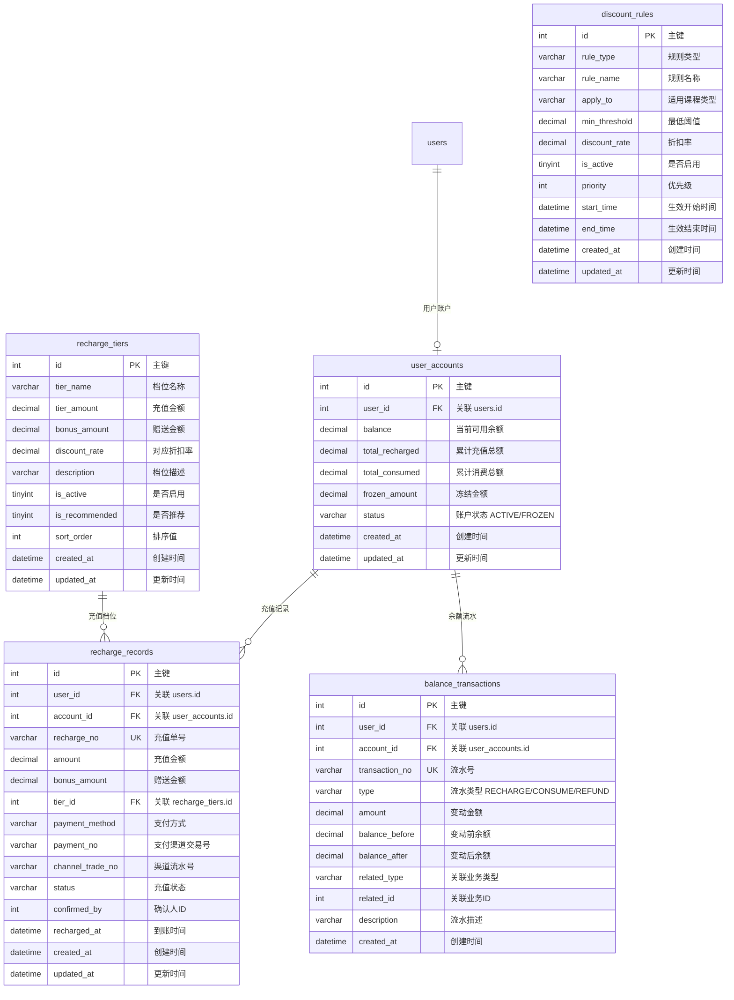

# 充值与余额模块 需求文档

> 模块编码：`recharge`  
> 版本：v1.0  
> 最后更新：2026-03-19

---

## 1. 模块概述

**充值与余额模块**是淘课网平台的资金管理核心，负责用户账户充值、余额管理、消费折扣计算、资金流水记录等完整的账户财务闭环。B 端企业用户和 C 端个人用户均可通过充值获取课程购买折扣，实现"充值越多、折扣越大"的激励机制。

### 1.1 核心职责

| 职责 | 说明 |
|------|------|
| 账户充值 | B 端/C 端用户均可在线充值，支持微信、支付宝、公对公转账等多种方式 |
| 余额管理 | 查看当前余额、冻结金额、累计充值、累计消费等账户信息 |
| 消费折扣 | 充值阶梯折扣（在线课）、多课购买折扣（在线课）、团购折扣（公开课） |
| 流水记录 | 充值、消费、退款等余额变动全链路流水记录，永久保存 |
| 折扣规则管理 | 后台管理员配置各类折扣规则，实时生效 |
| 资金安全 | 充值资金专款管理，仅用于平台课程购买，不可提现 |

### 1.2 模块边界

- **本模块包含**：用户账户管理、充值记录、余额流水、折扣规则配置、充值档位配置
- **本模块不包含**：订单创建与支付（→ 订单模块）、退款审核与处理（→ 订单模块）、讲师/机构提现（→ 订单模块）、第三方支付网关对接（→ 支付基础设施）

### 1.3 业务范围说明

| 用户类型 | 是否支持充值 | 充值用途说明 |
|----------|:----------:|------|
| B 端企业甲方 | ✅ | 充值后购买在线课享受阶梯折扣，公开课团购享团购折扣 |
| C 端个人甲方 | ✅ | 充值后购买在线课享受阶梯折扣 |
| 讲师/机构 | ❌ | 供给侧角色不参与充值体系 |

---

## 2. 功能描述

### 2.1 账户充值

#### 2.1.1 充值入口与流程

| 项目 | 说明 |
|------|------|
| 入口 | 用户中心"我的账户"页 → "充值"按钮 |
| 充值人 | B 端企业用户（`ENTERPRISE_BUYER`）、C 端个人用户（`INDIVIDUAL_BUYER`） |
| 充值档位 | 由后台管理员配置的固定档位（如 1000/5000/10000 元），用户选择后支付 |
| 自定义金额 | 支持用户输入自定义充值金额（最低 100 元，最高 50000 元） |
| 支付方式 | 微信支付、支付宝支付、公对公转账（仅企业用户） |
| 充值到账 | 在线支付成功后实时到账；公对公转账由客服确认后到账 |
| 充值赠送 | 部分档位可配置赠送金额（如充值 10000 元赠 500 元），赠送金额等同充值金额使用 |

#### 2.1.2 充值支付流程

```
用户选择充值档位/输入金额
  → 选择支付方式
  ├── 在线支付（微信/支付宝）
  │     → 创建充值记录（status=PENDING）
  │     → 调用支付网关生成预支付参数
  │     → 前端拉起支付组件
  │     → 接收支付回调
  │     → 校验签名与金额
  │     → 更新充值记录 status=SUCCESS
  │     → 增加用户账户余额
  │     → 生成余额流水记录（type=RECHARGE）
  └── 公对公转账（仅企业用户）
        → 创建充值记录（status=PENDING）
        → 展示平台对公账户信息
        → 用户线下完成转账
        → 后台客服确认到账
        → 更新充值记录 status=SUCCESS
        → 增加用户账户余额
        → 生成余额流水记录（type=RECHARGE）
```

### 2.2 余额管理

#### 2.2.1 用户端

| 功能 | 说明 |
|------|------|
| 账户总览 | 展示当前可用余额、冻结金额、累计充值总额、累计消费总额 |
| 充值记录 | 查看历史充值记录列表，包含充值时间、金额、支付方式、状态 |
| 消费记录 | 查看余额消费明细，关联订单信息（课程名称、订单号） |
| 退款记录 | 查看余额退回记录（因订单退款退回至余额的记录） |
| 余额流水 | 完整的余额变动流水，支持按类型（充值/消费/退款）筛选、按时间范围查询 |
| 数据隔离 | 每个账号只能查看自己的账户信息，不可跨账号查看 |

#### 2.2.2 后台管理端

| 功能 | 说明 |
|------|------|
| 账户列表 | 查看全平台用户账户列表，支持按用户、余额范围、状态筛选 |
| 账户详情 | 查看用户账户信息、充值记录、消费记录、余额流水 |
| 充值确认 | 公对公转账充值场景，客服确认收款后更新充值状态 |
| 账户冻结/解冻 | 异常账户可冻结，冻结后余额不可使用；解冻后恢复正常 |
| 充值记录管理 | 查看全平台充值记录，支持按用户、时间、状态、支付方式筛选 |

### 2.3 消费折扣

#### 2.3.1 在线课充值折扣

| 项目 | 说明 |
|------|------|
| 适用范围 | 使用充值余额购买在线课时享受折扣 |
| 折扣规则 | 按用户累计充值金额阶梯设置折扣比例，充值越多折扣越大 |
| 折扣示例 | 累计充值 ≥1000 元享 95 折、≥5000 元享 9 折、≥10000 元享 85 折（具体由后台配置） |
| 配置方式 | 后台管理员配置阶梯折扣规则，支持设置生效时间范围 |
| 折扣计算 | 下单时自动匹配用户当前折扣等级，展示折后价格 |
| 折扣叠加 | 充值折扣与多课购买折扣不可叠加，取最优折扣 |

#### 2.3.2 在线课多课购买折扣

| 项目 | 说明 |
|------|------|
| 适用范围 | 同一账号购买在线课 |
| 触发条件 | 同一账号下购买在线课数量 ≥2 门时自动触发 |
| 折扣规则 | 按累计购买在线课数量阶梯设置折扣比例，由后台配置 |
| 折扣计算 | 下单时自动判断用户历史在线课购买数量，匹配折扣等级 |

#### 2.3.3 公开课团购折扣

| 项目 | 说明 |
|------|------|
| 适用范围 | 企业用户报名线下公开课 |
| 触发条件 | 同一企业用户单笔订单报名同一公开课 ≥2 人 |
| 折扣规则 | 按报名人数阶梯设置折扣比例（如 2-4 人 95 折、5 人以上 9 折），由后台配置 |
| 折扣计算 | 下单时自动判断是否满足团购条件，展示折后总价 |

#### 2.3.4 折扣通用规则

| 规则 | 说明 |
|------|------|
| 折扣仅适用于课程购买 | 充值折扣和多课折扣仅适用于在线课；团购折扣仅适用于公开课 |
| 折后价格直接抵扣 | 折扣从课程价格中直接减免，减免金额体现在订单 `discount_amount` |
| 余额不可提现 | 充值金额专款管理，只能用于平台课程购买，不支持提现 |
| 规则实时生效 | 后台修改折扣规则后立即对新订单生效，已生成订单不受影响 |
| 规则快照 | 下单时将当时适用的折扣规则快照保存至订单，确保可追溯 |
| 多规则冲突 | 充值折扣与多课折扣不可叠加，系统自动选取优惠力度最大的规则 |

### 2.4 充值档位管理

| 功能 | 说明 |
|------|------|
| 档位配置 | 后台管理员配置充值档位（金额、赠送金额、对应折扣、描述） |
| 档位排序 | 支持自定义排序，控制前端展示顺序 |
| 启停控制 | 支持单个档位的启用/停用，停用后前端不展示 |
| 档位展示 | 前端按排序展示可用档位，突出推荐档位 |

---

## 3. 实体属性（字段设计）

### 3.1 用户账户表 `user_accounts`

> 记录每个用户的账户余额信息，与 `users` 表一对一关联。用户首次充值时自动创建。

| 字段名 | 类型 | 允许 NULL | 默认值 | 说明 |
|--------|------|-----------|--------|------|
| `id` | int | NO | AUTO_INCREMENT | 主键 |
| `user_id` | int | NO | — | 用户 ID，关联 `users.id`，唯一 |
| `balance` | decimal(12,2) | NO | 0.00 | 当前可用余额 |
| `total_recharged` | decimal(12,2) | NO | 0.00 | 累计充值总额（含赠送金额） |
| `total_consumed` | decimal(12,2) | NO | 0.00 | 累计消费总额 |
| `frozen_amount` | decimal(12,2) | NO | 0.00 | 冻结金额（下单锁定尚未扣除的金额） |
| `status` | varchar(20) | NO | 'ACTIVE' | 账户状态：`ACTIVE`=正常，`FROZEN`=冻结 |
| `created_at` | datetime | NO | CURRENT_TIMESTAMP | 创建时间 |
| `updated_at` | datetime | NO | CURRENT_TIMESTAMP ON UPDATE | 更新时间 |

**索引：**
- `UNIQUE idx_user_id (user_id)` — 一个用户只有一个账户
- `idx_status (status)` — 按账户状态筛选

---

### 3.2 充值记录表 `recharge_records`

> 记录每一笔充值操作的详细信息，包括支付方式、支付状态、渠道流水号等。

| 字段名 | 类型 | 允许 NULL | 默认值 | 说明 |
|--------|------|-----------|--------|------|
| `id` | int | NO | AUTO_INCREMENT | 主键 |
| `user_id` | int | NO | — | 用户 ID，关联 `users.id` |
| `account_id` | int | NO | — | 账户 ID，关联 `user_accounts.id` |
| `recharge_no` | varchar(64) | NO | — | 充值单号，全局唯一，格式：`RCH{yyyyMMddHHmmss}{6位随机数}` |
| `amount` | decimal(12,2) | NO | 0.00 | 充值金额（用户实际支付金额） |
| `bonus_amount` | decimal(12,2) | NO | 0.00 | 赠送金额 |
| `tier_id` | int | YES | NULL | 关联充值档位 ID，自定义金额时为 NULL |
| `payment_method` | varchar(20) | NO | — | 支付方式：`WECHAT`=微信支付，`ALIPAY`=支付宝支付，`BANK_TRANSFER`=公对公转账 |
| `payment_no` | varchar(128) | YES | NULL | 第三方支付渠道交易号 |
| `channel_trade_no` | varchar(128) | YES | NULL | 渠道返回的交易流水号 |
| `status` | varchar(20) | NO | 'PENDING' | 充值状态：`PENDING`=待支付，`SUCCESS`=充值成功，`FAILED`=充值失败 |
| `confirmed_by` | int | YES | NULL | 确认人 ID（公对公转账由客服确认时记录） |
| `recharged_at` | datetime | YES | NULL | 实际到账/确认时间 |
| `remark` | varchar(255) | YES | NULL | 备注 |
| `created_at` | datetime | NO | CURRENT_TIMESTAMP | 创建时间 |
| `updated_at` | datetime | NO | CURRENT_TIMESTAMP ON UPDATE | 更新时间 |

**索引：**
- `UNIQUE idx_recharge_no (recharge_no)` — 充值单号唯一
- `idx_user_id (user_id)` — 按用户查询充值记录
- `idx_account_id (account_id)` — 按账户查询充值记录
- `idx_status (status)` — 按充值状态筛选
- `idx_payment_method (payment_method)` — 按支付方式筛选
- `idx_channel_trade_no (channel_trade_no)` — 按渠道交易号查询（支付回调对账）
- `idx_created_at (created_at)` — 按时间排序

---

### 3.3 余额流水表 `balance_transactions`

> 记录账户余额每一次变动的完整流水，包括充值入账、消费扣款、退款回充，永久保存，不可篡改。

| 字段名 | 类型 | 允许 NULL | 默认值 | 说明 |
|--------|------|-----------|--------|------|
| `id` | int | NO | AUTO_INCREMENT | 主键 |
| `user_id` | int | NO | — | 用户 ID，关联 `users.id` |
| `account_id` | int | NO | — | 账户 ID，关联 `user_accounts.id` |
| `transaction_no` | varchar(64) | NO | — | 流水号，全局唯一 |
| `type` | varchar(20) | NO | — | 流水类型：`RECHARGE`=充值入账，`CONSUME`=消费扣款，`REFUND`=退款回充，`FREEZE`=冻结，`UNFREEZE`=解冻 |
| `amount` | decimal(12,2) | NO | 0.00 | 变动金额（正数表示增加，负数表示减少） |
| `balance_before` | decimal(12,2) | NO | 0.00 | 变动前余额 |
| `balance_after` | decimal(12,2) | NO | 0.00 | 变动后余额 |
| `related_type` | varchar(20) | YES | NULL | 关联业务类型：`ORDER`=订单消费，`RECHARGE`=充值入账，`REFUND`=退款回充 |
| `related_id` | int | YES | NULL | 关联业务 ID（订单 ID / 充值记录 ID / 退款记录 ID） |
| `description` | varchar(255) | YES | NULL | 流水描述（如"购买课程《xxx》"、"充值到账"、"订单退款回充"） |
| `created_at` | datetime | NO | CURRENT_TIMESTAMP | 创建时间 |

**索引：**
- `UNIQUE idx_transaction_no (transaction_no)` — 流水号唯一
- `idx_user_id (user_id)` — 按用户查询流水
- `idx_account_id (account_id)` — 按账户查询流水
- `idx_type (type)` — 按流水类型筛选
- `idx_related (related_type, related_id)` — 按关联业务查询
- `idx_created_at (created_at)` — 按时间排序

---

### 3.4 折扣规则表 `discount_rules`

> 统一管理平台所有折扣规则：充值阶梯折扣、在线课多课购买折扣、公开课团购折扣。支持按时间范围生效、优先级排序。

| 字段名 | 类型 | 允许 NULL | 默认值 | 说明 |
|--------|------|-----------|--------|------|
| `id` | int | NO | AUTO_INCREMENT | 主键 |
| `rule_type` | varchar(20) | NO | — | 规则类型：`RECHARGE_TIER`=充值阶梯折扣，`MULTI_BUY`=多课购买折扣，`GROUP_BUY`=团购折扣 |
| `rule_name` | varchar(100) | NO | — | 规则名称 |
| `apply_to` | varchar(20) | NO | — | 适用课程类型：`ONLINE_COURSE`=在线课，`OPEN_COURSE`=公开课 |
| `min_threshold` | decimal(12,2) | NO | 0.00 | 最低阈值（充值折扣=累计充值金额；多课折扣=购买课程数量；团购折扣=报名人数） |
| `discount_rate` | decimal(5,2) | NO | 1.00 | 折扣率（如 0.95 表示 95 折，0.85 表示 85 折） |
| `is_active` | tinyint | NO | 1 | 是否启用：0=停用，1=启用 |
| `priority` | int | NO | 0 | 优先级（多规则冲突时，值越大优先级越高） |
| `start_time` | datetime | YES | NULL | 生效开始时间（NULL 表示立即生效） |
| `end_time` | datetime | YES | NULL | 生效结束时间（NULL 表示长期有效） |
| `description` | varchar(500) | YES | NULL | 规则说明 |
| `created_by` | int | YES | NULL | 创建人（后台管理员 ID） |
| `created_at` | datetime | NO | CURRENT_TIMESTAMP | 创建时间 |
| `updated_at` | datetime | NO | CURRENT_TIMESTAMP ON UPDATE | 更新时间 |

**索引：**
- `idx_rule_type_active (rule_type, is_active)` — 按规则类型查询有效规则
- `idx_apply_to (apply_to)` — 按适用课程类型筛选
- `idx_priority (priority)` — 按优先级排序
- `idx_time_range (start_time, end_time)` — 按生效时间范围筛选

---

### 3.5 充值档位表 `recharge_tiers`

> 后台配置的充值档位，前端展示供用户选择。每个档位可配置赠送金额和对应折扣等级。

| 字段名 | 类型 | 允许 NULL | 默认值 | 说明 |
|--------|------|-----------|--------|------|
| `id` | int | NO | AUTO_INCREMENT | 主键 |
| `tier_name` | varchar(100) | NO | — | 档位名称（如"基础充值"、"尊享充值"） |
| `tier_amount` | decimal(12,2) | NO | 0.00 | 充值金额 |
| `bonus_amount` | decimal(12,2) | NO | 0.00 | 赠送金额 |
| `discount_rate` | decimal(5,2) | YES | NULL | 该档位对应的折扣率（冗余展示用，实际折扣以 `discount_rules` 为准） |
| `description` | varchar(500) | YES | NULL | 档位描述（前端展示用） |
| `is_active` | tinyint | NO | 1 | 是否启用：0=停用，1=启用 |
| `is_recommended` | tinyint | NO | 0 | 是否推荐档位：0=否，1=是（前端突出展示） |
| `sort_order` | int | NO | 0 | 排序值（值越小越靠前） |
| `created_at` | datetime | NO | CURRENT_TIMESTAMP | 创建时间 |
| `updated_at` | datetime | NO | CURRENT_TIMESTAMP ON UPDATE | 更新时间 |

**索引：**
- `idx_is_active (is_active, sort_order)` — 查询已启用档位并排序
- `idx_sort_order (sort_order)` — 排序展示

---

## 4. ER 关系说明

### 4.1 ER 图



### 4.2 关系说明

| 关系 | 类型 | 说明 |
|------|------|------|
| `users` → `user_accounts` | 一对零或一 | 一个用户最多有一个账户，首次充值时创建 |
| `user_accounts` → `recharge_records` | 一对多 | 一个账户可有多条充值记录 |
| `user_accounts` → `balance_transactions` | 一对多 | 一个账户可有多条余额流水记录 |
| `recharge_tiers` → `recharge_records` | 一对多 | 一个充值档位可被多次选用 |
| `discount_rules` — 独立配置表 | — | 折扣规则独立管理，由订单模块在下单时读取并应用 |

> **注意：** 数据库层面不建外键，所有关联关系在代码逻辑中维护。

---

## 5. 业务逻辑与规则

### 5.1 账户状态流转

```
┌─────────────────────────────────────────────────┐
│                 账户状态机                         │
├─────────────────────────────────────────────────┤
│                                                 │
│   首次充值 ──► 创建账户 [正常 ACTIVE]             │
│                  │          ▲                    │
│       管理员冻结 │          │ 管理员解冻           │
│                  ▼          │                    │
│              [冻结 FROZEN]                       │
│                                                 │
│   冻结状态下：余额不可使用、不可充值               │
│   解冻后：恢复正常使用                             │
│                                                 │
└─────────────────────────────────────────────────┘
```

### 5.2 充值流程

#### 5.2.1 在线支付充值（微信/支付宝）

```
用户选择充值档位或输入金额
  → 校验金额范围（100~50000 元）
  → 校验账户状态（FROZEN 时拒绝充值）
  → 创建 recharge_records 记录（status=PENDING）
  → 调用第三方支付 SDK 生成预支付参数
  → 前端拉起支付组件
  → 用户完成支付
  → 接收第三方回调通知
  → 校验签名与金额（幂等处理，同一 channel_trade_no 不重复处理）
  → 更新 recharge_records.status=SUCCESS, recharged_at
  → 更新 user_accounts.balance += (amount + bonus_amount)
  → 更新 user_accounts.total_recharged += (amount + bonus_amount)
  → 生成 balance_transactions 记录（type=RECHARGE）
```

#### 5.2.2 公对公转账充值

```
企业用户选择公对公转账
  → 创建 recharge_records 记录（status=PENDING）
  → 展示平台对公账户信息（银行、账号、户名、充值单号作为转账附言）
  → 用户线下完成银行转账
  → 后台客服在管理端查看待确认充值列表
  → 客服确认到账
  → 更新 recharge_records.status=SUCCESS, confirmed_by=客服ID, recharged_at
  → 更新 user_accounts.balance += (amount + bonus_amount)
  → 更新 user_accounts.total_recharged += (amount + bonus_amount)
  → 生成 balance_transactions 记录（type=RECHARGE）
```

### 5.3 余额消费流程（由订单模块调用）

```
订单模块发起余额扣款请求
  → 校验账户状态为 ACTIVE
  → 校验可用余额（balance - frozen_amount）≥ 扣款金额
  → 冻结金额：frozen_amount += 扣款金额
  → 生成 balance_transactions（type=FREEZE）
  → 订单支付确认后：
      → 扣减余额：balance -= 扣款金额
      → 释放冻结：frozen_amount -= 扣款金额
      → 增加消费：total_consumed += 扣款金额
      → 生成 balance_transactions（type=CONSUME）
  → 订单取消/超时：
      → 释放冻结：frozen_amount -= 扣款金额
      → 生成 balance_transactions（type=UNFREEZE）
```

### 5.4 退款回充流程（由订单模块调用）

```
订单退款审核通过（原支付方式为余额）
  → 增加余额：balance += 退款金额
  → 生成 balance_transactions（type=REFUND, related_type=REFUND, related_id=退款记录ID）
  → 描述："订单退款回充，订单号：{order_no}"
```

### 5.5 折扣规则匹配逻辑

#### 5.5.1 充值阶梯折扣匹配

```
用户下单时选择余额支付
  → 查询用户 user_accounts.total_recharged（累计充值总额）
  → 查询 discount_rules 中 rule_type=RECHARGE_TIER, is_active=1
  → 筛选 start_time <= NOW() AND (end_time IS NULL OR end_time >= NOW())
  → 筛选 min_threshold <= total_recharged 的所有规则
  → 按 min_threshold DESC 取第一条（匹配最高阶梯）
  → 返回 discount_rate 作为折扣率
```

#### 5.5.2 多课购买折扣匹配

```
用户购买在线课时
  → 统计用户历史已购买在线课数量（含当前订单）
  → 查询 discount_rules 中 rule_type=MULTI_BUY, is_active=1
  → 筛选时间范围内有效的规则
  → 筛选 min_threshold <= 购买数量 的所有规则
  → 按 min_threshold DESC 取第一条
  → 返回 discount_rate
```

#### 5.5.3 团购折扣匹配

```
企业用户报名公开课时
  → 获取当前订单报名人数
  → 查询 discount_rules 中 rule_type=GROUP_BUY, is_active=1
  → 筛选时间范围内有效的规则
  → 筛选 min_threshold <= 报名人数 的所有规则
  → 按 min_threshold DESC 取第一条
  → 返回 discount_rate
```

#### 5.5.4 最优折扣选取

```
在线课下单时：
  → 计算充值阶梯折扣折后价 = 原价 × 充值折扣率
  → 计算多课购买折扣折后价 = 原价 × 多课折扣率
  → 取价格更低者（折扣力度更大者）
  → 记录所选折扣规则快照至订单
```

### 5.6 充值金额规则

| 规则 | 说明 |
|------|------|
| 充值下限 | 自定义金额最低 100 元 |
| 充值上限 | 自定义金额最高 50000 元 |
| 档位充值 | 选择固定档位时按档位金额充值，不可修改 |
| 赠送金额 | 仅档位充值可享赠送，自定义金额无赠送 |
| 赠送使用 | 赠送金额等同充值金额，可正常用于课程购买 |
| 精度要求 | 金额精度为分（decimal(12,2)），所有金额运算保留两位小数 |

### 5.7 资金安全规则

| 规则 | 说明 |
|------|------|
| 专款管理 | 充值金额仅用于平台课程购买，不可提现、不可转账 |
| 余额不可提现 | 用户充值后的余额（含赠送金额）不支持任何形式的提现 |
| 流水不可篡改 | `balance_transactions` 为追加写入，不可更新或删除，永久保存 |
| 余额一致性 | `user_accounts.balance` 必须与流水记录的 `balance_after` 最新值一致 |
| 幂等处理 | 充值回调做幂等处理，同一 `channel_trade_no` 不重复入账 |
| 并发控制 | 余额操作使用分布式锁（Redisson），防止并发扣款导致超扣 |
| 冻结机制 | 下单时先冻结余额，支付确认后再扣减，取消时释放冻结 |
| 操作审计 | 所有余额变动记录流水，后台可完整追溯资金链路 |
| 对账机制 | 定期核对 `user_accounts.balance` 与 `balance_transactions` 流水合计是否一致 |

### 5.8 充值记录保留策略

| 规则 | 说明 |
|------|------|
| 充值记录 | 永久保存，不做归档或删除 |
| 余额流水 | 永久保存，不做归档或删除 |
| 用户可查 | 用户可随时查询全部历史充值记录和余额流水 |

---

## 6. 与其他模块的依赖关系

| 依赖模块 | 依赖方向 | 说明 |
|----------|---------|------|
| **用户模块 (users)** | 充值模块 → 用户模块 | `user_accounts.user_id → users.id`，充值时校验用户状态（冻结用户不允许充值） |
| **订单模块 (orders)** | 充值模块 ↔ 订单模块 | 订单模块调用充值模块扣减余额 / 冻结余额 / 释放冻结；退款时调用充值模块回充余额；下单时读取折扣规则计算折后价 |
| **课程模块 (courses)** | 充值模块 ← 课程模块 | 课程详情页展示用户当前折扣等级和折后价格，需读取充值模块的账户信息和折扣规则 |
| **消息通知模块 (notifications)** | 充值模块 → 消息模块 | 充值成功、余额变动、账户冻结/解冻等事件触发消息通知（站内消息） |
| **后台运营模块 (admin)** | 充值模块 ← 运营模块 | 折扣规则、充值档位由后台运营模块配置和管理 |

---

## 7. 参考旧表

### 7.1 旧表到新表的映射关系

| 旧表 | 新表 | 说明 |
|------|------|------|
| `tk_costco_member` | `user_accounts` | 旧会员表中的 `money`（余额）字段迁入新账户表 `balance`；旧表包含会员等级、集团、查询次数等字段在新系统中不再保留 |
| `tk_costco_auth` | `recharge_records` | 旧认证/授权记录表映射为充值记录表；旧表 `type` 字段区分课程类型的认证，新系统简化为统一的充值记录 |
| `tk_costco_records` | `balance_transactions` | 旧 Costco 认证和开通记录表映射为余额流水表，新表增加 `balance_before`/`balance_after` 快照、流水号、关联业务等字段 |
| `tk_costco_cart` | 订单模块（不再独立） | 旧购物车表迁至订单模块处理，新系统不单独维护充值模块内的购物车 |
| `tk_member_account` | `user_accounts` | 旧用户账户表的 `balance` 迁入新 `user_accounts.balance`；旧表 `taobi`（淘币）、`message`（短信条数）、`email`（邮件条数）等字段在新系统中不再保留 |
| _(无)_ | `discount_rules` | 全新设计，旧系统无统一的折扣规则配置，折扣逻辑硬编码在业务中 |
| _(无)_ | `recharge_tiers` | 全新设计，旧系统无充值档位管理 |

### 7.2 关键字段对照

```
tk_costco_member.uid            → user_accounts.user_id
tk_costco_member.money          → user_accounts.balance（int → decimal(12,2)）
tk_costco_member.is_volid       → user_accounts.status（旧 0/1 → 新 ACTIVE/FROZEN）
tk_costco_member.createtime     → user_accounts.created_at（int 时间戳 → datetime）

tk_costco_auth.target_id        → recharge_records.user_id（语义变更）
tk_costco_auth.type             → 不再保留（旧按课程类型分认证，新统一充值）
tk_costco_auth.createtime       → recharge_records.created_at（int → datetime）
tk_costco_auth.begintime        → recharge_records.recharged_at（int → datetime）

tk_costco_records.uid           → balance_transactions.user_id
tk_costco_records.type          → balance_transactions.type（旧 1~5 数字 → 新字符串枚举）
tk_costco_records.createtime    → balance_transactions.created_at（int → datetime）

tk_costco_cart.uid              → orders 模块（购物车功能迁至订单模块）
tk_costco_cart.costco_price     → 订单折后价（通过 discount_rules 动态计算）
tk_costco_cart.price            → 课程原价（来自课程模块）

tk_member_account.user_id       → user_accounts.user_id
tk_member_account.balance       → user_accounts.balance（float → decimal(12,2)）
tk_member_account.taobi         → 不再保留（淘币机制已废弃）
tk_member_account.createtime    → user_accounts.created_at（int → datetime）
```

### 7.3 关键变更点

1. **账户模型统一**：旧系统 `tk_member_account`（通用账户）和 `tk_costco_member`（Costco 会员）两张表分散存储余额信息，新系统统一为 `user_accounts` 一张表
2. **Costco 会员体系移除**：旧系统以 Costco 模式运营会员充值体系（含会员费、查询次数、集团管理等），新系统简化为纯充值余额 + 折扣体系，不再有会员费和查询次数概念
3. **折扣规则配置化**：旧系统折扣逻辑硬编码在业务代码中，新系统通过 `discount_rules` 表实现后台可配置，支持灵活调整
4. **充值档位管理**：新增 `recharge_tiers` 表，支持后台配置固定充值档位和赠送金额
5. **余额流水完善**：旧系统 `tk_costco_records` 仅记录简单的操作类型，新系统 `balance_transactions` 增加变动前后余额快照、流水号、关联业务等，形成完整资金审计链
6. **金额精度升级**：旧系统使用 `int`（分）或 `float` 存储金额，新系统统一使用 `decimal(12,2)`，避免浮点精度问题
7. **时间字段规范化**：旧系统使用 `int` 时间戳（`createtime`），新系统统一使用 `datetime`
8. **购物车功能外迁**：旧 `tk_costco_cart` 购物车功能迁至订单模块统一处理
9. **淘币机制废弃**：旧 `tk_member_account.taobi`（淘币）在新系统中不再保留，简化为纯余额模式

### 7.4 数据迁移注意事项

- 旧 `tk_costco_member.money` 类型为 `int`（表示元），新系统 `decimal(12,2)`，迁移时注意精度转换
- 旧 `tk_member_account.balance` 类型为 `float`，迁移至 `decimal(12,2)` 时注意浮点精度损失，建议四舍五入到分
- 旧 `tk_costco_member.is_volid` 值 `1=生效` 映射为 `ACTIVE`，`0=未生效` 映射为 `FROZEN`
- 旧 `tk_costco_records.type` 值（1=公开课, 2=内训课, 3=在线课, 4=讲师, 5=会员）统一映射为新流水类型枚举
- 旧系统中 `createtime`（int 时间戳）统一转换为 `datetime` 格式
- 旧 `tk_costco_auth` 表中的 `root_company_id`（集团 ID）和 `manager_identity`（集团身份）在新系统中不再保留，集团管理相关功能已移除
- 迁移时需重新计算 `user_accounts.total_recharged` 和 `user_accounts.total_consumed`（通过历史流水汇总）
- 建议迁移完成后执行余额一致性校验：核对 `user_accounts.balance` 与历史充值/消费/退款流水的净值是否一致
