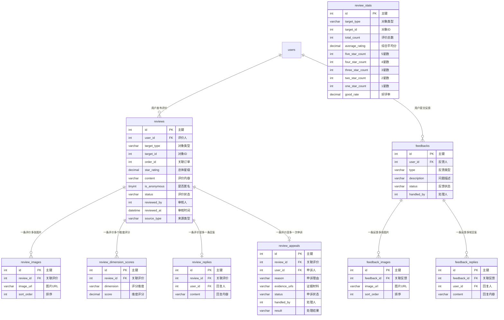

# 评价与反馈模块 需求文档

> 模块编码：`review`
> 版本：v1.0
> 最后更新：2026-03-19

---

## 1. 模块概述

### 1.1 核心定位

评价与反馈是平台信用体系与服务质量闭环的核心模块。甲方用户在培训合作完成或课程学习结束后，对讲师、机构、课程进行多维度星级评分与文字评价；讲师/机构可查看、回复及申诉评价；后台客服负责评价审核与问题反馈处理。所有评价经审核后公开展示，为其他采购方提供决策参考。

### 1.2 核心业务目标

- 建立可信的培训服务评价体系，辅助甲方采购决策
- 通过多维度评分（专业度、定制实用性、服务满意度等）精细化衡量培训质量
- 评价审核机制杜绝虚假、恶意、广告类评价，保障评价公信力
- 支持讲师/机构对评价的回复与申诉，保障被评方合理权益
- 问题反馈通道确保用户诉求得到及时响应与追踪
- 评价数据驱动讲师/机构评分聚合，影响搜索排序与推荐权重

### 1.3 典型用户行为路径

```
甲方完成培训合作/课程学习 → 提交星级评分 + 文字评价 + 上传图片
→ 后台客服审核 → 审核通过后公开展示在课程/讲师/机构主页
→ 讲师/机构查看评价 → 回复或申诉
→ 统计汇总更新评分数据
```

```
用户发现问题 → 提交问题反馈（描述 + 图片）
→ 后台客服受理 → 回复处理 → 用户追踪进度
```

---

## 2. 功能描述

### 2.1 培训后评价（发布评价）

#### 2.1.1 评价触发场景

| 场景 | 评价对象 | 触发条件 |
|------|---------|---------|
| 内训合作完成 | 讲师 + 机构 + 课程 | 内训订单标记"已完成"后开放评价入口 |
| 在线课学习完成 | 课程 + 讲师 | 个人用户完成在线课程全部章节学习后开放 |
| 公开课出席 | 课程 + 讲师/机构 | 公开课结束且用户签到/确认出席后开放 |
| 版权课学习完成 | 课程 | 版权课学习完成后开放 |

#### 2.1.2 评价内容

| 项目 | 说明 |
|------|------|
| 总体星级 | 1-5 星，必填，支持半星（精度 0.5） |
| 多维度评分 | 根据评价对象类型展示不同维度（详见 2.1.3），每个维度 1-5 分 |
| 文字评价 | 选填，最多 500 字 |
| 培训效果图片 | 选填，最多上传 9 张图片，支持 JPG/PNG 格式 |
| 匿名选项 | 用户可选择匿名发布评价，匿名后前台隐藏评价人真实信息 |

#### 2.1.3 多维度评分维度

| 评价对象类型 | 评分维度 | 说明 |
|-------------|---------|------|
| 内训课评价 | PROFESSIONALISM（讲师专业度） | 讲师授课水平与专业表现 |
| 内训课评价 | CUSTOMIZATION（定制实用性） | 课程内容与企业需求的匹配程度 |
| 内训课评价 | SERVICE（客服服务满意度） | 平台客服对接与服务质量 |
| 公开课/在线课评价 | QUALITY（课程质量） | 课程内容、结构、深度 |
| 公开课评价 | ENVIRONMENT（场地环境） | 公开课授课场地环境 |
| 公开课/在线课评价 | TEACHER（讲师授课质量） | 讲师的授课表现 |

#### 2.1.4 评价规则

- 同一订单/同一课程学习记录只能评价一次，不可重复提交
- 评价提交后进入"待审核"状态，审核通过后方可在前台公开展示
- 评价提交后不可编辑、不可删除（仅后台客服有权隐藏/删除）
- 评价入口在订单完成后 **90 天内** 有效，超时自动关闭

### 2.2 评价审核

#### 2.2.1 审核流程

```
用户提交评价(PENDING) → 后台客服审核
    → 通过(APPROVED)：评价公开展示，更新评分统计
    → 隐藏(HIDDEN)：评价不展示，通知用户并告知原因
    → 删除(DELETED)：评价软删除，通知用户并告知原因
```

#### 2.2.2 审核要点

| 审核项 | 说明 |
|--------|------|
| 真实性校验 | 核实评价人确实参与了该培训/课程 |
| 内容合规 | 检查恶意言论、人身攻击、辱骂等违规内容 |
| 广告过滤 | 检查评价内容是否含有广告、推广信息 |
| 图片审查 | 检查上传图片是否与培训相关，排除无关/违规图片 |

#### 2.2.3 审核范围

- 培训合作/课程学习后的用户评价
- 版权课的用户评价
- 增值工具相关的用户评价

#### 2.2.4 通知规则

- 审核通过：不单独通知评价人（评价自然展示即可）
- 审核隐藏/删除：通过站内消息通知评价人，告知处理结果与原因

### 2.3 评价管理（讲师/机构端）

#### 2.3.1 查看评价

- 讲师可在个人中心查看所有针对自己及自己课程的评价列表
- 机构可在机构后台查看所有针对机构及机构课程的评价列表
- 支持按评分等级（好评/中评/差评）、时间范围、课程筛选
- 展示评价总数、各星级分布、综合评分

#### 2.3.2 回复评价

- 讲师/机构可对已审核通过的评价进行回复
- 每条评价仅允许回复一次（不支持追加回复）
- 回复内容最多 500 字
- 回复提交后即时展示，无需审核

#### 2.3.3 评价申诉

| 项目 | 说明 |
|------|------|
| 申诉对象 | 仅可对已审核通过、正在展示的评价发起申诉 |
| 申诉内容 | 填写申诉理由（必填，最多 500 字）+ 上传证据材料（选填，最多 5 张图片） |
| 申诉次数 | 同一条评价仅允许申诉一次 |
| 处理流程 | 后台客服受理 → 审核证据 → 处理结果：维持原评价 / 隐藏评价 / 删除评价 |
| 处理通知 | 申诉结果通过站内消息通知申诉人与评价人 |

### 2.4 问题反馈

#### 2.4.1 反馈提交

| 项目 | 说明 |
|------|------|
| 反馈类型 | 资源信息不符、联系不畅通、课程质量问题、平台功能异常、其他 |
| 反馈内容 | 问题描述（必填，最多 1000 字）+ 图片证据（选填，最多 9 张） |
| 关联对象 | 可选择关联的课程/讲师/机构/订单（辅助客服定位问题） |

#### 2.4.2 反馈处理

- 后台客服收到反馈后进行受理，更新状态为"处理中"
- 客服可对反馈进行回复，支持多轮回复
- 处理完成后标记为"已解决"或"已关闭"

#### 2.4.3 进度追踪

- 用户可在个人中心查看所有已提交反馈的列表
- 每条反馈展示当前状态：待处理 → 处理中 → 已解决/已关闭
- 用户可查看客服的回复内容

### 2.5 评价展示

#### 2.5.1 展示位置

| 页面 | 展示内容 |
|------|---------|
| 课程详情页 | 该课程所有已审核通过的评价列表、课程综合评分、各维度评分 |
| 讲师主页 | 针对该讲师的所有已审核通过评价、讲师综合评分 |
| 机构主页 | 针对该机构的所有已审核通过评价、机构综合评分 |

#### 2.5.2 评分聚合展示

- 展示综合平均分（保留一位小数，如 4.8）
- 展示各星级评价数量分布（5 星 xx 条、4 星 xx 条...1 星 xx 条）
- 展示好评率（4-5 星评价占比）

#### 2.5.3 优秀讲师标签

- 后台客服可在真实评价 + 成单完成的基础上，手动为讲师打上"优秀讲师"标签
- 该标签展示在讲师主页与搜索列表中，增加讲师可信度

#### 2.5.4 评价排序

- 默认按时间倒序展示（最新评价在前）
- 支持按评分高低排序
- 有图评价可单独筛选展示

---

## 3. 实体属性（字段设计）

### 3.1 reviews — 评价主表

> 存储用户对讲师/机构/课程的评价记录，一条记录对应一次评价行为。

| 字段名 | 类型 | 约束 | 默认值 | 说明 |
|--------|------|------|--------|------|
| `id` | int | PK, AUTO_INCREMENT | — | 主键 |
| `user_id` | int | NOT NULL | — | 评价人用户 ID，关联 users.id |
| `target_type` | varchar(20) | NOT NULL | — | 评价对象类型：TRAINER / ORGANIZATION / COURSE |
| `target_id` | int | NOT NULL | — | 评价对象 ID（讲师 ID / 机构 ID / 课程 ID） |
| `order_id` | int | | NULL | 关联订单 ID（内训/公开课评价时关联） |
| `learning_record_id` | int | | NULL | 关联学习记录 ID（在线课评价时关联） |
| `star_rating` | decimal(2,1) | NOT NULL | — | 总体星级评分（1.0 - 5.0，步长 0.5） |
| `content` | varchar(500) | | NULL | 文字评价内容 |
| `is_anonymous` | tinyint | NOT NULL | 0 | 是否匿名：0=否，1=是 |
| `status` | varchar(20) | NOT NULL | 'PENDING' | 评价状态：PENDING / APPROVED / HIDDEN / DELETED |
| `reviewed_by` | int | | NULL | 审核人用户 ID |
| `reviewed_at` | datetime | | NULL | 审核时间 |
| `review_remark` | varchar(500) | | NULL | 审核备注（隐藏/删除时填写原因） |
| `source_type` | varchar(20) | | NULL | 来源类型：INHOUSE（内训）/ ONLINE（在线课）/ OPEN（公开课）/ COPYRIGHT（版权课） |
| `created_at` | datetime | NOT NULL | CURRENT_TIMESTAMP | 创建时间 |
| `updated_at` | datetime | NOT NULL | CURRENT_TIMESTAMP | 更新时间 |

**索引设计：**

| 索引名 | 字段 | 类型 | 说明 |
|--------|------|------|------|
| `idx_review_user_id` | `user_id` | 普通 | 按评价人查询 |
| `idx_review_target` | `target_type, target_id` | 联合 | 按评价对象查询（核心查询路径） |
| `idx_review_order_id` | `order_id` | 普通 | 按订单查询评价 |
| `idx_review_status` | `status` | 普通 | 按审核状态筛选 |
| `idx_review_created` | `created_at` | 普通 | 按时间排序 |
| `idx_review_source` | `source_type` | 普通 | 按来源类型筛选 |

---

### 3.2 review_images — 评价图片表

> 存储评价关联的培训效果反馈图片，每条评价最多 9 张。

| 字段名 | 类型 | 约束 | 默认值 | 说明 |
|--------|------|------|--------|------|
| `id` | int | PK, AUTO_INCREMENT | — | 主键 |
| `review_id` | int | NOT NULL | — | 关联评价 ID，关联 reviews.id |
| `image_url` | varchar(500) | NOT NULL | — | 图片 URL |
| `sort_order` | int | NOT NULL | 0 | 排序序号，值越小越靠前 |
| `created_at` | datetime | NOT NULL | CURRENT_TIMESTAMP | 创建时间 |
| `updated_at` | datetime | NOT NULL | CURRENT_TIMESTAMP | 更新时间 |

**索引设计：**

| 索引名 | 字段 | 类型 | 说明 |
|--------|------|------|------|
| `idx_ri_review_id` | `review_id` | 普通 | 按评价查询图片 |

---

### 3.3 review_dimension_scores — 多维度评分表

> 存储每条评价的各维度评分，一条评价可有多条维度评分记录。

| 字段名 | 类型 | 约束 | 默认值 | 说明 |
|--------|------|------|--------|------|
| `id` | int | PK, AUTO_INCREMENT | — | 主键 |
| `review_id` | int | NOT NULL | — | 关联评价 ID，关联 reviews.id |
| `dimension` | varchar(30) | NOT NULL | — | 评分维度：PROFESSIONALISM / CUSTOMIZATION / SERVICE / QUALITY / ENVIRONMENT / TEACHER |
| `score` | decimal(2,1) | NOT NULL | — | 维度评分（1.0 - 5.0） |
| `created_at` | datetime | NOT NULL | CURRENT_TIMESTAMP | 创建时间 |
| `updated_at` | datetime | NOT NULL | CURRENT_TIMESTAMP | 更新时间 |

**索引设计：**

| 索引名 | 字段 | 类型 | 说明 |
|--------|------|------|------|
| `idx_rds_review_id` | `review_id` | 普通 | 按评价查询维度评分 |
| `UNIQUE idx_rds_review_dim` | `review_id, dimension` | 唯一 | 同一评价同一维度不重复 |

---

### 3.4 review_replies — 评价回复表

> 讲师/机构对评价的回复，每条评价仅允许一条回复。

| 字段名 | 类型 | 约束 | 默认值 | 说明 |
|--------|------|------|--------|------|
| `id` | int | PK, AUTO_INCREMENT | — | 主键 |
| `review_id` | int | NOT NULL | — | 关联评价 ID，关联 reviews.id |
| `user_id` | int | NOT NULL | — | 回复人用户 ID（讲师/机构管理员的 users.id） |
| `content` | varchar(500) | NOT NULL | — | 回复内容 |
| `created_at` | datetime | NOT NULL | CURRENT_TIMESTAMP | 创建时间 |
| `updated_at` | datetime | NOT NULL | CURRENT_TIMESTAMP | 更新时间 |

**索引设计：**

| 索引名 | 字段 | 类型 | 说明 |
|--------|------|------|------|
| `UNIQUE idx_rr_review_id` | `review_id` | 唯一 | 一条评价仅一条回复 |
| `idx_rr_user_id` | `user_id` | 普通 | 按回复人查询 |

---

### 3.5 review_appeals — 评价申诉表

> 讲师/机构对恶意评价的申诉记录，每条评价仅允许一次申诉。

| 字段名 | 类型 | 约束 | 默认值 | 说明 |
|--------|------|------|--------|------|
| `id` | int | PK, AUTO_INCREMENT | — | 主键 |
| `review_id` | int | NOT NULL | — | 关联评价 ID，关联 reviews.id |
| `user_id` | int | NOT NULL | — | 申诉人用户 ID |
| `reason` | varchar(500) | NOT NULL | — | 申诉理由 |
| `evidence_urls` | varchar(2000) | | NULL | 证据材料图片 URL，JSON 数组格式 |
| `status` | varchar(20) | NOT NULL | 'PENDING' | 申诉状态：PENDING / ACCEPTED / REJECTED |
| `handled_by` | int | | NULL | 处理人用户 ID |
| `handled_at` | datetime | | NULL | 处理时间 |
| `result` | varchar(500) | | NULL | 处理结果说明 |
| `created_at` | datetime | NOT NULL | CURRENT_TIMESTAMP | 创建时间 |
| `updated_at` | datetime | NOT NULL | CURRENT_TIMESTAMP | 更新时间 |

**索引设计：**

| 索引名 | 字段 | 类型 | 说明 |
|--------|------|------|------|
| `UNIQUE idx_ra_review_id` | `review_id` | 唯一 | 一条评价仅一次申诉 |
| `idx_ra_user_id` | `user_id` | 普通 | 按申诉人查询 |
| `idx_ra_status` | `status` | 普通 | 按申诉状态筛选 |

---

### 3.6 review_stats — 评价统计汇总表

> 按评价对象聚合的统计数据，用于前台展示评分、各星级分布等。每个评价对象（讲师/机构/课程）对应一条记录，通过事件驱动或定时任务更新。

| 字段名 | 类型 | 约束 | 默认值 | 说明 |
|--------|------|------|--------|------|
| `id` | int | PK, AUTO_INCREMENT | — | 主键 |
| `target_type` | varchar(20) | NOT NULL | — | 对象类型：TRAINER / ORGANIZATION / COURSE |
| `target_id` | int | NOT NULL | — | 对象 ID |
| `total_count` | int | NOT NULL | 0 | 已审核通过的评价总数 |
| `average_rating` | decimal(2,1) | NOT NULL | 0.0 | 综合平均评分（1.0 - 5.0） |
| `five_star_count` | int | NOT NULL | 0 | 5 星评价数 |
| `four_star_count` | int | NOT NULL | 0 | 4 星评价数 |
| `three_star_count` | int | NOT NULL | 0 | 3 星评价数 |
| `two_star_count` | int | NOT NULL | 0 | 2 星评价数 |
| `one_star_count` | int | NOT NULL | 0 | 1 星评价数 |
| `good_rate` | decimal(5,2) | NOT NULL | 0.00 | 好评率（4-5 星占比，百分比） |
| `avg_professionalism` | decimal(2,1) | | NULL | 讲师专业度平均分（仅讲师/内训课） |
| `avg_customization` | decimal(2,1) | | NULL | 定制实用性平均分（仅内训课） |
| `avg_service` | decimal(2,1) | | NULL | 服务满意度平均分 |
| `avg_quality` | decimal(2,1) | | NULL | 课程质量平均分 |
| `avg_environment` | decimal(2,1) | | NULL | 场地环境平均分（仅公开课） |
| `avg_teacher` | decimal(2,1) | | NULL | 讲师授课质量平均分 |
| `created_at` | datetime | NOT NULL | CURRENT_TIMESTAMP | 创建时间 |
| `updated_at` | datetime | NOT NULL | CURRENT_TIMESTAMP | 更新时间 |

**索引设计：**

| 索引名 | 字段 | 类型 | 说明 |
|--------|------|------|------|
| `UNIQUE idx_rs_target` | `target_type, target_id` | 唯一 | 每个对象一条统计记录 |

---

### 3.7 feedbacks — 问题反馈主表

> 用户提交的问题反馈记录。

| 字段名 | 类型 | 约束 | 默认值 | 说明 |
|--------|------|------|--------|------|
| `id` | int | PK, AUTO_INCREMENT | — | 主键 |
| `user_id` | int | NOT NULL | — | 反馈人用户 ID，关联 users.id |
| `type` | varchar(30) | NOT NULL | — | 反馈类型：RESOURCE_MISMATCH（资源信息不符）/ CONNECTION_ISSUE（联系不畅通）/ QUALITY_ISSUE（课程质量问题）/ PLATFORM_BUG（平台功能异常）/ OTHER（其他） |
| `description` | varchar(1000) | NOT NULL | — | 问题描述 |
| `related_type` | varchar(20) | | NULL | 关联对象类型：COURSE / TRAINER / ORGANIZATION / ORDER |
| `related_id` | int | | NULL | 关联对象 ID |
| `status` | varchar(20) | NOT NULL | 'PENDING' | 反馈状态：PENDING（待处理）/ PROCESSING（处理中）/ RESOLVED（已解决）/ CLOSED（已关闭） |
| `handled_by` | int | | NULL | 处理人用户 ID（后台客服） |
| `handled_at` | datetime | | NULL | 首次受理时间 |
| `resolved_at` | datetime | | NULL | 解决/关闭时间 |
| `created_at` | datetime | NOT NULL | CURRENT_TIMESTAMP | 创建时间 |
| `updated_at` | datetime | NOT NULL | CURRENT_TIMESTAMP | 更新时间 |

**索引设计：**

| 索引名 | 字段 | 类型 | 说明 |
|--------|------|------|------|
| `idx_fb_user_id` | `user_id` | 普通 | 按反馈人查询 |
| `idx_fb_status` | `status` | 普通 | 按状态筛选 |
| `idx_fb_type` | `type` | 普通 | 按反馈类型筛选 |
| `idx_fb_handled_by` | `handled_by` | 普通 | 按处理人查询 |
| `idx_fb_created` | `created_at` | 普通 | 按时间排序 |

---

### 3.8 feedback_images — 反馈图片表

> 问题反馈关联的图片证据。

| 字段名 | 类型 | 约束 | 默认值 | 说明 |
|--------|------|------|--------|------|
| `id` | int | PK, AUTO_INCREMENT | — | 主键 |
| `feedback_id` | int | NOT NULL | — | 关联反馈 ID，关联 feedbacks.id |
| `image_url` | varchar(500) | NOT NULL | — | 图片 URL |
| `sort_order` | int | NOT NULL | 0 | 排序序号 |
| `created_at` | datetime | NOT NULL | CURRENT_TIMESTAMP | 创建时间 |
| `updated_at` | datetime | NOT NULL | CURRENT_TIMESTAMP | 更新时间 |

**索引设计：**

| 索引名 | 字段 | 类型 | 说明 |
|--------|------|------|------|
| `idx_fi_feedback_id` | `feedback_id` | 普通 | 按反馈查询图片 |

---

### 3.9 feedback_replies — 反馈回复表

> 后台客服对问题反馈的回复记录，支持多轮回复。

| 字段名 | 类型 | 约束 | 默认值 | 说明 |
|--------|------|------|--------|------|
| `id` | int | PK, AUTO_INCREMENT | — | 主键 |
| `feedback_id` | int | NOT NULL | — | 关联反馈 ID，关联 feedbacks.id |
| `user_id` | int | NOT NULL | — | 回复人用户 ID（后台客服或反馈人追加说明） |
| `content` | varchar(1000) | NOT NULL | — | 回复内容 |
| `created_at` | datetime | NOT NULL | CURRENT_TIMESTAMP | 创建时间 |
| `updated_at` | datetime | NOT NULL | CURRENT_TIMESTAMP | 更新时间 |

**索引设计：**

| 索引名 | 字段 | 类型 | 说明 |
|--------|------|------|------|
| `idx_fr_feedback_id` | `feedback_id` | 普通 | 按反馈查询回复 |
| `idx_fr_user_id` | `user_id` | 普通 | 按回复人查询 |

---

## 4. ER 关系说明



---

## 5. 业务逻辑与规则

### 5.1 评价状态机

```
[待审核](PENDING) --审核通过--> [已通过](APPROVED)
[待审核](PENDING) --审核隐藏--> [已隐藏](HIDDEN)
[待审核](PENDING) --审核删除--> [已删除](DELETED)
[已通过](APPROVED) --申诉成功/客服操作--> [已隐藏](HIDDEN)
[已通过](APPROVED) --申诉成功/客服操作--> [已删除](DELETED)
```

- 只有 `APPROVED` 状态的评价在前台公开展示
- `HIDDEN` 和 `DELETED` 的评价不参与评分统计

### 5.2 评价唯一性约束

- **基于订单的评价**（内训/公开课）：同一 `user_id` + `target_type` + `target_id` + `order_id` 组合唯一
- **基于学习记录的评价**（在线课/版权课）：同一 `user_id` + `target_type` + `target_id` + `learning_record_id` 组合唯一
- 约束在应用层校验，不在数据库层建唯一索引（因 `order_id` 和 `learning_record_id` 可为 NULL）

### 5.3 评分统计更新规则

- **触发时机**：评价审核通过、评价被隐藏/删除、申诉处理完成时
- **更新方式**：事件驱动异步更新（通过消息队列），确保统计数据最终一致
- **计算逻辑**：
  1. 仅统计 `status = APPROVED` 的评价
  2. `average_rating` = 所有审核通过评价的 `star_rating` 算术平均值，保留一位小数
  3. 各星级计数按 `star_rating` 四舍五入取整后归入对应档位（4.5-5.0 归入五星，3.5-4.0 归入四星，依此类推）
  4. `good_rate` = (四星 + 五星) / 总数 × 100%
  5. 各维度平均分 = 对应维度所有评分的算术平均值

### 5.4 联动更新

评价统计变更后，需同步更新关联模块的冗余评分字段：

| 目标表 | 更新字段 | 触发条件 |
|--------|---------|---------|
| `trainers` | `score`, `comment_count` | 讲师评价统计变更时 |
| `organizations` | `review_score`, `review_count` | 机构评价统计变更时 |

- 通过事件消息（如 `REVIEW_STATS_UPDATED`）通知讲师模块与机构模块异步更新

### 5.5 评价有效期

- 订单完成后 90 天内开放评价入口，超时自动关闭
- 定时任务无需清理，仅在前端/API 层按时间判断是否展示评价入口

### 5.6 申诉处理规则

```
讲师/机构发起申诉(PENDING) → 后台客服受理
    → 申诉通过(ACCEPTED)：将评价状态改为 HIDDEN 或 DELETED，通知双方
    → 申诉驳回(REJECTED)：维持原评价展示，通知申诉人
```

- 申诉处理时限建议 3 个工作日内完成
- 申诉通过后自动触发评分统计重算

### 5.7 反馈状态机

```
[待处理](PENDING) --客服受理--> [处理中](PROCESSING)
[处理中](PROCESSING) --处理完成--> [已解决](RESOLVED)
[处理中](PROCESSING) --无法解决/无效反馈--> [已关闭](CLOSED)
[待处理](PENDING) --无效反馈--> [已关闭](CLOSED)
```

### 5.8 优秀讲师标签规则

- 后台客服在确认以下条件后可手动授予"优秀讲师"标签：
  1. 讲师有真实用户评价（非后台代发）
  2. 讲师综合评分 ≥ 4.5
  3. 至少有一笔已完成的成单记录
- 该标签存储在讲师模块（`trainers` 表），本模块仅提供数据支撑

---

## 6. 接口契约（REST API）

### 6.1 评价发布

| 方法 | 路径 | 说明 |
|------|------|------|
| POST | `/api/v1/reviews` | 提交评价（含星级、内容、图片、维度评分） |
| GET | `/api/v1/reviews/check` | 检查当前用户对指定对象是否可评价（query: target_type, target_id, order_id） |

### 6.2 评价展示（公开）

| 方法 | 路径 | 说明 |
|------|------|------|
| GET | `/api/v1/reviews` | 获取评价列表（query: target_type, target_id, 分页/排序/星级筛选） |
| GET | `/api/v1/reviews/{id}` | 获取评价详情（含图片、维度评分、回复） |
| GET | `/api/v1/review-stats` | 获取评价统计（query: target_type, target_id） |

### 6.3 评价管理（讲师/机构端）

| 方法 | 路径 | 说明 |
|------|------|------|
| GET | `/api/v1/my/reviews` | 获取针对自己的评价列表（讲师/机构视角，支持筛选） |
| POST | `/api/v1/reviews/{id}/reply` | 回复评价 |
| POST | `/api/v1/reviews/{id}/appeal` | 发起评价申诉 |

### 6.4 评价审核（后台）

| 方法 | 路径 | 说明 |
|------|------|------|
| GET | `/api/v1/admin/reviews/pending` | 获取待审核评价列表（分页） |
| PUT | `/api/v1/admin/reviews/{id}/approve` | 审核通过评价 |
| PUT | `/api/v1/admin/reviews/{id}/hide` | 隐藏评价（需填写原因） |
| PUT | `/api/v1/admin/reviews/{id}/delete` | 删除评价（需填写原因） |
| GET | `/api/v1/admin/review-appeals/pending` | 获取待处理申诉列表 |
| PUT | `/api/v1/admin/review-appeals/{id}/handle` | 处理评价申诉（接受/驳回） |

### 6.5 问题反馈

| 方法 | 路径 | 说明 |
|------|------|------|
| POST | `/api/v1/feedbacks` | 提交问题反馈 |
| GET | `/api/v1/my/feedbacks` | 获取我的反馈列表（分页） |
| GET | `/api/v1/feedbacks/{id}` | 获取反馈详情（含回复列表） |

### 6.6 反馈处理（后台）

| 方法 | 路径 | 说明 |
|------|------|------|
| GET | `/api/v1/admin/feedbacks` | 获取反馈列表（支持按状态/类型筛选，分页） |
| PUT | `/api/v1/admin/feedbacks/{id}/accept` | 受理反馈（状态变更为处理中） |
| POST | `/api/v1/admin/feedbacks/{id}/reply` | 回复反馈 |
| PUT | `/api/v1/admin/feedbacks/{id}/resolve` | 标记反馈已解决 |
| PUT | `/api/v1/admin/feedbacks/{id}/close` | 关闭反馈 |

---

## 7. 参考旧表

### 7.1 旧表到新表的映射关系

| 旧表 | 新表 | 说明 |
|------|------|------|
| `tk_course_comment` | `reviews` + `review_dimension_scores` | 旧表为课程评价主表（含 quality/yard/service 等多维度评分），约 80+ 字段严重冗余；新系统拆分为评价主表 + 独立维度评分表 |
| `tk_course_comment_reply` | `review_replies` | 旧表评价解释/回复，字段精简对应 |
| `tk_comment_course` | `reviews` + `review_dimension_scores` | 旧表为另一套课程评价表（含 c_classmatch/c_teacherlevel/c_service 维度评分、学员信息、追加评论等），合并入统一评价体系 |
| `tk_comment_course_info` | `review_stats`（课程维度） | 旧表按课程聚合评分统计，合并入统一统计表 |
| `tk_comment_course_company` | `review_stats`（讲师/机构维度） | 旧表按机构/讲师聚合评分统计，合并入统一统计表 |
| `tk_comment_support` | —（暂不迁移） | 旧表评论点赞/支持功能，新系统一期暂不支持评价点赞 |
| `tk_big_course_score` | `review_stats`（课程维度） | 旧表大课程综合评分（含好评率、各维度总分），合并入统一统计表 |
| `tk_company_course_score` | `review_stats`（机构维度） | 旧表机构课程综合评分（含周/月/半年维度统计），合并入统一统计表 |
| `tk_comment_touser` | `reviews`（target_type=TRAINER/ORGANIZATION） | 旧表为对用户（学习爱好者/培训管理者）的评价，合并入统一评价体系 |
| `tk_comment_user_info` | `review_stats` | 旧表用户评价详细统计（好评/差评/周/月数据），合并入统一统计表 |

### 7.2 关键字段对照

```
tk_course_comment.order_id          → reviews.order_id
tk_course_comment.course_id         → reviews.target_id (target_type=COURSE)
tk_course_comment.company_id        → reviews.target_id (target_type=ORGANIZATION)
tk_course_comment.rank              → reviews.star_rating（旧表 -1/0/1 差中好 → 新表 1.0-5.0 星级）
tk_course_comment.content           → reviews.content
tk_course_comment.quality           → review_dimension_scores (dimension=QUALITY)
tk_course_comment.yard              → review_dimension_scores (dimension=ENVIRONMENT)
tk_course_comment.service           → review_dimension_scores (dimension=SERVICE)
tk_course_comment.userid            → reviews.user_id
tk_course_comment.is_show           → reviews.status（旧 is_show=1 → APPROVED，is_show=0 → HIDDEN）
tk_course_comment.createtime        → reviews.created_at（int 时间戳 → datetime）

tk_comment_course.c_classmatch      → review_dimension_scores (dimension=QUALITY)
tk_comment_course.c_teacherlevel    → review_dimension_scores (dimension=TEACHER)
tk_comment_course.c_service         → review_dimension_scores (dimension=SERVICE)
tk_comment_course.c_all_av          → review_stats.average_rating
tk_comment_course.from_userid       → reviews.user_id
tk_comment_course.to_userid         → reviews.target_id
tk_comment_course.comment           → reviews.content
tk_comment_course.status            → reviews.status（旧 0=待审核 → PENDING，1=通过 → APPROVED，-1=驳回 → DELETED）
tk_comment_course.is_anonymous      → reviews.is_anonymous
tk_comment_course.comment_type      → reviews.source_type + reviews.target_type（拆分为来源类型与对象类型）

tk_course_comment_reply.comment_id  → review_replies.review_id
tk_course_comment_reply.explain     → review_replies.content
tk_course_comment_reply.company_id  → review_replies.user_id（机构管理员 user_id）

tk_comment_course_company.user_id   → review_stats.target_id (target_type=TRAINER/ORGANIZATION)
tk_comment_course_company.comment_total → review_stats.total_count
tk_comment_course_company.c_all_av  → review_stats.average_rating

tk_big_course_score.good_rate       → review_stats.good_rate
tk_big_course_score.good_num        → review_stats.five_star_count + four_star_count
tk_big_course_score.colligation_score → review_stats.average_rating
tk_big_course_score.comment_num     → review_stats.total_count

tk_company_course_score.good_rate   → review_stats.good_rate
tk_company_course_score.good_num    → review_stats.five_star_count + four_star_count
tk_company_course_score.colligation_score → review_stats.average_rating
```

### 7.3 关键变更点

1. **统一评价模型**：旧系统有 `tk_course_comment`、`tk_comment_course`、`tk_comment_touser` 等多套评价表，字段大量重复；新系统统一为 `reviews` + `review_dimension_scores`，通过 `target_type` 区分评价对象
2. **维度评分独立**：旧系统将评分维度（quality/yard/service/classmatch/teacherlevel 等）作为主表字段硬编码；新系统拆分为独立的 `review_dimension_scores` 表，支持灵活扩展评分维度
3. **统计表归一**：旧系统 `tk_comment_course_info`、`tk_comment_course_company`、`tk_big_course_score`、`tk_company_course_score` 等多张统计表按不同维度存储；新系统统一为 `review_stats`，通过 `target_type + target_id` 区分
4. **去除冗余字段**：旧表中大量冗余的用户信息（username、company_name 等）、课程信息（course_title 等）不再冗余存储，查询时 JOIN 或批量查询获取
5. **追加评论移除**：旧系统支持追加评论（add_comment）与追加解释（add_explain），新系统简化为一次性评价 + 一次回复
6. **评价点赞暂缓**：旧系统 `tk_comment_support` 评论点赞功能，新系统一期暂不实现
7. **时间字段规范化**：旧系统使用 `int` 时间戳（createtime/updatetime），新系统统一使用 `datetime`
8. **状态字段规范化**：旧系统状态用 tinyint（0/1/-1），新系统使用语义化字符串枚举（PENDING/APPROVED/HIDDEN/DELETED）
9. **新增评价申诉**：`review_appeals` 为全新功能，旧系统无对应表
10. **新增问题反馈**：`feedbacks` 体系为全新功能，旧系统无独立的问题反馈通道

### 7.4 数据迁移注意事项

- 旧系统多套评价表（`tk_course_comment`、`tk_comment_course`）需合并去重后导入 `reviews`，需建立 `comment_type` 到 `target_type + source_type` 的映射规则
- 旧系统评分为整数（tinyint 1-5），新系统为 decimal(2,1) 支持半星，迁移时直接转为 x.0
- 旧系统 `rank`（-1/0/1 差中好）需转换为星级评分：差评→2.0，中评→3.0，好评→5.0（具体规则可调整）
- 旧系统 `createtime` 为 int 时间戳，迁移时需转换为 datetime
- 旧系统 `is_del=1` 的记录迁移为 `status=DELETED`
- 旧系统 `is_show=0` 的记录迁移为 `status=HIDDEN`
- 旧系统各统计表数据迁移后需全量重算以保证数据一致性

---

## 附录 A: 状态枚举汇总

### 评价状态（reviews.status）

| 值 | 常量 | 说明 |
|----|------|------|
| `PENDING` | 待审核 | 用户提交后默认状态，等待后台客服审核 |
| `APPROVED` | 已通过 | 审核通过，前台公开展示 |
| `HIDDEN` | 已隐藏 | 被客服隐藏，不展示但数据保留 |
| `DELETED` | 已删除 | 被客服删除（软删除），不展示不计入统计 |

### 评价对象类型（reviews.target_type）

| 值 | 常量 | 说明 |
|----|------|------|
| `TRAINER` | 讲师 | 对讲师的评价 |
| `ORGANIZATION` | 机构 | 对机构的评价 |
| `COURSE` | 课程 | 对课程的评价 |

### 评价来源类型（reviews.source_type）

| 值 | 常量 | 说明 |
|----|------|------|
| `INHOUSE` | 内训 | 内训合作后评价 |
| `ONLINE` | 在线课 | 在线课学习完成后评价 |
| `OPEN` | 公开课 | 公开课出席后评价 |
| `COPYRIGHT` | 版权课 | 版权课学习完成后评价 |

### 评分维度（review_dimension_scores.dimension）

| 值 | 常量 | 适用场景 | 说明 |
|----|------|---------|------|
| `PROFESSIONALISM` | 讲师专业度 | 内训课 | 讲师授课水平与专业表现 |
| `CUSTOMIZATION` | 定制实用性 | 内训课 | 课程内容与企业需求匹配度 |
| `SERVICE` | 客服服务满意度 | 内训课 | 平台客服对接服务质量 |
| `QUALITY` | 课程质量 | 公开课/在线课 | 课程内容与结构质量 |
| `ENVIRONMENT` | 场地环境 | 公开课 | 授课场地环境 |
| `TEACHER` | 讲师授课质量 | 公开课/在线课 | 讲师授课表现 |

### 申诉状态（review_appeals.status）

| 值 | 常量 | 说明 |
|----|------|------|
| `PENDING` | 待处理 | 申诉提交后默认状态 |
| `ACCEPTED` | 已接受 | 申诉成功，评价被处理 |
| `REJECTED` | 已驳回 | 申诉不成立，维持原评价 |

### 反馈类型（feedbacks.type）

| 值 | 常量 | 说明 |
|----|------|------|
| `RESOURCE_MISMATCH` | 资源信息不符 | 课程/讲师/机构信息与实际不一致 |
| `CONNECTION_ISSUE` | 联系不畅通 | 无法联系到讲师/机构/客服 |
| `QUALITY_ISSUE` | 课程质量问题 | 课程内容质量不达标 |
| `PLATFORM_BUG` | 平台功能异常 | 平台产品功能缺陷 |
| `OTHER` | 其他 | 其他类型反馈 |

### 反馈状态（feedbacks.status）

| 值 | 常量 | 说明 |
|----|------|------|
| `PENDING` | 待处理 | 用户提交后默认状态 |
| `PROCESSING` | 处理中 | 客服已受理，正在处理 |
| `RESOLVED` | 已解决 | 问题已解决 |
| `CLOSED` | 已关闭 | 反馈已关闭（无法解决/无效反馈） |

---

## 附录 B: 与其他模块的关联关系

```
users (用户表)
  ├── reviews (评价主表)                  via user_id     评价发布者
  │     ├── review_images                 via review_id   评价图片
  │     ├── review_dimension_scores       via review_id   维度评分
  │     ├── review_replies                via review_id   评价回复
  │     └── review_appeals                via review_id   评价申诉
  ├── feedbacks (反馈主表)                via user_id     反馈提交者
  │     ├── feedback_images               via feedback_id 反馈图片
  │     └── feedback_replies              via feedback_id 反馈回复
  └── review_stats (评价统计)             独立聚合表
        ├── TRAINER 维度                  → trainers.score / comment_count
        ├── ORGANIZATION 维度            → organizations.review_score / review_count
        └── COURSE 维度                  → 课程模块冗余评分字段
```

### 跨模块依赖

| 依赖模块 | 关联说明 |
|----------|----------|
| **用户模块 (users)** | `reviews.user_id` → `users.id`，评价人身份；`review_replies.user_id` → `users.id`，回复人身份；`feedbacks.user_id` → `users.id`，反馈人身份 |
| **讲师模块 (trainers)** | `reviews.target_id`（target_type=TRAINER）关联讲师；评价统计变更时异步更新 `trainers.score` 和 `trainers.comment_count` |
| **机构模块 (organizations)** | `reviews.target_id`（target_type=ORGANIZATION）关联机构；评价统计变更时异步更新 `organizations.review_score` 和 `organizations.review_count` |
| **课程模块 (courses)** | `reviews.target_id`（target_type=COURSE）关联课程；评价统计数据展示在课程详情页 |
| **订单模块 (orders)** | `reviews.order_id` 关联订单，用于校验评价资格与防止重复评价 |
| **消息通知模块 (notifications)** | 评价审核结果通知、申诉处理结果通知、反馈回复通知等通过消息模块发送（站内消息） |
| **审核工作台 (admin)** | 后台客服对评价的审核、申诉处理、反馈处理操作均在后台工作台完成 |
| **文件存储模块 (attachments)** | 评价图片、反馈图片、申诉证据材料的上传与存储 |
