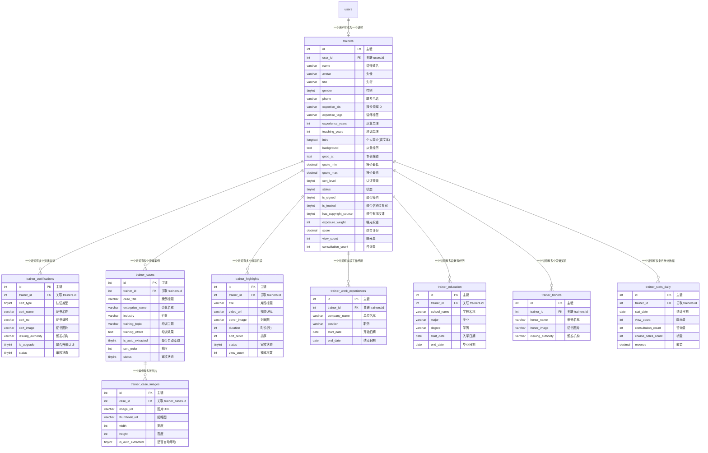

# 讲师模块 需求文档

## 1. 模块概述

讲师是平台的核心内容生产者与培训资源供给方，涵盖名师大咖、实战讲师、行业资深专家等类型。讲师模块提供从入驻认证、个人主页管理、课程发布与管理、授课片段展示，到收益查看与评价管理的完整功能闭环，帮助讲师提升个人曝光、对接培训需求、实现课程变现。

**核心业务目标：**

- 建立讲师入驻与资质认证体系，保障平台师资质量
- 提供多维度的个人主页展示与美化能力，提升讲师品牌形象
- 支持在线课、线下公开课、内训课、版权课等多种课程类型的发布与管理
- 提供数据统计与收益管理，辅助讲师运营决策
- 通过授课精彩片段提升讲师宣传能力

**典型用户行为路径：**

讲师入驻申请 → 资质认证 → 完善/美化个人主页 → 自动萃取讲师案例 → 发布课程（在线课/线下公开课/内训课/版权课） → 管理课程/曝光数据 → 上传精彩片段 → 查看收益/评价

---

## 2. 功能描述

### 2.1 入驻与认证

#### 2.1.1 入驻申请

- 讲师自主提交入驻申请，需填写：姓名、头衔、联系电话、核心擅长领域
- 上传资质证明（证书/职称）、授课案例、个人简介
- 提交后由后台客服审核，审核结果通过短信/平台消息通知
- **草稿保留机制**：未完成的入驻申请草稿保留 48 小时，超时自动删除

#### 2.1.2 资质升级认证

- 支持讲师提交更高等级资质证明（如行业认证、知名企业授课案例）
- 升级成功后平台增加曝光权重，优先推荐

### 2.2 个人主页管理

#### 2.2.1 简介美化

- 文字编辑：支持字体颜色调整（16 色可选）、字体大小调整（12-18 号）、加粗/斜体/下划线格式
- 图片编辑：支持上传背景图、案例图片，调整图片位置与大小
- 平台统一样式规范（待后续方案确定）

#### 2.2.2 基础信息编辑

- 可编辑字段：头像、姓名、头衔、从业经历、核心擅长领域
- **报价范围**：讲师可编辑、仅自己与后台客服可见，不展示在前台
- 授课案例上传/修改：需标注企业名称与培训效果，案例经后台客服审核后展示

#### 2.2.3 咨询对接（分阶段实现）

- **第一阶段**：仅保留留言功能，由平台运营人员实时响应和对接，不直通讲师
- **第二阶段**：对信得过的专家开放直达通道（虚拟号码通话），初期由人工介入协调

#### 2.2.4 自动萃取讲师案例

- 讲师上传含照片的简介资料后，系统自动识别带人物形象的精彩瞬间图片（授课现场、合影等）
- 识别图片需满足基础尺寸要求（具体尺寸待后续讨论）
- 自动萃取并提示讲师"是否添加至讲师案例库"
- 讲师确认后，图片自动同步至个人主页案例板块，支持手动调整排序

#### 2.2.5 主页数据展示

- 展示指标：曝光量、咨询量、课程销量、用户评价星级
- 支持按时间维度（周/月/年）查看数据趋势

### 2.3 AI 课件美化与生成（外接，仅 PC 端）

#### 2.3.1 AI 课件生成

- 输入课程主题、课纲，上传已有素材
- AI 自动生成课程大纲，大纲可编辑修改
- 确认大纲后选择 PPT 模板（支持上传自有模板），AI 生成 PPT 课件
- 生成后可在线修改编辑，支持导出

#### 2.3.2 PPT 美化

- 上传已有 PPT 课件，AI 自动优化页面布局、配色风格
- 美化后可在线预览、修改，支持导出

### 2.4 版权课管理

- 上传版权课信息：课程名称、定价、课程大纲、适用人群、版权证书、课程封面
- 版权课经后台客服审核通过后，在个人主页单独展示"版权课"板块，标注版权标识
- **定价由平台统一定义，讲师不可自行修改**

### 2.5 课程管理

#### 2.5.1 在线课发布

- 填写：课程名称、定价、课程简介、适用人群、课程目录、课程封面
- 支持分章节发布，设置免费试听章节（1-5 分钟）
- 讲师前台支持单个视频上传（大小要求另行约定），批量视频由后台客服统一上传
- 发布后经后台客服审核上线

#### 2.5.2 线下公开课发布

- 填写：课程名称、定价、开课城市/时间/场地、课程大纲、适合人群、报名须知、课程封面
- 支持设置名额上限、报名截止时间
- 发布后经后台审核上线

#### 2.5.3 内训课发布

- 填写：课程名称、课程简介、核心模块、适配行业、适配企业规模、授课时长、课程封面
- 上传讲师个人资质及过往企业内训案例
- **允许讲师填写定价**
- 不开放直接报名与交付入口，仅作为企业预约咨询的展示依据
- 发布后经后台客服审核上线，审核重点核查讲师资质、案例真实性及内容合规性

#### 2.5.4 课程编辑/上下架

- 支持对已发布课程做编辑（修改价格/大纲/视频）、下架/重新上架
- 公开课修改开课信息时，提前向报名用户发送通知
- 操作同步至后台，关键操作需二次确认

#### 2.5.5 课程数据统计

- 统计指标：曝光量、播放量/报名量、咨询量、销量、收益
- 支持按时间维度查看数据

### 2.6 授课精彩片段上传

- 讲师上传授课精彩片段（短视频），用于个人宣传
- 片段经后台审核后展示在个人主页
- 支持排序、删除
- 片段格式及大小要求另行约定，仅用于讲师宣传，不涉及课程付费内容

### 2.7 收益与评价

#### 2.7.1 收益管理

- 查看在线课/公开课课程销售、培训合作的收益明细
- 展示累计收益、结算时间、结算方式

#### 2.7.2 评价管理

- 查看甲方对自己/课程的评价
- 支持对评价做回复
- 支持对恶意评价提交申诉，附证据材料，由后台客服审核处理

---

## 3. 实体属性（字段设计）

### 3.1 trainers — 讲师主表

> 讲师核心信息表，与 `users` 通过 `user_id` 逻辑关联。

| 字段名 | 类型 | 必填 | 默认值 | 说明 |
|---|---|---|---|---|
| id | int | 是 | 自增 | 主键 |
| user_id | int | 是 | — | 关联用户表 users.id |
| name | varchar(100) | 是 | — | 讲师姓名 |
| avatar | varchar(500) | 否 | '' | 头像 URL |
| title | varchar(200) | 否 | '' | 头衔（如：资深管理顾问） |
| gender | tinyint | 否 | 0 | 性别：0=未知，1=男，2=女 |
| phone | varchar(20) | 是 | — | 联系电话 |
| email | varchar(200) | 否 | '' | 电子邮箱 |
| province_code | varchar(20) | 否 | NULL | 省份编码 |
| city_code | varchar(20) | 否 | NULL | 城市编码 |
| expertise_ids | varchar(500) | 否 | '' | 核心擅长领域 ID 列表，逗号分隔，关联分类表 |
| expertise_tags | varchar(500) | 否 | '' | 讲师自选/新增标签，逗号分隔 |
| experience_years | int | 否 | 0 | 从业年限 |
| teaching_years | int | 否 | 0 | 培训年限 |
| intro | longtext | 否 | NULL | 个人简介（富文本，支持美化格式） |
| background | text | 否 | NULL | 从业经历/背景 |
| good_at | text | 否 | NULL | 专长描述 |
| teaching_style | varchar(500) | 否 | '' | 授课风格 |
| quote_min | decimal(10,2) | 否 | NULL | 报价范围-最低（仅讲师与客服可见） |
| quote_max | decimal(10,2) | 否 | NULL | 报价范围-最高（仅讲师与客服可见） |
| quote_unit | varchar(20) | 否 | '天' | 报价单位：天/次/小时 |
| quote_remark | varchar(500) | 否 | '' | 报价备注（仅讲师与客服可见） |
| background_image | varchar(500) | 否 | '' | 主页背景图 URL |
| cert_level | tinyint | 否 | 0 | 认证等级：0=未认证，1=基础认证，2=高级认证，3=专家认证 |
| status | tinyint | 是 | 0 | 状态：0=草稿/待提交，1=待审核，2=审核通过，3=审核驳回，4=已禁用 |
| reject_reason | varchar(500) | 否 | '' | 审核驳回原因 |
| is_signed | tinyint | 否 | 0 | 是否签约讲师：0=否，1=是 |
| is_trusted | tinyint | 否 | 0 | 是否信得过专家（可直通）：0=否，1=是 |
| is_recommended | tinyint | 否 | 0 | 是否推荐讲师：0=否，1=是 |
| has_copyright_course | tinyint | 否 | 0 | 是否拥有版权课：0=否，1=是（冗余标记，用于列表标识展示） |
| exposure_weight | int | 否 | 0 | 曝光权重，资质升级后增加 |
| sort_order | int | 否 | 0 | 自定义排序值 |
| score | decimal(3,2) | 否 | 0.00 | 综合评分（1.00-5.00） |
| view_count | int | 否 | 0 | 累计曝光量 |
| consultation_count | int | 否 | 0 | 累计咨询量 |
| comment_count | int | 否 | 0 | 累计评论数 |
| draft_expired_at | datetime | 否 | NULL | 草稿过期时间（入驻申请草稿 48 小时有效） |
| approved_at | datetime | 否 | NULL | 审核通过时间 |
| created_at | datetime | 是 | CURRENT_TIMESTAMP | 创建时间 |
| updated_at | datetime | 是 | CURRENT_TIMESTAMP | 更新时间 |

**索引设计：**
- `idx_user_id` (user_id) — 用户关联查询
- `idx_status` (status) — 状态筛选
- `idx_cert_level` (cert_level) — 认证等级筛选
- `idx_expertise_ids` (expertise_ids) — 擅长领域筛选
- `idx_province_city` (province_code, city_code) — 地区筛选
- `idx_exposure_weight` (exposure_weight) — 曝光排序
- `idx_sort_order` (sort_order) — 自定义排序
- `idx_score` (score) — 评分排序
- `idx_draft_expired` (draft_expired_at) — 草稿清理定时任务

---

### 3.2 trainer_certifications — 讲师资质认证表

> 记录讲师的各类资质证明材料，支持多次认证与升级。

| 字段名 | 类型 | 必填 | 默认值 | 说明 |
|---|---|---|---|---|
| id | int | 是 | 自增 | 主键 |
| trainer_id | int | 是 | — | 关联 trainers.id |
| cert_type | tinyint | 是 | — | 认证类型：1=职称证书，2=行业认证，3=培训资质，4=学历证书，5=其他 |
| cert_name | varchar(200) | 是 | — | 证书/认证名称 |
| cert_no | varchar(100) | 否 | '' | 证书编号 |
| cert_image | varchar(500) | 是 | — | 证书图片 URL |
| issuing_authority | varchar(200) | 否 | '' | 颁发机构 |
| issued_at | date | 否 | NULL | 颁发日期 |
| expired_at | date | 否 | NULL | 到期日期（NULL 表示长期有效） |
| is_upgrade | tinyint | 否 | 0 | 是否为升级认证：0=否，1=是 |
| status | tinyint | 是 | 0 | 审核状态：0=待审核，1=审核通过，2=审核驳回 |
| reject_reason | varchar(500) | 否 | '' | 驳回原因 |
| reviewer_id | int | 否 | NULL | 审核人 ID |
| reviewed_at | datetime | 否 | NULL | 审核时间 |
| created_at | datetime | 是 | CURRENT_TIMESTAMP | 创建时间 |
| updated_at | datetime | 是 | CURRENT_TIMESTAMP | 更新时间 |

**索引设计：**
- `idx_trainer_id` (trainer_id) — 按讲师查询
- `idx_cert_type` (cert_type) — 按认证类型筛选
- `idx_status` (status) — 审核状态筛选

---

### 3.3 trainer_cases — 讲师授课案例表

> 记录讲师的授课案例，包含企业名称、培训效果等，需后台审核。

| 字段名 | 类型 | 必填 | 默认值 | 说明 |
|---|---|---|---|---|
| id | int | 是 | 自增 | 主键 |
| trainer_id | int | 是 | — | 关联 trainers.id |
| case_title | varchar(200) | 是 | — | 案例标题 |
| enterprise_name | varchar(200) | 是 | — | 企业名称 |
| industry | varchar(100) | 否 | '' | 所属行业 |
| training_topic | varchar(200) | 否 | '' | 培训主题 |
| training_effect | text | 否 | NULL | 培训效果描述 |
| trainee_count | int | 否 | NULL | 培训人数 |
| training_date | date | 否 | NULL | 培训日期 |
| description | text | 否 | NULL | 案例详细描述 |
| cover_image | varchar(500) | 否 | '' | 案例封面图 URL |
| is_auto_extracted | tinyint | 否 | 0 | 是否由系统自动萃取：0=否，1=是 |
| sort_order | int | 否 | 0 | 排序值，值越大越靠前 |
| status | tinyint | 是 | 0 | 审核状态：0=待审核，1=审核通过，2=审核驳回 |
| reject_reason | varchar(500) | 否 | '' | 驳回原因 |
| reviewer_id | int | 否 | NULL | 审核人 ID |
| reviewed_at | datetime | 否 | NULL | 审核时间 |
| created_at | datetime | 是 | CURRENT_TIMESTAMP | 创建时间 |
| updated_at | datetime | 是 | CURRENT_TIMESTAMP | 更新时间 |

**索引设计：**
- `idx_trainer_id` (trainer_id) — 按讲师查询
- `idx_status` (status) — 审核状态筛选
- `idx_sort_order` (sort_order) — 排序

---

### 3.4 trainer_case_images — 授课案例图片表

> 每个案例可关联多张图片，支持自动萃取的授课现场照片。

| 字段名 | 类型 | 必填 | 默认值 | 说明 |
|---|---|---|---|---|
| id | int | 是 | 自增 | 主键 |
| case_id | int | 是 | — | 关联 trainer_cases.id |
| image_url | varchar(500) | 是 | — | 图片 URL |
| thumbnail_url | varchar(500) | 否 | '' | 缩略图 URL |
| width | int | 否 | 0 | 图片宽度（px） |
| height | int | 否 | 0 | 图片高度（px） |
| is_auto_extracted | tinyint | 否 | 0 | 是否系统自动萃取：0=否，1=是 |
| sort_order | int | 否 | 0 | 排序值 |
| created_at | datetime | 是 | CURRENT_TIMESTAMP | 创建时间 |
| updated_at | datetime | 是 | CURRENT_TIMESTAMP | 更新时间 |

**索引设计：**
- `idx_case_id` (case_id) — 按案例查询

---

### 3.5 trainer_highlights — 讲师精彩片段表

> 讲师上传的授课精彩短视频，用于个人宣传，需后台审核。

| 字段名 | 类型 | 必填 | 默认值 | 说明 |
|---|---|---|---|---|
| id | int | 是 | 自增 | 主键 |
| trainer_id | int | 是 | — | 关联 trainers.id |
| title | varchar(200) | 是 | — | 片段标题 |
| description | varchar(500) | 否 | '' | 片段描述 |
| video_url | varchar(500) | 是 | — | 视频文件 URL |
| cover_image | varchar(500) | 否 | '' | 视频封面图 URL |
| duration | int | 否 | 0 | 视频时长（秒） |
| file_size | bigint | 否 | 0 | 文件大小（字节） |
| sort_order | int | 否 | 0 | 排序值，值越大越靠前 |
| status | tinyint | 是 | 0 | 审核状态：0=待审核，1=审核通过，2=审核驳回 |
| reject_reason | varchar(500) | 否 | '' | 驳回原因 |
| reviewer_id | int | 否 | NULL | 审核人 ID |
| reviewed_at | datetime | 否 | NULL | 审核时间 |
| view_count | int | 否 | 0 | 播放次数 |
| created_at | datetime | 是 | CURRENT_TIMESTAMP | 创建时间 |
| updated_at | datetime | 是 | CURRENT_TIMESTAMP | 更新时间 |

**索引设计：**
- `idx_trainer_id` (trainer_id) — 按讲师查询
- `idx_status` (status) — 审核状态筛选
- `idx_sort_order` (sort_order) — 排序

---

### 3.6 trainer_work_experiences — 讲师工作经历表

> 记录讲师的从业经历。

| 字段名 | 类型 | 必填 | 默认值 | 说明 |
|---|---|---|---|---|
| id | int | 是 | 自增 | 主键 |
| trainer_id | int | 是 | — | 关联 trainers.id |
| company_name | varchar(200) | 是 | — | 单位名称 |
| position | varchar(100) | 否 | '' | 职务 |
| start_date | date | 是 | — | 开始日期 |
| end_date | date | 否 | NULL | 结束日期（NULL 表示至今） |
| description | text | 否 | NULL | 工作描述 |
| sort_order | int | 否 | 0 | 排序值 |
| created_at | datetime | 是 | CURRENT_TIMESTAMP | 创建时间 |
| updated_at | datetime | 是 | CURRENT_TIMESTAMP | 更新时间 |

**索引设计：**
- `idx_trainer_id` (trainer_id) — 按讲师查询

---

### 3.7 trainer_education — 讲师教育经历表

> 记录讲师的教育背景。

| 字段名 | 类型 | 必填 | 默认值 | 说明 |
|---|---|---|---|---|
| id | int | 是 | 自增 | 主键 |
| trainer_id | int | 是 | — | 关联 trainers.id |
| school_name | varchar(200) | 是 | — | 学校名称 |
| major | varchar(100) | 否 | '' | 所学专业 |
| degree | varchar(50) | 否 | '' | 学历/学位 |
| start_date | date | 是 | — | 入学日期 |
| end_date | date | 否 | NULL | 毕业日期（NULL 表示在读） |
| is_graduated | tinyint | 否 | 1 | 是否毕业：0=否，1=是 |
| diploma_image | varchar(500) | 否 | '' | 文凭照片 URL |
| sort_order | int | 否 | 0 | 排序值 |
| created_at | datetime | 是 | CURRENT_TIMESTAMP | 创建时间 |
| updated_at | datetime | 是 | CURRENT_TIMESTAMP | 更新时间 |

**索引设计：**
- `idx_trainer_id` (trainer_id) — 按讲师查询

---

### 3.8 trainer_honors — 讲师荣誉奖项表

> 记录讲师获得的荣誉与奖项。

| 字段名 | 类型 | 必填 | 默认值 | 说明 |
|---|---|---|---|---|
| id | int | 是 | 自增 | 主键 |
| trainer_id | int | 是 | — | 关联 trainers.id |
| honor_name | varchar(200) | 是 | — | 荣誉名称 |
| honor_image | varchar(500) | 否 | '' | 荣誉证书/图片 URL |
| issuing_authority | varchar(200) | 否 | '' | 颁发机构 |
| issued_at | date | 否 | NULL | 获得日期 |
| description | text | 否 | NULL | 荣誉描述 |
| sort_order | int | 否 | 0 | 排序值 |
| created_at | datetime | 是 | CURRENT_TIMESTAMP | 创建时间 |
| updated_at | datetime | 是 | CURRENT_TIMESTAMP | 更新时间 |

**索引设计：**
- `idx_trainer_id` (trainer_id) — 按讲师查询

---

### 3.9 trainer_stats_daily — 讲师数据统计日表

> 按天记录讲师的核心运营数据，用于数据趋势分析。

| 字段名 | 类型 | 必填 | 默认值 | 说明 |
|---|---|---|---|---|
| id | int | 是 | 自增 | 主键 |
| trainer_id | int | 是 | — | 关联 trainers.id |
| stat_date | date | 是 | — | 统计日期 |
| view_count | int | 否 | 0 | 当日曝光量 |
| consultation_count | int | 否 | 0 | 当日咨询量 |
| course_sales_count | int | 否 | 0 | 当日课程销量 |
| revenue | decimal(12,2) | 否 | 0.00 | 当日收益金额 |
| created_at | datetime | 是 | CURRENT_TIMESTAMP | 创建时间 |
| updated_at | datetime | 是 | CURRENT_TIMESTAMP | 更新时间 |

**索引设计：**
- `idx_trainer_date` (trainer_id, stat_date) — 唯一索引，按讲师+日期查询
- `idx_stat_date` (stat_date) — 按日期范围查询

---

## 4. ER 关系说明



---

## 5. 业务逻辑与规则

### 5.1 入驻审核流程

```
讲师填写入驻信息 → 保存草稿（48小时有效）→ 提交申请(status=1)
    → 后台客服审核
        → 通过(status=2)：激活讲师账号，发送通知
        → 驳回(status=3)：填写驳回原因，发送通知，讲师可修改后重新提交
```

- **草稿清理**：定时任务每小时扫描 `draft_expired_at < NOW() AND status = 0` 的记录，执行软删除或物理删除
- **审核通知**：审核结果通过短信 + 平台站内消息双通道通知

### 5.2 资质升级规则

- 讲师状态为"审核通过"后方可申请资质升级
- 升级需提交新的认证记录（`is_upgrade=1`）
- 升级审核通过后：
  - 更新 `trainers.cert_level` 为对应等级
  - 增加 `trainers.exposure_weight`（具体增量由后台配置）
  - 曝光权重影响搜索排序与推荐列表排序

### 5.3 案例审核与自动萃取

- 讲师上传/修改的授课案例必须经后台客服审核后方可在前台展示
- 案例必须标注企业名称与培训效果，缺少必填项不允许提交审核
- **自动萃取流程**：
  1. 讲师上传简介资料（含图片）
  2. 系统异步调用图像识别服务，检测带人物形象的图片
  3. 符合基础尺寸要求的图片标记为候选
  4. 向讲师推送提示消息"是否添加至案例库"
  5. 讲师确认后，自动创建 `trainer_case_images` 记录（`is_auto_extracted=1`），并同步至个人主页

### 5.4 精彩片段管理规则

- 片段仅用于讲师宣传展示，不涉及付费课程内容
- 上传后必须经后台客服审核方可展示
- 讲师可调整已审核通过的片段排序
- 片段格式与大小限制由系统配置决定（后续确定具体值）

### 5.5 报价范围可见性

- 报价范围字段（`quote_min`、`quote_max`、`quote_unit`、`quote_remark`）为敏感信息
- **可见范围**：仅讲师本人 + 后台客服可查看
- **前台接口**：讲师详情页公开接口不返回报价字段
- 讲师编辑报价后，数据同步至后台客服工作台

### 5.6 主页数据统计

- `trainer_stats_daily` 由后台定时任务每日凌晨汇总前一天数据生成
- 数据来源：曝光量取访问日志、咨询量取消息记录、销量取订单表、收益取结算表
- 前端展示支持按周（近 7 天）、月（近 30 天）、年（近 365 天）聚合查询
- `trainers` 主表中的 `view_count`、`consultation_count`、`comment_count` 为累计冗余值，通过事件驱动实时更新

### 5.7 讲师与课程的关系

- 课程（在线课、公开课、内训课、版权课）属于独立模块，通过 `trainer_id` 关联本模块
- 内训课与讲师高度绑定，每门内训课明确专属核心讲师
- 版权课审核通过后，更新 `trainers.has_copyright_course = 1`
- 讲师被禁用时，其名下所有课程自动下架

### 5.8 评分计算规则

- `trainers.score` 为综合评分，取所有已审核通过的评价的加权平均分
- 评分更新由评价模块通过事件通知触发
- 评分精度保留两位小数（1.00 ~ 5.00）

### 5.9 状态机

```
[草稿/待提交](0) --提交申请--> [待审核](1)
[待审核](1) --审核通过--> [审核通过](2)
[待审核](1) --审核驳回--> [审核驳回](3)
[审核驳回](3) --修改后重新提交--> [待审核](1)
[审核通过](2) --管理员禁用--> [已禁用](4)
[已禁用](4) --管理员恢复--> [审核通过](2)
```

---

## 6. 与其他模块的依赖关系

| 依赖模块 | 关系说明 |
|---|---|
| **用户模块 (users)** | `trainers.user_id → users.id`，讲师是用户的一种角色扩展；用户注册后申请成为讲师 |
| **分类模块 (categories)** | `trainers.expertise_ids` 关联分类表中的培训领域分类 |
| **课程模块 (courses)** | 在线课、公开课、内训课通过 `trainer_id` 关联讲师；课程的发布、上下架、数据统计等逻辑在课程模块实现 |
| **版权课模块 (copyright_courses)** | 版权课通过 `trainer_id` 关联讲师，审核通过后更新讲师 `has_copyright_course` 标记 |
| **评价模块 (reviews)** | 甲方对讲师/课程的评价关联讲师，评分变更触发 `trainers.score` 更新 |
| **订单模块 (orders)** | 课程销售订单关联讲师，用于收益统计 |
| **收益结算模块 (settlements)** | 讲师收益明细、累计收益、结算方式等在结算模块管理 |
| **消息通知模块 (notifications)** | 审核结果通知、课程状态变更通知、评价回复通知等通过消息模块发送（短信 + 站内消息） |
| **文件存储模块 (attachments)** | 讲师头像、资质证书、案例图片、精彩片段视频等文件的上传与存储 |
| **审核工作台 (admin)** | 后台客服对讲师入驻、案例、精彩片段、版权课等内容的审核操作 |
| **AI 服务（外接）** | 图像识别（自动萃取案例图片）、课件生成与美化等 AI 能力通过外部服务集成 |

---

## 7. 参考旧表

以下为旧系统中与讲师模块相关的数据表，供迁移与字段对照参考：

| 旧表名 | 说明 | 新表映射 |
|---|---|---|
| `tk_member` | 用户主表（`groupid=9` 为讲师），含姓名、擅长领域、省市、公司、简介、评分、点击数、评论数、是否推荐、是否签约等 | `trainers`（拆分讲师专属字段） + `users`（通用用户字段） |
| `tk_member_ext` | 用户扩展表，含手机、报价、行业背景、授课风格、培训年限、资格证书、主打课程、典型案例、擅长课题等 | `trainers`（报价、培训年限、授课风格等） |
| `tk_member_auth` | 认证标识表，含讲师认证、实名认证、质量认证、金牌讲师、信得过等标识 | `trainers.cert_level` + `trainer_certifications` |
| `tk_member_authinfo` | 认证详情表，含身份证、银行卡、公司认证等材料 | `trainer_certifications`（证书类材料） |
| `tk_member_quality` | 质量三包记录表 | `trainers.cert_level`（认证等级体系替代） |
| `tk_member_work` | 工作经历表 | `trainer_work_experiences` |
| `tk_member_education` | 教育经历表 | `trainer_education` |
| `tk_member_honor` | 荣誉表 | `trainer_honors` |
| `tk_member_product` | 讲师产品/课程表 | 课程模块独立（`courses` 等表） |
| `tk_member_comment` | 评论表 | 评价模块独立（`reviews` 等表） |
| `tk_member_access_log` | 访问日志表 | `trainer_stats_daily`（聚合统计） |
| `tk_member_intro_ext` | 业务介绍扩展表 | `trainers.intro`（富文本简介） |
| `tk_member_style` | 讲师风格表 | `trainers.teaching_style` |

### 旧表关键字段对照

```
tk_member.realname        → trainers.name
tk_member.cid             → trainers.expertise_ids
tk_member.province/city   → trainers.province_code / city_code
tk_member.company         → trainer_work_experiences.company_name
tk_member.intro           → trainers.intro
tk_member.goodat          → trainers.good_at
tk_member.score           → trainers.score
tk_member.clicknum        → trainers.view_count
tk_member.commentnum      → trainers.comment_count
tk_member.isrec           → trainers.is_recommended
tk_member.issign          → trainers.is_signed
tk_member_ext.price       → trainers.quote_min / quote_max
tk_member_ext.trade       → trainers.expertise_ids (行业背景)
tk_member_ext.teaching_experience → trainers.teaching_years
tk_member_ext.teaching_methods    → trainers.teaching_style
tk_member_ext.classic_case        → trainer_cases
tk_member_ext.credential          → trainer_certifications
tk_member_auth.istrainer          → trainers.cert_level
tk_member_auth.isqc               → trainers.cert_level
tk_member_auth.is_xdg             → trainers.is_trusted
```
