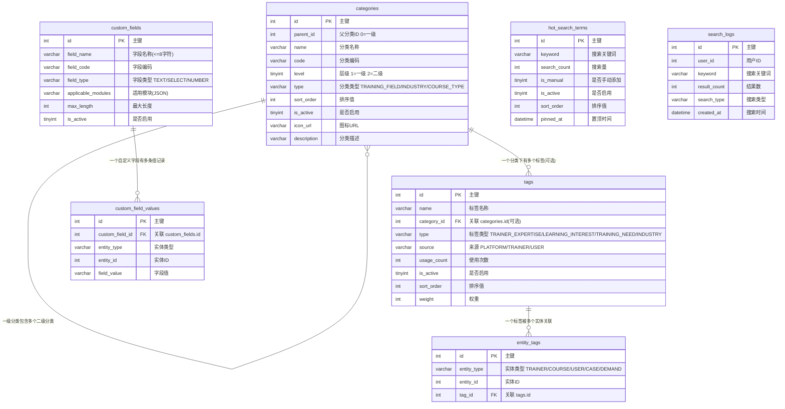

# 分类、标签与自定义字段模块 需求文档

> 模块编码：`category`
> 版本：v1.0
> 最后更新：2026-03-19

---

## 1. 模块概述

### 1.1 核心定位

分类、标签与自定义字段模块是淘课网平台的**基础支撑模块**，为课程、讲师、案例、需求、用户等核心实体提供统一的分类体系、标签管理、热门搜索词维护及自定义字段扩展能力。本模块不直接面向终端用户交互，而是为其他业务模块提供**数据分类、内容打标、搜索引导与字段扩展**的底层服务。

### 1.2 核心业务目标

- 建立平台统一的**两级分类体系**（培训领域/行业分类），覆盖课程分类、讲师擅长领域、需求匹配、搜索筛选等全场景
- 构建灵活的**标签库**，支持平台预设标签与讲师/用户自创标签共存，实现多维度内容打标与精准推荐
- 通过**热门搜索词**引导用户发现热点内容，提升搜索转化率
- 提供**自定义字段管理**能力，使后台客服可灵活扩展核心业务实体的数据字段，并与批量导入/导出功能联动

### 1.3 典型应用场景

```
平台运营定义一级分类（职场办公/销售技能/领导力/AI赋能...）
    → 讲师入驻时选择擅长领域分类 + 自选/新增标签
    → 课程发布时关联分类 + 打标签
    → 用户搜索/筛选课程：按分类筛选、按标签过滤
    → 首页搜索框展示热门搜索词 → 用户点击直接搜索
    → 后台客服新增自定义字段 → 自动同步至导入/导出模板
```

---

## 2. 功能描述

### 2.1 培训领域/行业分类

#### 2.1.1 两级分类体系

- **一级分类（培训领域）**：由开发团队/平台运营预设，如：职场办公、销售技能、领导力、AI 赋能、生产管理、人力资源、财务管理、市场营销、供应链管理、项目管理等
- **二级分类（细分标签级）**：由讲师/平台运营动态维护，如：领导力 → 高管领导力、中层管理、团队建设、变革管理
- 一级分类相对固定，二级分类可由讲师在入驻/发布课程时按需新增（需审核或自动生效，由后台配置）

#### 2.1.2 分类使用场景

| 使用场景 | 说明 |
|---------|------|
| 课程分类 | 课程发布时选择所属一级分类 + 二级分类 |
| 讲师擅长领域 | 讲师入驻/编辑资料时选择擅长的分类领域 |
| 需求匹配 | 企业发布培训需求时选择培训领域，用于与讲师/课程匹配 |
| 搜索筛选 | 课程列表、讲师列表、公开课列表、案例列表、内训课列表均支持按分类筛选 |
| 数据统计 | 按分类维度统计课程数、讲师数、需求量等运营指标 |

#### 2.1.3 分类类型

| 分类类型 | 编码 | 说明 |
|---------|------|------|
| 培训领域 | `TRAINING_FIELD` | 课程/讲师的培训方向分类，如职场办公、销售技能 |
| 行业分类 | `INDUSTRY` | 适配的行业维度分类，如金融、制造、互联网、医药 |
| 课程类型 | `COURSE_TYPE` | 特殊课程分类维度，如版权课程类型 |

#### 2.1.4 后台管理

- 后台客服/管理员可新增、编辑、排序、启用/停用分类
- 停用分类后，已关联该分类的数据不受影响，但新数据不可再选择该分类
- 支持为分类设置图标、描述，用于前端展示

### 2.2 标签库

#### 2.2.1 标签体系设计

- **一级菜单（标签类型）** 由开发者确定，不可由用户修改
- **二级菜单（具体标签）** 由讲师/用户自行创建或从平台预设标签中选择
- 同一实体支持关联多个标签

#### 2.2.2 标签类型

| 标签类型 | 编码 | 适用实体 | 说明 |
|---------|------|---------|------|
| 讲师专长 | `TRAINER_EXPERTISE` | 讲师 | 讲师的专业技能标签，如"绩效管理""教练式领导" |
| 学习兴趣 | `LEARNING_INTEREST` | 用户 | 个人学习偏好，如"AI 办公""销售技能" |
| 培训需求 | `TRAINING_NEED` | 需求/企业 | 企业培训需求标签，如"销售培训""生产管理""AI 赋能" |
| 行业标签 | `INDUSTRY` | 讲师/课程/案例 | 行业维度标签，如"金融""制造""互联网" |

#### 2.2.3 标签来源

| 来源 | 编码 | 说明 |
|------|------|------|
| 平台预设 | `PLATFORM` | 平台运营团队维护的通用标签，覆盖主流培训领域 |
| 讲师创建 | `TRAINER` | 讲师在入驻/编辑资料/发布课程时自行输入的新标签 |
<!-- | 用户创建 | `USER` | 用户在填写学习兴趣/培训需求时自行输入的新标签 | -->
| 规则约束 | — | 个人/企业用户（B/C端）仅可按系统分类管理或选择已有标签，**暂不支持普通用户自定义/新建标签** |

#### 2.2.4 标签管理规则

- 平台团队定期维护标签库：合并同义标签、清理无效标签、调整权重
- 标签使用量（`usage_count`）随实体关联/取消关联实时更新
- 前端展示标签时限制数量，按权重（`weight`）/ 使用量排序
- 用户前端不区分"标签"与"关键词"，系统内部通过标签类型和权重区分，用于推荐与搜索

#### 2.2.5 标签活跃度指标

- 统计标签创建量变化趋势
- 统计标签库整体活跃度（新增标签数/关联增量/高频标签 Top N）
- 后台可查看标签使用排行、低活跃标签预警

### 2.3 热门搜索词

#### 2.3.1 展示规则

- 展示位置：首页搜索框下方
- 展示内容：平台近 30 天高频搜索关键词（涵盖课程、讲师、培训领域等搜索维度）
- 排序规则：按搜索量降序排列
- 交互方式：用户点击热门搜索词，直接触发对应关键词的搜索

#### 2.3.2 数据来源

- **自动采集**：系统自动记录用户搜索行为至 `search_logs` 表，定时任务（每日凌晨）统计近 30 天搜索量，自动更新 `hot_search_terms` 表
- **手动管理**：后台客服可手动新增/删除/置顶热门关键词（如：两会政策解读、新质生产力、AI 办公等时事热点）
- 手动添加的关键词标记 `is_manual = 1`，置顶展示，不受自动统计排序影响

#### 2.3.3 后台管理

- 查看当前热门搜索词列表（含搜索量、来源类型、是否置顶）
- 手动添加热搜词（最大 8 字符）
- 手动删除/停用不合适的热搜词
- 调整手动热搜词的排序与置顶状态
- 支持查看搜索日志明细（关键词、搜索时间、搜索类型、结果数）

### 2.4 自定义字段管理

#### 2.4.1 功能说明

- 后台客服/管理员可为核心业务实体新增自定义字段，无需开发介入
- 适用场景举例：新增"版权课程类型""增值工具权限""用户采购类型""公开课状态"等运营扩展字段
- 自定义字段可应用于多个模块，通过 `applicable_modules` 配置

#### 2.4.2 字段规则

| 规则 | 说明 |
|------|------|
| 字段名长度 | ≤ 8 个字符 |
| 字段类型 | 文本（TEXT）、下拉选择（SELECT）、数字（NUMBER） |
| 重名处理 | 新增字段名与已有字段重名时，自动覆盖原有数据 |
| 导入/导出同步 | 新增自定义字段自动同步至所有相关模块的批量导入模板、导出模板、文件上传功能中，按字段名匹配 |
| 启停控制 | 支持启用/停用自定义字段，停用后导入/导出模板中不再包含该字段 |

#### 2.4.3 自定义字段值存储

- 自定义字段的值通过 `custom_field_values` 表以 EAV（实体-属性-值）模式存储
- 支持不同实体类型（课程、讲师、用户、需求等）共用同一套自定义字段体系
- 查询自定义字段值时，通过 `entity_type` + `entity_id` + `custom_field_id` 三元组定位

---

## 3. 实体属性（字段设计）

### 3.1 categories — 分类表

> 统一管理平台的两级分类体系，通过 `parent_id` 实现层级关系，通过 `type` 区分分类维度。

| 字段名 | 类型 | 允许 NULL | 默认值 | 说明 |
|--------|------|-----------|--------|------|
| `id` | int | NO | AUTO_INCREMENT | 主键 |
| `parent_id` | int | NO | 0 | 父分类 ID，0 表示一级分类 |
| `name` | varchar(100) | NO | — | 分类名称 |
| `code` | varchar(50) | YES | NULL | 分类编码（英文标识，如 `WORKPLACE`、`SALES`），用于程序引用 |
| `level` | tinyint | NO | 1 | 层级：1=一级分类，2=二级分类 |
| `type` | varchar(30) | NO | — | 分类类型：`TRAINING_FIELD`=培训领域，`INDUSTRY`=行业分类，`COURSE_TYPE`=课程类型 |
| `sort_order` | int | NO | 0 | 排序值（值越大越靠前） |
| `is_active` | tinyint | NO | 1 | 是否启用：0=停用，1=启用 |
| `icon_url` | varchar(500) | YES | NULL | 分类图标 URL |
| `description` | varchar(500) | YES | NULL | 分类描述 |
| `created_at` | datetime | NO | CURRENT_TIMESTAMP | 创建时间 |
| `updated_at` | datetime | NO | CURRENT_TIMESTAMP | 更新时间 |

**索引设计：**
- `idx_parent_id` (parent_id) — 按父分类查询子分类
- `idx_type_level` (type, level) — 按类型+层级查询分类列表
- `idx_type_active` (type, is_active) — 按类型查询启用中的分类
- `UNIQUE idx_code` (code) — 分类编码唯一（code 非 NULL 时）
- `idx_sort_order` (sort_order) — 排序

---

### 3.2 tags — 标签表

> 标签库主表，存储平台预设标签和讲师/用户创建的标签。通过 `category_id` 可选关联分类表，实现标签与分类的松耦合。

| 字段名 | 类型 | 允许 NULL | 默认值 | 说明 |
|--------|------|-----------|--------|------|
| `id` | int | NO | AUTO_INCREMENT | 主键 |
| `name` | varchar(100) | NO | — | 标签名称 |
| `category_id` | int | YES | NULL | 关联分类 ID（可选，标签可归属于某个分类） |
| `type` | varchar(30) | NO | — | 标签类型：`TRAINER_EXPERTISE`=讲师专长，`LEARNING_INTEREST`=学习兴趣，`TRAINING_NEED`=培训需求，`INDUSTRY`=行业标签 |
| `source` | varchar(20) | NO | 'PLATFORM' | 来源：`PLATFORM`=平台预设，`TRAINER`=讲师创建，`USER`=用户创建 |
| `usage_count` | int | NO | 0 | 使用次数（被关联的实体数量），实时更新 |
| `is_active` | tinyint | NO | 1 | 是否启用：0=停用，1=启用 |
| `sort_order` | int | NO | 0 | 排序值（值越大越靠前） |
| `weight` | int | NO | 0 | 权重值，影响前端展示优先级与推荐排序 |
| `created_at` | datetime | NO | CURRENT_TIMESTAMP | 创建时间 |
| `updated_at` | datetime | NO | CURRENT_TIMESTAMP | 更新时间 |

**索引设计：**
- `idx_type_active` (type, is_active) — 按类型查询启用中的标签
- `idx_category_id` (category_id) — 按分类查询标签
- `idx_source` (source) — 按来源筛选
- `idx_usage_count` (usage_count) — 按使用量排序
- `idx_weight` (weight) — 按权重排序
- `UNIQUE idx_name_type` (name, type) — 同类型下标签名称唯一

---

### 3.3 entity_tags — 实体-标签关联表

> 通用的实体与标签多对多关联表，通过 `entity_type` + `entity_id` 实现多态关联。

| 字段名 | 类型 | 允许 NULL | 默认值 | 说明 |
|--------|------|-----------|--------|------|
| `id` | int | NO | AUTO_INCREMENT | 主键 |
| `entity_type` | varchar(20) | NO | — | 实体类型：`TRAINER`=讲师，`COURSE`=课程，`USER`=用户，`CASE`=案例，`DEMAND`=需求 |
| `entity_id` | int | NO | — | 实体 ID |
| `tag_id` | int | NO | — | 关联 tags.id |
| `created_at` | datetime | NO | CURRENT_TIMESTAMP | 关联创建时间 |

**索引设计：**
- `UNIQUE idx_entity_tag` (entity_type, entity_id, tag_id) — 同一实体不重复关联同一标签
- `idx_entity` (entity_type, entity_id) — 查询某实体的全部标签
- `idx_tag_id` (tag_id) — 查询某标签关联的全部实体

---

### 3.4 hot_search_terms — 热门搜索词表

> 存储首页热门搜索词，包含自动统计和手动管理的关键词。

| 字段名 | 类型 | 允许 NULL | 默认值 | 说明 |
|--------|------|-----------|--------|------|
| `id` | int | NO | AUTO_INCREMENT | 主键 |
| `keyword` | varchar(50) | NO | — | 搜索关键词 |
| `search_count` | int | NO | 0 | 近 30 天搜索量（自动统计） |
| `is_manual` | tinyint | NO | 0 | 是否手动添加：0=自动统计，1=手动添加 |
| `is_active` | tinyint | NO | 1 | 是否启用：0=停用，1=启用 |
| `sort_order` | int | NO | 0 | 排序值（手动排序，值越大越靠前） |
| `pinned_at` | datetime | YES | NULL | 置顶时间（非 NULL 表示置顶，置顶词优先展示） |
| `created_at` | datetime | NO | CURRENT_TIMESTAMP | 创建时间 |
| `updated_at` | datetime | NO | CURRENT_TIMESTAMP | 更新时间 |

**索引设计：**
- `UNIQUE idx_keyword` (keyword) — 关键词唯一
- `idx_active_sort` (is_active, sort_order) — 启用中的热搜词排序查询
- `idx_search_count` (search_count) — 按搜索量排序

---

### 3.5 search_logs — 搜索日志表

> 记录用户的每一次搜索行为，用于热门搜索词统计和搜索分析。数据量较大，定期归档。

| 字段名 | 类型 | 允许 NULL | 默认值 | 说明 |
|--------|------|-----------|--------|------|
| `id` | int | NO | AUTO_INCREMENT | 主键 |
| `user_id` | int | YES | NULL | 搜索用户 ID（未登录为 NULL） |
| `keyword` | varchar(200) | NO | — | 搜索关键词 |
| `result_count` | int | NO | 0 | 搜索结果数量 |
| `search_type` | varchar(20) | YES | NULL | 搜索类型：`COURSE`=课程，`TRAINER`=讲师，`ALL`=综合搜索 |
| `created_at` | datetime | NO | CURRENT_TIMESTAMP | 搜索时间 |

**索引设计：**
- `idx_keyword` (keyword) — 按关键词统计搜索量
- `idx_created_at` (created_at) — 按时间范围查询（近 30 天统计）
- `idx_user_id` (user_id) — 按用户查询搜索历史
- `idx_search_type` (search_type, created_at) — 按搜索类型+时间范围统计

---

### 3.6 custom_fields — 自定义字段表

> 后台客服/管理员定义的扩展字段，可应用于多个业务模块。

| 字段名 | 类型 | 允许 NULL | 默认值 | 说明 |
|--------|------|-----------|--------|------|
| `id` | int | NO | AUTO_INCREMENT | 主键 |
| `field_name` | varchar(8) | NO | — | 字段名称（≤8 字符，中文名，用于前端展示与导入/导出匹配） |
| `field_code` | varchar(50) | NO | — | 字段编码（英文标识，程序引用） |
| `field_type` | varchar(20) | NO | 'TEXT' | 字段类型：`TEXT`=文本，`SELECT`=下拉选择，`NUMBER`=数字 |
| `options` | varchar(2000) | YES | NULL | 下拉选项值（JSON 数组，仅 `field_type=SELECT` 时有值，如 `["选项A","选项B"]`） |
| `applicable_modules` | varchar(500) | NO | — | 适用模块（JSON 数组，如 `["COURSE","TRAINER","DEMAND"]`） |
| `max_length` | int | YES | NULL | 字段值最大长度（仅 TEXT 类型有效） |
| `is_active` | tinyint | NO | 1 | 是否启用：0=停用，1=启用 |
| `sort_order` | int | NO | 0 | 排序值 |
| `created_by` | int | YES | NULL | 创建人（后台管理员 ID） |
| `created_at` | datetime | NO | CURRENT_TIMESTAMP | 创建时间 |
| `updated_at` | datetime | NO | CURRENT_TIMESTAMP | 更新时间 |

**索引设计：**
- `UNIQUE idx_field_name` (field_name) — 字段名唯一（重名覆盖策略在业务层实现）
- `UNIQUE idx_field_code` (field_code) — 字段编码唯一
- `idx_is_active` (is_active) — 查询启用中的字段

---

### 3.7 custom_field_values — 自定义字段值表

> EAV 模式存储自定义字段的具体值，通过 `entity_type` + `entity_id` 关联业务实体。

| 字段名 | 类型 | 允许 NULL | 默认值 | 说明 |
|--------|------|-----------|--------|------|
| `id` | int | NO | AUTO_INCREMENT | 主键 |
| `custom_field_id` | int | NO | — | 关联 custom_fields.id |
| `entity_type` | varchar(20) | NO | — | 实体类型：`COURSE`=课程，`TRAINER`=讲师，`USER`=用户，`DEMAND`=需求，`OPEN_COURSE`=公开课 |
| `entity_id` | int | NO | — | 实体 ID |
| `field_value` | varchar(2000) | YES | NULL | 字段值（统一存储为字符串，NUMBER 类型在业务层转换） |
| `created_at` | datetime | NO | CURRENT_TIMESTAMP | 创建时间 |
| `updated_at` | datetime | NO | CURRENT_TIMESTAMP | 更新时间 |

**索引设计：**
- `UNIQUE idx_field_entity` (custom_field_id, entity_type, entity_id) — 同一字段同一实体仅一条记录
- `idx_entity` (entity_type, entity_id) — 查询某实体的全部自定义字段值
- `idx_custom_field_id` (custom_field_id) — 按字段查询所有值

---
<!-- 
## 4. ER 关系说明

### 4.1 ER 图



### 4.2 关系说明

| 关系 | 类型 | 说明 |
|------|------|------|
| `categories` → `categories` | 自关联（一对多） | 一级分类通过 `parent_id=0` 标识，二级分类通过 `parent_id` 指向一级分类 |
| `categories` → `tags` | 一对多（可选） | 标签可通过 `category_id` 归属于某个分类，也可不归属（`category_id=NULL`） |
| `tags` → `entity_tags` | 一对多 | 一个标签可被多个实体关联 |
| `entity_tags` → 业务实体 | 多态关联 | 通过 `entity_type` + `entity_id` 关联讲师/课程/用户/案例/需求等 |
| `custom_fields` → `custom_field_values` | 一对多 | 一个自定义字段可存储多个实体的值 |
| `custom_field_values` → 业务实体 | 多态关联 | 通过 `entity_type` + `entity_id` 关联具体业务实体 |
| `search_logs` → `hot_search_terms` | 统计关系 | `search_logs` 的搜索数据定时聚合更新到 `hot_search_terms.search_count` |

> **注意：** 数据库层面不建外键，所有关联关系在代码逻辑中维护。

--- -->

## 5. 业务逻辑与规则

### 5.1 分类管理规则

| 规则 | 说明 |
|------|------|
| 层级限制 | 最多两级，一级分类 `parent_id=0, level=1`，二级分类 `parent_id>0, level=2` |
| 一级分类管理 | 仅平台运营/管理员可新增、编辑、排序一级分类 |
| 二级分类管理 | 平台运营可维护；讲师在入驻/发布课程时可申请新增二级分类 |
| 停用规则 | 停用分类时，已关联该分类的实体数据保持不变，仅新创建/编辑时不可选择该分类 |
| 删除保护 | 存在关联数据的分类不允许物理删除，仅允许停用 |
| 编码规范 | `code` 字段使用大写英文+下划线格式，如 `WORKPLACE_OFFICE`、`AI_EMPOWERMENT` |

### 5.2 标签创建与维护规则

```
讲师输入标签名称
    → 系统检索已有标签库
        → 存在同名同类型标签：直接关联已有标签（usage_count + 1）
        → 不存在：创建新标签（source=TRAINER/USER），自动关联
企业/普通用户维护标签
    → 仅可从平台已有标签库中进行“选择/关联”，不可触发新建流程
平台运营定期审查新标签
    → 合并同义标签（如"AI办公"与"AI 办公"）
    → 调整标签权重（高频标签提升权重，低频标签降低权重）
    → 停用无效/违规标签
```

| 规则 | 说明 |
|------|------|
| 标签名唯一性 | 同一 `type` 下标签名称唯一，大小写不敏感 |
| 使用量更新 | `entity_tags` 新增关联时 `usage_count + 1`，删除关联时 `usage_count - 1` |
| 前端展示 | 标签列表按 `weight` 降序 → `usage_count` 降序 → `sort_order` 降序排列 |
| 展示数量限制 | 各展示场景限制标签数量（如课程详情页最多展示 10 个标签，讲师列表最多展示 5 个） |
| 标签搜索 | 用户搜索时，标签作为搜索维度参与匹配，但用户不感知"标签"概念，统一展示为搜索结果 |

### 5.3 热门搜索词生成规则

```
用户执行搜索 → 写入 search_logs
    → 每日凌晨定时任务：
        1. 统计近 30 天 search_logs 中各 keyword 的搜索次数
        2. 取搜索量 Top N（默认 20）的关键词
        3. 更新 hot_search_terms 表：
           - 已存在的关键词：更新 search_count
           - 新上榜关键词：插入新记录（is_manual=0）
           - 落榜关键词：保留记录但不再展示（is_active 不变，由排序控制）
        4. 手动添加的关键词（is_manual=1）不受自动统计影响
```

| 规则 | 说明 |
|------|------|
| 统计周期 | 滚动近 30 天 |
| 展示优先级 | 置顶词（`pinned_at IS NOT NULL`）> 手动添加词 > 自动统计词 |
| 展示数量 | 首页最多展示 10 个热门搜索词（可配置） |
| 敏感词过滤 | 自动统计的热搜词需经过敏感词库过滤，命中敏感词的不展示 |
| 手动关键词 | 后台添加时长度 ≤ 8 字符，立即生效 |

### 5.4 搜索日志记录规则

| 规则 | 说明 |
|------|------|
| 记录时机 | 用户每次执行搜索时写入一条记录 |
| 空搜索 | 搜索关键词为空时不记录 |
| 未登录用户 | `user_id` 为 NULL，仍记录搜索行为 |
| 数据归档 | 超过 90 天的搜索日志转移至归档表，保持主表查询性能 |
| 数据用途 | 热门搜索词统计、搜索质量分析、用户兴趣画像 |

### 5.5 自定义字段管理规则

| 规则 | 说明 |
|------|------|
| 字段名长度 | ≤ 8 个字符（中文/英文/数字均计 1 个字符） |
| 重名处理 | 新增字段名与已有字段重名时，更新原字段配置，已存储的值数据保留 |
| 导入/导出同步 | 启用中的自定义字段自动出现在对应模块的批量导入模板和导出列中，按 `field_name` 匹配 |
| 停用影响 | 停用字段后，已存储的字段值数据保留，但不再出现在导入/导出模板中 |
| 字段值存储 | 统一以字符串形式存储在 `custom_field_values.field_value` 中，NUMBER 类型在业务层做数值校验与转换 |
| SELECT 类型 | 下拉选项值存储在 `custom_fields.options` 字段中（JSON 数组），字段值必须为选项之一 |

### 5.6 自定义字段与导入/导出联动

```
后台管理员新增/编辑自定义字段
    → 更新 custom_fields 表
    → 导入模板生成服务读取 custom_fields（is_active=1, applicable_modules 包含目标模块）
    → 动态生成导入模板（含自定义字段列）
    → 用户上传导入文件时，按列名（field_name）匹配自定义字段
    → 匹配成功：写入 custom_field_values 表
    → 匹配失败：忽略该列，不报错

导出时同理：
    → 查询实体的自定义字段值
    → 按 field_name 作为列名输出至 Excel
```

---

## 6. 与其他模块的依赖关系

| 依赖模块 | 依赖方向 | 关系说明 |
|----------|---------|---------|
| **课程模块 (courses)** | 分类 ← 课程 | `courses.category_id` / `sub_category_id` 关联 `categories.id`；课程可打标签（`entity_tags` 中 `entity_type=COURSE`）；课程支持自定义字段值 |
| **讲师模块 (trainers)** | 分类 ← 讲师 | `trainers.expertise_ids` 关联 `categories.id`（培训领域分类）；讲师可打专长标签（`entity_type=TRAINER`）；讲师可自行创建新标签 |
| **需求模块 (demands)** | 分类 ← 需求 | 企业培训需求关联培训领域分类；需求可打培训需求标签（`entity_type=DEMAND`） |
| **案例模块 (cases)** | 分类 ← 案例 | 案例可关联行业分类和行业标签（`entity_type=CASE`） |
| **用户模块 (users)** | 分类 ← 用户 | 用户的学习兴趣标签（`entity_type=USER`，`tag.type=LEARNING_INTEREST`）；搜索日志记录 `user_id` |
| **机构模块 (organizations)** | 分类 ← 机构 | 机构可关联行业分类和标签 |
| **搜索模块 (search)** | 分类 → 搜索 | 分类与标签数据同步至搜索引擎，支持筛选条件构建；热门搜索词展示在搜索界面 |
| **批量导入/导出 (import/export)** | 分类 → 导入导出 | 自定义字段自动同步至导入模板和导出列，按字段名匹配 |
| **审核工作台 (admin)** | 分类 ← 后台 | 后台客服管理分类、标签、热门搜索词、自定义字段 |
| **推荐模块 (recommendation)** | 分类 → 推荐 | 标签与分类数据作为推荐算法的输入维度，辅助内容推荐与需求匹配 |

---
<!-- 
## 7. 参考旧表

### 7.1 旧表到新表的映射关系

| 旧表 | 新表 | 说明 |
|------|------|------|
| `tk_cate` | `categories` | 旧表为多类型混合分类树（type: 1=公开课, 2=内训, 3=讲师, 4=案例...），新表通过 `type` 字段区分分类维度，统一为两级结构 |
| `tk_tag` | `tags` | 旧表为平台关键字表（含 parentid、groupcode 等分组字段），新表简化为扁平标签 + `type` 分类，通过 `category_id` 可选关联分类 |
| `tk_tagcate` | `categories` (部分) + `tags` | 旧表为关键字分类，新系统中标签分类通过 `tags.category_id` 关联 `categories` 实现 |
| `tk_member_tag` | `entity_tags` | 旧表为讲师/机构-关键字关联（uid + tagid），新表统一为多态关联（entity_type + entity_id + tag_id） |
| `tk_member_tags_temp` | — | 旧表为讲师机构待处理标签临时表，新系统通过标签自动匹配流程替代，无需临时表 |
| `tk_agent_cate` | `categories` | 旧表为代理讲师分类，新系统合并至统一分类体系 |
| `tk_agent_trainer_cate` | `entity_tags` | 旧表为代理-讲师-分类排序关系，新系统通过 `entity_tags` 统一关联 |
| `tk_course_key_word` | `tags` + `custom_fields` | 旧表为自定义匹配课程关键字（含预设关键字、匹配规则），新系统拆分为标签库和自定义字段两部分 |
| `tk_keyword` | `hot_search_terms` | 旧表为热门搜索关键字统计（type + keyword + count），新表独立为热门搜索词表 |
| `tk_keyword_details` | `search_logs` | 旧表为搜索关键字详情（记录每次搜索），新表扩展为完整搜索日志 |
| `tk_keyword_log` | `search_logs` + `hot_search_terms` | 旧表为关键词记录（含搜索次数统计），新系统拆分为搜索日志和热搜统计 |
| `tk_keyword_rule` | `custom_fields` | 旧表为自定义讲师/课程替换关键字规则，新系统通过自定义字段管理实现 |

### 7.2 关键字段对照

```
tk_cate.id              → categories.id
tk_cate.sub             → categories.parent_id（旧 sub=父类id → 新 parent_id）
tk_cate.name            → categories.name
tk_cate.descr           → categories.description
tk_cate.icon            → categories.icon_url
tk_cate.sort            → categories.sort_order
tk_cate.isopen          → categories.is_active（旧 1=开启→新 1=启用）
tk_cate.issys           → categories.level（旧系统分类→新一级分类）

tk_tag.id               → tags.id
tk_tag.name             → tags.name
tk_tag.parentid         → tags.category_id（旧父级标签→新关联分类）
tk_tag.sort             → tags.sort_order
tk_tag.isopen           → tags.is_active
tk_tag.ismain           → tags.weight（旧主关键字→新高权重标签）
tk_tag.cateid           → tags.category_id
tk_tag.opencoursecount  → tags.usage_count（旧按类型分计数→新统一 usage_count）
tk_tag.teachercount     → tags.usage_count

tk_member_tag.uid       → entity_tags.entity_id（entity_type=TRAINER/ORGANIZATION）
tk_member_tag.tagid     → entity_tags.tag_id

tk_keyword.type         → search_logs.search_type / hot_search_terms（按类型拆分）
tk_keyword.keyword      → hot_search_terms.keyword
tk_keyword.count        → hot_search_terms.search_count
tk_keyword.special      → hot_search_terms.is_manual（旧 2=热门→新 is_manual=1）

tk_keyword_details.keyword    → search_logs.keyword
tk_keyword_details.uid        → search_logs.user_id
tk_keyword_details.createtime → search_logs.created_at（int 时间戳→datetime）
```

### 7.3 关键变更点

1. **分类体系统一**：旧系统 `tk_cate` 通过 `type` 字段（1=公开课, 2=内训, 3=讲师, 4=案例...）混合存储多种业务分类，新系统统一为 `categories` 表，通过 `type`（TRAINING_FIELD/INDUSTRY/COURSE_TYPE）按维度区分，结构更清晰
2. **标签与关键字合并**：旧系统 `tk_tag`（标签）+ `tk_keyword`/`tk_keyword_rule`（关键字/规则）分散管理，新系统统一为 `tags` 标签库，支持多类型、多来源标签
3. **多态关联替代多表**：旧系统 `tk_member_tag`（用户-标签）、`tk_agent_trainer_cate`（代理-讲师-分类）等多张关联表，新系统统一为 `entity_tags` 一张多态关联表
4. **搜索行为完整记录**：旧系统 `tk_keyword_details` 仅记录关键字+用户+时间，新系统 `search_logs` 增加搜索结果数、搜索类型等维度，支持更精细的搜索分析
5. **热门搜索词独立管理**：旧系统热搜统计混在 `tk_keyword` 中，新系统独立 `hot_search_terms` 表，支持手动管理、置顶、启停等运营能力
6. **自定义字段体系全新**：旧系统 `tk_course_key_word` 仅支持课程关键字匹配，新系统通过 `custom_fields` + `custom_field_values` 实现通用的 EAV 扩展字段，并与导入/导出功能联动
7. **时间字段规范化**：旧系统使用 `int` 时间戳，新系统统一使用 `datetime` -->
