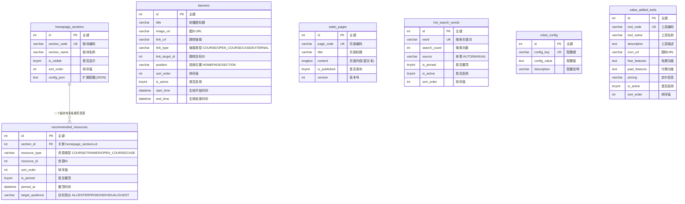

# 内容管理模块 需求文档

> 模块编码：`cms`
> 版本：v1.0
> 最后更新：2026-03-19

---

## 1. 模块概述

### 1.1 核心定位

内容管理模块（CMS）是淘课网平台的**前台展示控制中枢**，负责首页及各板块的内容编排、资源推荐、广告轮播、静态页面、智能机器人、增值工具等全部前端展示内容的统一管理与配置。后台客服/运营人员通过本模块对前端所有可见内容进行增/删/改/排序/上下架操作，修改实时同步至前端页面。

### 1.2 核心业务目标

- 统一管控首页及各板块的展示内容，实现运营人员对前端页面的完全可配置化管理
- 支持轮播图、推荐资源、热点课程、增值工具、核心价值区等首页板块的灵活配置与排序
- 提供智能机器人入口，支持多轮对话推荐讲师/课程，辅助企业快速找到培训资源
- 管理静态页面（关于我们、注册指南、用户协议、隐私政策等），支持富文本编辑与版本管理
- 管理热门搜索词，结合自动采集与人工干预，提升搜索引导效率
- 管理增值工具推荐区，区分免费基础版与付费高级版，引导讲师使用 AI 工具

### 1.3 典型用户行为路径

```
运营人员在后台配置首页内容
    → 管理轮播图（新增/编辑/排序/上下架/设置生效时间）
    → 配置首页板块显隐与排序（热点课程/专家推荐/资源推荐/增值工具/核心价值）
    → 管理推荐资源（按用户类型投放不同内容：企业/个人/游客）
    → 管理热门搜索词（自动采集 + 人工置顶/新增/删除）
    → 编辑静态页面（关于我们/注册指南/协议/隐私政策）
    → 配置增值工具（AI 课件制作/幻灯片美化/海报生成）
    → 配置机器人对话参数
    → 所有修改实时同步至前端页面

访客/用户浏览首页
    ├─ 查看轮播图 → 点击跳转课程/公开课/案例/外部链接
    ├─ 查看热点课程区 → 浏览课纲/讲师/适用人群 → 点击进入课程详情
    ├─ 查看资源推荐区 → 根据用户类型看到不同推荐内容
    ├─ 点击「发布需求」→ 引导输入公司/主题/预算 → 登录后提交需求
    ├─ 使用首页机器人 → 输入公司/预算/人数/目标 → 获得讲师/课程推荐
    ├─ 查看增值工具 → 了解功能/定价 → 进入工具页面
    ├─ 点击热门搜索词 → 触发搜索
    └─ 查看底部信息 → 关于我们/联系方式/协议等
```

---

## 2. 功能描述

### 2.1 首页内容管理

#### 2.1.1 头部导航

| 功能点 | 说明 |
|--------|------|
| 核心板块入口 | 6 个核心板块导航入口：推荐专家、在线学习、线下公开课、企业案例、内训课、版权课 |
| 搜索框 | 全局搜索入口，支持关键词模糊搜索讲师/课程/案例 |
| 登录/注册入口 | 未登录用户展示登录/注册按钮 |
| 用户中心入口 | 已登录用户展示头像/昵称，点击进入用户中心 |

#### 2.1.2 轮播图管理

| 功能点 | 说明 |
|--------|------|
| 展示内容 | 精品在线课、热门公开课、大型企业合作案例等运营推广内容 |
| 点击跳转 | 支持跳转至课程详情、公开课详情、企业案例详情或外部链接 |
| 后台管理 | 支持新增/编辑/删除/排序轮播图 |
| 生效时间 | 支持设置开始时间与结束时间，到期自动下线 |
| 投放位置 | 支持配置轮播图投放位置：首页、板块页等 |
| 状态控制 | 支持手动启用/停用，配合时间控制双重管理 |

#### 2.1.3 热点课程课纲展示区

| 功能点 | 说明 |
|--------|------|
| 板块名称 | "行业热点课程"，展示近期行业热门课程 |
| 展示内容 | 每个课程卡片展示 3-5 条课纲要点、授课讲师、适用人群 |
| 排序规则 | 默认按点击量/点赞数/评价数/上传时间综合排序 |
| 后台操作 | 支持手动置顶、自定义排序位置 |
| 板块开关 | **非固定板块**，后台可配置显示/隐藏，支持随时开关 |
| 版权课置顶 | 支持单独置顶版权课程，展示版权标识 |

#### 2.1.4 AI 智能匹配入口

| 功能点 | 说明 |
|--------|------|
| 入口形式 | 首页醒目位置展示「发布需求」按钮 |
| 引导输入 | 引导用户输入公司名称、培训主题、预算范围 |
| 登录要求 | 需企业账号登录方可提交，未登录引导注册/登录 |
| 需求同步 | 提交后实时同步至客服工作台 + 外部业务系统 |
| 关联模块 | 实际需求数据由培训需求模块（demand）处理，CMS 仅管理入口展示 |

#### 2.1.5 首页智能机器人

| 功能点 | 说明 |
|--------|------|
| 入口位置 | 页面右下角常驻浮窗 |
| 输入引导 | 支持用户输入公司名称、预算、参训人数、培训目标 |
| 智能推荐 | 根据输入信息自动推荐匹配的讲师和课程 |
| 多轮对话 | 支持多轮对话交互，逐步细化需求并优化推荐结果 |
<!-- | 课件生成 | 支持生成课程 PPT（**付费功能**），需购买后使用 | -->
| 人工接管 | 机器人无法回答时自动触发人工客服接管 |
| 后台配置 | 通过 `robot_config` 表配置机器人各项参数（欢迎语、推荐策略、接管阈值等） |

#### 2.1.6 资源推荐区

| 功能点 | 说明 |
|--------|------|
| 推荐内容 | 智能推荐讲师、在线课程、公开课等优质资源 |
| 分众投放 | 根据用户类型展示不同推荐内容：`ENTERPRISE`=企业用户、`INDIVIDUAL`=个人用户、`GUEST`=未登录游客 |
| 后台管理 | 运营人员配置推荐资源列表，指定资源类型、目标受众、排序 |
| 置顶功能 | 支持将指定资源置顶展示，记录置顶时间 |

#### 2.1.7 核心价值区

| 功能点 | 说明 |
|--------|------|
| 展示内容 | 展示平台四大核心价值：「找得到」「信得过」「价更优」「提效快」 |
| 详细描述 | 每个价值点配有描述文案，阐述平台优势 |
| 后台管理 | 支持编辑各价值点的标题（≤8 个字符）与描述内容 |
| 配置限制 | 核心价值字段标题长度限制 ≤8 个汉字 |

#### 2.1.8 增值工具推荐区

| 功能点 | 说明 |
|--------|------|
| 展示位置 | 首页右侧区域 |
| 工具类型 | AI 课件制作、幻灯片美化、海报生成等 |
| 版本区分 | 区分免费基础版与付费高级版，分别展示可用功能 |
| 展示内容 | 工具名称、功能介绍、定价信息、讲师使用案例 |
| 点击行为 | 点击进入对应工具页面 |
| 后台管理 | 运营人员配置工具展示顺序、启用/停用、隐藏/显示 |

#### 2.1.9 热门搜索词展示区

| 功能点 | 说明 |
|--------|------|
| 展示位置 | 搜索框下方 |
| 数据来源 | 自动采集近 30 天高频搜索关键词 |
| 排序规则 | 按搜索量降序排列 |
| 点击行为 | 用户点击关键词直接触发搜索 |
| 后台管理 | 支持人工新增/删除/置顶热门词；自动采集与人工管理并存 |
| 自动采集 | 定时任务统计搜索日志，按频次自动更新热门词列表 |

#### 2.1.10 底部信息区

| 功能点 | 说明 |
|--------|------|
| 静态页面链接 | 关于我们、联系方式、注册指南、用户协议、隐私政策 |
| 增值工具入口 | 增值工具介绍（小程序入口、二维码展示） |
| 版权课合作 | 版权课程合作联系方式 |
| 客服入口 | 官方客服企业微信二维码 |
| 后台管理 | 底部所有内容通过静态页面管理功能编辑，富文本支持 |

### 2.2 平台板块管理

#### 2.2.1 推荐专家板块

| 功能点 | 说明 |
|--------|------|
| 专家列表 | 展示平台推荐讲师列表，含头像、姓名、头衔、擅长领域、评分 |
| 讲师对比 | 用户可选择多名讲师进行对比查看（**需登录**） |
| 专家详情 | 点击进入讲师详情页，展示完整个人信息与课程列表 |
| TOP 排行 | 展示讲师综合排行榜（按曝光量/咨询量/成交量/收藏量排名） |
| 美化简介 | 讲师个人简介支持美化展示（富文本格式） |
| 智能排序 | 排序维度：曝光量、咨询量、成交量、收藏量，支持后台配置各维度权重 |
| 版权标识 | 拥有版权课程的讲师展示版权讲师徽章 |

#### 2.2.2 在线学习板块

| 功能点 | 说明 |
|--------|------|
| 课程列表 | 展示在线课程列表，支持分类筛选 |
| 搜索功能 | 支持关键词模糊搜索课程 |
| 分类体系 | 按培训领域分类展示（关联平台分类模块） |
| 多格式资料 | 支持 PPT/PDF/视频等多格式课程资料 |
| 免费试听 | 标记免费试听章节，吸引用户体验 |
| 播放权限 | 购买后解锁完整课程，未购买仅可试听 |
| 消费优惠 | 展示充值折扣信息，引导用户充值享折扣 |

#### 2.2.3 线下公开课板块

| 功能点 | 说明 |
|--------|------|
| 课程列表 | 展示公开课列表，含名称、讲师、价格、城市、时间、剩余名额 |
| 报名功能 | 支持单人/多人在线报名 |
| 批量导出 | 后台支持批量导出报名数据（Excel） |
| 预告展示 | 展示即将开课的公开课列表，支持预约提醒 |
| 状态展示 | 展示课程状态（招生中/确认开课/已取消） |
| 团报折扣 | 企业用户多人报名享团报折扣 |
| 报名统计 | 后台展示报名数据统计看板 |

#### 2.2.4 企业案例板块

| 功能点 | 说明 |
|--------|------|
| 案例列表 | 展示平台精选企业培训案例 |
| 案例详情 | 展示完整培训方案、过程、量化成果 |
| 定制需求 | 案例详情页提供「定制类似方案」入口，关联需求模块 |

#### 2.2.5 内训课板块

| 功能点 | 说明 |
|--------|------|
| 课程列表 | 展示内训课列表，含课程名、讲师、适配行业、授课时长 |
| 咨询入口 | 提供在线咨询/预约入口，不支持直接购买 |
| 预约管理 | 企业提交预约后同步至客服工作台 |
| 批量导出 | 后台支持批量导出预约数据（Excel） |
| 数据统计 | 后台展示预约数据统计看板 |
| 课程详情 | 展示核心模块、讲师简介、适合企业、课程收益、过往案例 |
| 培训反馈 | 培训完成后企业可提交反馈评价 |
| 版权专项 | 版权内训课置顶展示，标注版权标识 |

### 2.3 内容管理后台

#### 2.3.1 统一管理

| 功能点 | 说明 |
|--------|------|
| 管理范围 | 统一管理全部前端展示内容：轮播图、推荐资源、首页板块配置、热点课程、增值工具、静态页面、热门搜索词 |
| 内容上传 | 支持多格式内容上传（图片、富文本、链接等） |
| 实时同步 | 所有后台修改实时同步至前端页面 |
| 操作记录 | 关键操作记录操作人与操作时间 |

#### 2.3.2 轮播图管理

| 功能点 | 说明 |
|--------|------|
| 新增轮播图 | 上传图片、填写标题、配置跳转链接（课程/公开课/案例/外链）、设置生效时间 |
| 编辑 | 修改已有轮播图的所有字段 |
| 删除 | 支持删除轮播图 |
| 排序 | 支持拖拽或指定排序值调整展示顺序 |
| 启用/停用 | 控制轮播图是否展示 |
| 二次确认弹窗 | 对于轮播图下线/删除、热点课程下架、板块隐藏等关键操作，必须加入带预览的二次确认弹窗 |

#### 2.3.3 首页板块配置

| 功能点 | 说明 |
|--------|------|
| 板块列表 | 管理所有首页板块：热点课程区、专家推荐区、资源推荐区、增值工具区、核心价值区 |
| 显隐控制 | 每个板块独立控制显示/隐藏 |
| 排序调整 | 调整各板块在首页的展示顺序 |
| 扩展配置 | 每个板块支持 JSON 格式的扩展配置（如热点课程区的排序权重参数） |

#### 2.3.4 推荐资源管理

| 功能点 | 说明 |
|--------|------|
| 资源配置 | 选择资源类型（课程/讲师/公开课/案例）+ 资源 ID 进行推荐 |
| 分众配置 | 为每条推荐资源指定目标受众（全部/企业/个人/游客） |
| 排序管理 | 支持自定义排序 |
| 置顶功能 | 支持将指定资源置顶，记录置顶时间 |

#### 2.3.5 热点课程管理

| 功能点 | 说明 |
|--------|------|
| 手动置顶 | 将指定课程置顶至热点课程区 |
| 自定义排序 | 指定课程在热点区的展示位置 |
| 版权课置顶 | 单独支持版权课的置顶操作 |
| 行业热点课置顶 | 单独支持行业热门课程的置顶操作 |

#### 2.3.6 核心价值字段管理

| 功能点 | 说明 |
|--------|------|
| 编辑标题 | 编辑四大价值点的标题文案，限制 ≤8 个字符 |
| 编辑描述 | 编辑每个价值点的详细描述内容 |

#### 2.3.7 增值工具管理

| 功能点 | 说明 |
|--------|------|
| 工具配置 | 配置工具名称、介绍、图标、免费功能、付费功能、定价 |
| 显隐控制 | 控制每个工具的展示/隐藏 |
| 排序调整 | 调整工具在推荐区的展示顺序 |

#### 2.3.8 热门搜索词管理

| 功能点 | 说明 |
|--------|------|
| 自动采集 | 系统定时统计近 30 天搜索日志，按频次自动生成热门词列表 |
| 人工新增 | 运营人员可手动新增热门搜索词 |
| 人工删除 | 运营人员可删除不合适的热门词 |
| 置顶管理 | 支持将指定词置顶展示 |
| 来源标识 | 区分自动采集与人工添加的热门词 |

#### 2.3.9 静态页面管理

| 功能点 | 说明 |
|--------|------|
| 页面列表 | 管理关于我们、注册指南、用户协议、隐私政策等静态页面 |
| 富文本编辑 | 支持富文本内容编辑 |
| 版本管理 | 每次修改自动递增版本号，支持历史版本追溯 |
| 发布控制 | 支持草稿 → 发布流程，未发布的修改不影响前端展示 |

---

## 3. 实体属性（字段设计）

### 3.1 banners — 轮播图/广告位表

> 管理首页及各板块页面的轮播图/广告位，支持定时上下线。

| 字段名 | 类型 | 允许 NULL | 默认值 | 说明 |
|--------|------|-----------|--------|------|
| `id` | int | NO | AUTO_INCREMENT | 主键 |
| `title` | varchar(200) | NO | — | 轮播图标题 |
| `image_url` | varchar(500) | NO | — | 轮播图图片 URL |
| `link_url` | varchar(500) | YES | NULL | 跳转链接 URL（外部链接时填写完整 URL） |
| `link_type` | varchar(20) | NO | 'EXTERNAL' | 链接类型：`COURSE`=在线课，`OPEN_COURSE`=线下公开课，`CASE`=企业案例，`EXTERNAL`=外部链接 |
| `link_target_id` | int | YES | NULL | 跳转目标 ID（link_type 为站内类型时填写对应资源 ID） |
| `position` | varchar(30) | NO | 'HOMEPAGE' | 投放位置：`HOMEPAGE`=首页，`EXPERT`=推荐专家页，`ONLINE`=在线学习页，`OPEN_COURSE`=公开课页，`CASE`=企业案例页，`INTERNAL`=内训课页 |
| `sort_order` | int | NO | 0 | 排序值（值越大越靠前） |
| `is_active` | tinyint | NO | 1 | 是否启用：0=停用，1=启用 |
| `start_time` | datetime | YES | NULL | 生效开始时间（NULL 表示立即生效） |
| `end_time` | datetime | YES | NULL | 生效结束时间（NULL 表示长期有效） |
| `created_at` | datetime | NO | CURRENT_TIMESTAMP | 创建时间 |
| `updated_at` | datetime | NO | CURRENT_TIMESTAMP | 更新时间 |

**索引设计：**
- `idx_position_active` (position, is_active) — 按位置查询有效轮播图
- `idx_sort_order` (sort_order) — 排序查询
- `idx_start_end_time` (start_time, end_time) — 定时上下线任务扫描

---

### 3.2 homepage_sections — 首页板块配置表

> 管理首页各功能板块的显隐状态、排序和扩展配置。

| 字段名 | 类型 | 允许 NULL | 默认值 | 说明 |
|--------|------|-----------|--------|------|
| `id` | int | NO | AUTO_INCREMENT | 主键 |
| `section_code` | varchar(50) | NO | — | 板块编码：`HOT_COURSES`=热点课程区，`EXPERT_RECOMMEND`=专家推荐区，`RESOURCE_RECOMMEND`=资源推荐区，`VALUE_TOOLS`=增值工具区，`CORE_VALUES`=核心价值区 |
| `section_name` | varchar(100) | NO | — | 板块显示名称 |
| `is_visible` | tinyint | NO | 1 | 是否显示：0=隐藏，1=显示 |
| `sort_order` | int | NO | 0 | 板块排序值（值越大越靠前） |
| `config_json` | text | YES | NULL | 扩展配置（JSON 格式，如热点课程排序权重：`{"click_weight":40,"like_weight":20,"review_weight":20,"time_weight":20}`） |
| `created_at` | datetime | NO | CURRENT_TIMESTAMP | 创建时间 |
| `updated_at` | datetime | NO | CURRENT_TIMESTAMP | 更新时间 |

**索引设计：**
- `UNIQUE idx_section_code` (section_code) — 板块编码唯一
- `idx_is_visible` (is_visible, sort_order) — 查询可见板块并排序

---

### 3.3 recommended_resources — 推荐资源表

> 管理首页和各板块的推荐资源列表，支持分众投放和置顶功能。

| 字段名 | 类型 | 允许 NULL | 默认值 | 说明 |
|--------|------|-----------|--------|------|
| `id` | int | NO | AUTO_INCREMENT | 主键 |
| `section_id` | int | NO | — | 所属板块 ID，关联 `homepage_sections.id` |
| `resource_type` | varchar(20) | NO | — | 资源类型：`COURSE`=在线课，`TRAINER`=讲师，`OPEN_COURSE`=公开课，`CASE`=企业案例 |
| `resource_id` | int | NO | — | 资源 ID（关联对应资源表的主键） |
| `sort_order` | int | NO | 0 | 排序值（值越大越靠前） |
| `is_pinned` | tinyint | NO | 0 | 是否置顶：0=否，1=是 |
| `pinned_at` | datetime | YES | NULL | 置顶时间 |
| `target_audience` | varchar(20) | NO | 'ALL' | 目标受众：`ALL`=全部，`ENTERPRISE`=企业用户，`INDIVIDUAL`=个人用户，`GUEST`=游客 |
| `created_at` | datetime | NO | CURRENT_TIMESTAMP | 创建时间 |
| `updated_at` | datetime | NO | CURRENT_TIMESTAMP | 更新时间 |

**索引设计：**
- `idx_section_id` (section_id) — 按板块查询推荐资源
- `idx_resource` (resource_type, resource_id) — 按资源类型+ID查询（防重复推荐）
- `idx_target_audience` (target_audience) — 按目标受众筛选
- `idx_is_pinned` (is_pinned, sort_order) — 置顶资源排序

---

### 3.4 static_pages — 静态页面表

> 管理平台静态页面内容（关于我们、注册指南、用户协议、隐私政策等），支持富文本编辑和版本管理。

| 字段名 | 类型 | 允许 NULL | 默认值 | 说明 |
|--------|------|-----------|--------|------|
| `id` | int | NO | AUTO_INCREMENT | 主键 |
| `page_code` | varchar(50) | NO | — | 页面编码：`ABOUT_US`=关于我们，`CONTACT_US`=联系我们，`REGISTRATION_GUIDE`=注册指南，`USER_AGREEMENT`=用户协议，`PRIVACY_POLICY`=隐私政策，`TOOL_INTRO`=增值工具介绍，`COPYRIGHT_COOPERATION`=版权课合作 |
| `title` | varchar(200) | NO | — | 页面标题 |
| `content` | longtext | YES | NULL | 页面内容（富文本） |
| `is_published` | tinyint | NO | 0 | 是否已发布：0=草稿，1=已发布 |
| `version` | int | NO | 1 | 版本号，每次修改自动递增 |
| `created_at` | datetime | NO | CURRENT_TIMESTAMP | 创建时间 |
| `updated_at` | datetime | NO | CURRENT_TIMESTAMP | 更新时间 |

**索引设计：**
- `UNIQUE idx_page_code` (page_code) — 页面编码唯一
- `idx_is_published` (is_published) — 按发布状态筛选

---

### 3.5 hot_search_words — 热门搜索词表

> 管理搜索框下方展示的热门搜索关键词，支持自动采集和人工管理。

| 字段名 | 类型 | 允许 NULL | 默认值 | 说明 |
|--------|------|-----------|--------|------|
| `id` | int | NO | AUTO_INCREMENT | 主键 |
| `word` | varchar(100) | NO | — | 搜索关键词 |
| `search_count` | int | NO | 0 | 近 30 天搜索次数 |
| `source` | varchar(20) | NO | 'AUTO' | 来源：`AUTO`=自动采集，`MANUAL`=人工添加 |
| `is_pinned` | tinyint | NO | 0 | 是否置顶：0=否，1=是 |
| `is_active` | tinyint | NO | 1 | 是否启用：0=停用，1=启用 |
| `sort_order` | int | NO | 0 | 排序值（值越大越靠前，置顶词优先） |
| `created_at` | datetime | NO | CURRENT_TIMESTAMP | 创建时间 |
| `updated_at` | datetime | NO | CURRENT_TIMESTAMP | 更新时间 |

**索引设计：**
- `UNIQUE idx_word` (word) — 关键词唯一
- `idx_is_active_sort` (is_active, is_pinned, sort_order) — 前端查询有效热门词并排序
- `idx_source` (source) — 按来源筛选
- `idx_search_count` (search_count) — 按搜索量排序

---

### 3.6 robot_config — 机器人配置表

> 存储首页智能机器人的各项配置参数，采用 Key-Value 结构便于灵活扩展。

| 字段名 | 类型 | 允许 NULL | 默认值 | 说明 |
|--------|------|-----------|--------|------|
| `id` | int | NO | AUTO_INCREMENT | 主键 |
| `config_key` | varchar(100) | NO | — | 配置键：如 `welcome_message`=欢迎语，`recommend_strategy`=推荐策略，`human_takeover_threshold`=人工接管阈值，`ppt_generation_price`=PPT 生成价格，`max_dialogue_rounds`=最大对话轮次 |
| `config_value` | text | NO | — | 配置值（字符串或 JSON 格式） |
| `description` | varchar(500) | YES | NULL | 配置说明 |
| `created_at` | datetime | NO | CURRENT_TIMESTAMP | 创建时间 |
| `updated_at` | datetime | NO | CURRENT_TIMESTAMP | 更新时间 |

**索引设计：**
- `UNIQUE idx_config_key` (config_key) — 配置键唯一

---

### 3.7 value_added_tools — 增值工具表

> 管理首页增值工具推荐区的工具列表（AI 课件制作、幻灯片美化、海报生成等）。

| 字段名 | 类型 | 允许 NULL | 默认值 | 说明 |
|--------|------|-----------|--------|------|
| `id` | int | NO | AUTO_INCREMENT | 主键 |
| `tool_code` | varchar(50) | NO | — | 工具编码：如 `AI_COURSEWARE`=AI 课件制作，`SLIDE_BEAUTIFY`=幻灯片美化，`POSTER_GENERATE`=海报生成 |
| `tool_name` | varchar(100) | NO | — | 工具名称 |
| `description` | text | YES | NULL | 工具描述/介绍 |
| `icon_url` | varchar(500) | YES | NULL | 工具图标 URL |
| `page_url` | varchar(500) | YES | NULL | 工具页面跳转链接 |
| `free_features` | text | YES | NULL | 免费基础版功能描述（JSON 数组格式：`["功能1","功能2"]`） |
| `paid_features` | text | YES | NULL | 付费高级版功能描述（JSON 数组格式：`["功能1","功能2"]`） |
| `pricing` | varchar(500) | YES | NULL | 定价信息描述 |
| `trainer_cases` | text | YES | NULL | 讲师使用案例（JSON 格式） |
| `is_active` | tinyint | NO | 1 | 是否启用：0=停用，1=启用 |
| `sort_order` | int | NO | 0 | 排序值（值越大越靠前） |
| `created_at` | datetime | NO | CURRENT_TIMESTAMP | 创建时间 |
| `updated_at` | datetime | NO | CURRENT_TIMESTAMP | 更新时间 |

**索引设计：**
- `UNIQUE idx_tool_code` (tool_code) — 工具编码唯一
- `idx_is_active_sort` (is_active, sort_order) — 查询有效工具并排序

---
<!-- 
## 4. ER 关系说明

### 4.1 ER 图



### 4.2 关系说明

| 关系 | 类型 | 说明 |
|------|------|------|
| `homepage_sections` → `recommended_resources` | 一对多 | 一个首页板块下可配置多条推荐资源 |
| `banners` | 独立 | 轮播图独立管理，通过 `position` 字段区分投放位置 |
| `static_pages` | 独立 | 静态页面独立管理，通过 `page_code` 标识不同页面 |
| `hot_search_words` | 独立 | 热门搜索词独立管理，结合自动采集与人工维护 |
| `robot_config` | 独立 | 机器人配置独立管理，Key-Value 结构 |
| `value_added_tools` | 独立 | 增值工具独立管理，通过 `tool_code` 标识不同工具 |
| `recommended_resources` → 其他模块 | 逻辑关联 | `resource_type` + `resource_id` 逻辑关联课程表/讲师表/案例表（不建物理外键） |
| `banners` → 其他模块 | 逻辑关联 | `link_type` + `link_target_id` 逻辑关联课程表/案例表（不建物理外键） |

> **注意：** 数据库层面不建外键，所有关联关系在代码逻辑中维护。

--- -->

## 5. 业务逻辑与规则

### 5.1 轮播图展示规则

```
前端请求轮播图列表
    → 筛选条件：position = 指定位置 AND is_active = 1
    → 时间校验：(start_time IS NULL OR start_time <= NOW()) AND (end_time IS NULL OR end_time >= NOW())
    → 排序：sort_order DESC, id DESC
    → 返回有效轮播图列表
```

**规则明细：**

| 规则 | 说明 |
|------|------|
| 时间控制 | `start_time` 为空表示立即生效，`end_time` 为空表示长期有效 |
| 过期处理 | 定时任务扫描已过期但未停用的轮播图，自动更新 `is_active = 0` |
| 链接跳转 | 站内链接通过 `link_type` + `link_target_id` 构造跳转路径；外部链接直接使用 `link_url` |
| 跳转目标校验 | 站内链接类型时，前端跳转前校验目标资源是否存在且状态为上架 |

### 5.2 首页板块显示规则

```
前端请求首页板块列表
    → 查询 homepage_sections WHERE is_visible = 1
    → 按 sort_order DESC 排序
    → 逐个板块加载对应数据：
        ├─ HOT_COURSES → 加载热点课程列表（取 config_json 中的排序权重配置）
        ├─ EXPERT_RECOMMEND → 加载推荐专家列表
        ├─ RESOURCE_RECOMMEND → 加载推荐资源列表（按当前用户类型过滤 target_audience）
        ├─ VALUE_TOOLS → 加载增值工具列表
        └─ CORE_VALUES → 加载核心价值配置
```

**规则明细：**

| 规则 | 说明 |
|------|------|
| 板块开关 | 运营人员可随时切换板块的 `is_visible` 状态，前端实时响应 |
| 热点课程非固定 | 热点课程区为非固定板块，后台可随时开关 |
| 排序权重 | 热点课程区的 `config_json` 存储排序维度权重（点击量/点赞数/评价数/上传时间），综合计算排序分值 |

### 5.3 推荐资源分众投放规则

| 用户类型 | target_audience 匹配规则 | 说明 |
|---------|------------------------|------|
| 企业用户 | `ALL` + `ENTERPRISE` | 展示通用推荐 + 企业专属推荐 |
| 个人用户 | `ALL` + `INDIVIDUAL` | 展示通用推荐 + 个人专属推荐 |
| 未登录游客 | `ALL` + `GUEST` | 展示通用推荐 + 游客引导推荐 |

**置顶规则：**
- 置顶资源（`is_pinned = 1`）始终排在最前
- 多个置顶资源之间按 `pinned_at` 降序排列（最新置顶在最前）
- 非置顶资源按 `sort_order` 降序排列

### 5.4 热门搜索词管理规则

```
定时任务（每日凌晨执行）
    → 统计搜索日志表近 30 天各关键词搜索频次
    → 按搜索量降序排列
    → 自动更新 hot_search_words 表：
        ├─ 已存在的词：更新 search_count
        ├─ 新词（超过阈值）：插入新记录（source=AUTO）
        └─ 低频词（低于阈值）：标记 is_active = 0
    → 人工添加的词（source=MANUAL）不受自动清理影响
```

**规则明细：**

| 规则 | 说明 |
|------|------|
| 采集周期 | 近 30 天搜索数据 |
| 采集阈值 | 搜索次数超过配置阈值的关键词才纳入自动采集（阈值由运营配置） |
| 人工优先 | 人工添加的词不受自动采集任务的清理/覆盖 |
| 置顶优先 | 置顶词始终在列表最前，不论搜索量高低 |
| 前端展示 | 前端查询 `is_active = 1` 的词，按 `is_pinned DESC, sort_order DESC, search_count DESC` 排序 |

### 5.5 静态页面版本管理规则

| 规则 | 说明 |
|------|------|
| 版本递增 | 每次保存修改自动递增 `version` 字段 |
| 发布控制 | 修改后需手动设置 `is_published = 1` 方可在前端展示 |
| 前端读取 | 前端通过 `page_code` 查询且 `is_published = 1` 的记录 |
| 内容缓存 | 静态页面内容使用 Redis 缓存，发布时主动清除缓存 |

### 5.6 机器人对话规则

| 规则 | 说明 |
|------|------|
| 欢迎语 | 用户打开机器人时展示 `welcome_message` 配置的欢迎语 |
| 推荐策略 | 根据 `recommend_strategy` 配置调整推荐算法参数 |
| 人工接管 | 对话连续 N 轮无法满足用户需求时自动触发人工接管（N = `human_takeover_threshold`） |
| 对话轮次 | 单次会话最大对话轮次由 `max_dialogue_rounds` 控制 |
| PPT 生成 | PPT 生成为付费功能，价格由 `ppt_generation_price` 配置 |
| 数据记录 | 对话记录保存用于分析优化（关联消息模块） |

### 5.7 增值工具展示规则

| 规则 | 说明 |
|------|------|
| 展示条件 | `is_active = 1` 的工具才在前端展示 |
| 排序规则 | 按 `sort_order DESC` 排列 |
| 版本区分 | `free_features` 展示免费基础版功能，`paid_features` 展示付费高级版功能 |
| 跳转行为 | 点击工具卡片跳转至 `page_url` 对应的工具页面 |

### 5.8 内容修改实时同步规则

| 规则 | 说明 |
|------|------|
| 同步方式 | 后台修改保存后立即清除对应 Redis 缓存，前端下次请求获取最新数据 |
| 缓存策略 | 轮播图、板块配置、推荐资源、热门词、静态页面均使用 Redis 缓存 |
| 缓存失效 | 增/删/改操作触发主动缓存失效；缓存 TTL 设置为 5 分钟（兜底） |
| 前端刷新 | 前端首页每次加载请求最新板块配置，无需手动刷新 |

---

## 6. 与其他模块的依赖关系

| 依赖模块 | 依赖方向 | 关系说明 |
|----------|---------|---------|
| **课程模块 (courses)** | CMS → 课程 | 轮播图链接跳转课程详情（`link_type=COURSE`）；推荐资源关联课程（`resource_type=COURSE`/`OPEN_COURSE`）；热点课程区展示课程数据 |
| **讲师模块 (trainers)** | CMS → 讲师 | 推荐资源关联讲师（`resource_type=TRAINER`）；推荐专家板块展示讲师列表与排行 |
| **企业案例模块 (cases)** | CMS → 案例 | 轮播图链接跳转案例详情（`link_type=CASE`）；推荐资源关联案例（`resource_type=CASE`） |
| **培训需求模块 (demands)** | CMS → 需求 | AI 智能匹配入口引导用户发布需求，需求数据由需求模块处理 |
| **用户模块 (users)** | CMS → 用户 | 首页资源推荐区根据用户类型（企业/个人/游客）展示不同内容；AI 匹配入口需校验登录状态 |
| **分类模块 (categories)** | CMS → 分类 | 在线学习板块、内训课板块等按培训领域分类展示 |
| **消息通知模块 (notifications)** | CMS → 消息 | 机器人对话记录关联消息模块；人工接管时触发客服通知 |
| **搜索模块 (search)** | CMS ↔ 搜索 | 热门搜索词基于搜索日志统计生成；用户点击热门词触发搜索请求 |
| **后台管理模块 (admin)** | CMS ← 后台 | 后台客服/运营人员通过管理端操作 CMS 全部配置（轮播图、板块、推荐、静态页面等） |
| **文件存储模块 (attachments)** | CMS → 文件 | 轮播图图片、增值工具图标、静态页面富文本中的图片等文件上传与存储 |

---
<!-- 
## 7. 参考旧表

### 7.1 旧表到新表的映射关系

| 旧表 | 新表 | 说明 |
|------|------|------|
| `tk_advert` | `banners` | 旧广告位表映射至新轮播图表；旧 `position` 字段需重新定义枚举值；旧 `displayorder` 映射至 `sort_order`；旧 `status`+`begintime`+`endtime` 映射至 `is_active`+`start_time`+`end_time` |
| `tk_company_recommend` | `recommended_resources` | 旧推荐公司表扩展为通用推荐资源表，支持多种资源类型和分众投放 |
| 无对应旧表 | `homepage_sections` | 新增首页板块配置功能，旧系统无板块级别的动态配置能力 |
| 无对应旧表 | `static_pages` | 新增静态页面管理，旧系统静态内容硬编码在前端模板中 |
| 无对应旧表 | `hot_search_words` | 新增热门搜索词管理，旧系统无此功能 |
| 无对应旧表 | `robot_config` | 新增首页智能机器人配置，旧系统无机器人功能 |
| 无对应旧表 | `value_added_tools` | 新增增值工具推荐区管理，旧系统无增值工具体系 |

### 7.2 关键字段对照

```
tk_advert.id            → banners.id
tk_advert.title         → banners.title
tk_advert.pic           → banners.image_url
tk_advert.url           → banners.link_url（外部链接时直接使用）
tk_advert.position      → banners.position（需重新定义枚举，旧值为数字编码）
tk_advert.displayorder  → banners.sort_order
tk_advert.status        → banners.is_active（旧 1=显示→1, 旧 0=隐藏→0）
tk_advert.begintime     → banners.start_time（int 时间戳→datetime）
tk_advert.endtime       → banners.end_time（int 时间戳→datetime）

tk_company_recommend.id → recommended_resources.id（仅参考，resource_type 固定为 CASE 或相应类型）
```

### 7.3 关键变更点

1. **广告位升级**：旧 `tk_advert` 仅支持简单的图片+链接广告位，新 `banners` 表支持站内多类型跳转（课程/公开课/案例/外链）、多投放位置、定时上下线
2. **推荐体系全面升级**：旧 `tk_company_recommend` 仅支持推荐公司，新系统扩展为通用推荐资源表，支持课程/讲师/公开课/案例等多种资源类型，并支持分众投放
3. **板块配置化**：旧系统首页板块布局硬编码，新系统通过 `homepage_sections` 实现板块的动态显隐和排序配置
4. **静态页面可管理**：旧系统静态内容（关于我们/协议等）硬编码在前端模板中，新系统支持后台富文本编辑和版本管理
5. **新增智能机器人**：首页智能机器人为全新功能，支持多轮对话推荐讲师/课程，支持人工接管
6. **新增热门搜索词管理**：结合自动采集与人工管理，提升搜索引导效率
7. **新增增值工具体系**：AI 课件制作/幻灯片美化/海报生成等增值工具为新增功能，支持免费/付费版本区分
8. **时间字段规范化**：旧系统 `begintime`/`endtime` 使用 int 时间戳，新系统统一使用 datetime
9. **缓存与实时同步**：新系统所有 CMS 内容使用 Redis 缓存，后台修改主动清除缓存实现实时同步 -->
