# 客服系统模块 需求文档

> 模块编码：`customer-service`
> 版本：v1.0
> 最后更新：2026-03-19

---

## 1. 模块概述

### 1.1 核心定位

客服系统是淘课网平台的 **核心运营支撑模块**，分为 **前台客服** 和 **后台客服** 两个子系统。前台客服面向用户在线咨询，提供实时聊天、智能机器人辅助、需求转接与咨询记录管理；后台客服面向平台运营，承载全维度审核、资料维护、问题处理、数据管理与操作日志等核心管控职能。两者协同构成平台从用户触达到运营管控的完整闭环。

### 1.2 核心业务目标

- 建立统一的在线咨询接待体系，保障用户咨询零遗漏、快速响应
- 智能机器人辅助前台客服完成高频问题解答，降低人工成本
- 前台客服可将复杂问题无缝转接至后台客服/平台运营，确保问题流转高效
- 后台客服拥有全维度审核能力（入驻审核、内容审核、版权审核、评价审核）
- 操作全程可追溯（操作日志），关键操作需二次确认，保障数据安全
- 平台运营数据统一汇总，支持多维度导出与分析
- 支持数据自动清理与归档，保障系统长期健康运行

### 1.3 典型用户行为路径

```
前台客服路径：
用户发起在线咨询 → 机器人自动接待
    → 机器人无法解答 → 人工客服接管
    → 客服实时回复（文字/图片/链接/快捷回复）
    → 咨询完成 → 打标签 → 归档
    → 复杂问题 → 转接后台客服 → 同步聊天记录 → 后台客服处理

后台客服路径：
后台客服登录工作台 → 查看待办任务列表（按优先级排序）
    → 审核入驻/课程/版权/评价
    → 维护讲师/机构资料
    → 处理前台转接的复杂问题与用户申诉
    → 查看平台运营数据 → 导出报表
```

---

## 2. 功能描述

### 2.1 前台客服

#### 2.1.1 客服工作台

| 功能点 | 说明 |
|--------|------|
| 专属账号 | 前台客服使用独立账号登录工作台 |
| 服务数据总览 | 展示个人服务数据：今日/本周/本月接待量、问题解决率、用户满意度 |
| 工作台首页 | 汇总待处理消息、进行中会话、转接进度等核心信息 |

#### 2.1.2 咨询消息统一接待

| 功能点 | 说明 |
|--------|------|
| 消息汇聚 | 所有用户在线咨询消息统一接入客服工作台 |
| 会话分类 | 按状态分类展示：未接（WAITING）/ 接待中（ACTIVE）/ 已完成（CLOSED） |
| 用户类型筛选 | 支持按用户角色筛选（企业用户/个人用户/讲师/机构） |
| 新消息提醒 | 新咨询消息实时弹窗提醒，支持声音提示 |
| 同步失败告警 | 培训需求同步外部系统失败时，在工作台显示告警通知 |

#### 2.1.3 聊天功能

| 功能点 | 说明 |
|--------|------|
| 消息类型 | 支持文字、图片、链接回复 |
| 快捷回复 | 客服可自定义快捷回复短语，按分类管理（通用/版权课程/增值工具等） |
| 聊天记录 | 聊天记录永久保存，支持按关键词/时间/用户搜索 |
| 交互提示 | 统一交互提示规范（TBD，后续补充具体规范） |

#### 2.1.4 首页机器人配置配合

| 功能点 | 说明 |
|--------|------|
| 机器人记录查看 | 客服可查看机器人与用户的交互记录 |
| 人工接管 | 机器人无法解答时，客服可主动介入接管会话 |
| 推荐话术配置 | 配置机器人推荐话术与引导逻辑（如用户提及预算 → 引导创建培训需求） |
| 付费功能状态 | 机器人 PPT 生成为付费功能，客服可查看用户付费状态 |

#### 2.1.5 常见问题知识库

| 功能点 | 说明 |
|--------|------|
| 知识库内容 | 覆盖注册流程、课程购买、版权课程、增值工具规则等常见问题 |
| 关键词搜索 | 支持按关键词快速检索知识库文章 |
| 收藏功能 | 客服可收藏常用知识库文章，便于快速引用 |
| 更新提醒 | 知识库文章更新时，向相关客服弹窗通知 |

#### 2.1.6 需求转接

| 功能点 | 说明 |
|--------|------|
| 转接对象 | 前台客服可将复杂问题转接至后台客服或平台运营 |
| 转接信息 | 必须填写转接原因 |
| 聊天同步 | 转接时自动同步完整聊天记录给接收方 |
| 消息重定向 | 转接后用户新消息自动路由至接收方客服 |
| 进度追踪 | 原客服可追踪转接后的处理进度 |

#### 2.1.7 咨询记录管理

| 功能点 | 说明 |
|--------|------|
| 标签管理 | 咨询完成后打标签：入驻咨询 / 课程购买 / 问题反馈 / 版权课程咨询 / 增值工具咨询 |
| 搜索筛选 | 支持按时间范围、用户类型、标签分类搜索 |
| 数据导出 | 支持导出个人/团队咨询记录（Excel），导出字段同步自定义核心字段 |

#### 2.1.8 服务统计

| 功能点 | 说明 |
|--------|------|
| 统计维度 | 接待量、问题解决率、平均回复时长、用户满意度 |
| 时间维度 | 支持日/周/月统计，展示趋势图表 |

#### 2.1.9 未接消息提醒

| 功能点 | 说明 |
|--------|------|
| 超时提醒 | 用户消息未接待超过 5 分钟，弹窗告警提醒 |
| 移动端支持 | 移动端支持下拉刷新获取最新未接消息 |

### 2.2 后台客服

#### 2.2.1 专属账号与权限

| 功能点 | 说明 |
|--------|------|
| 细粒度权限 | 支持按模块授权：仅审核入驻 / 仅审核课程 / 仅审核评价 / 仅审核版权 / 仅管理增值工具 |
| 权限隔离 | 未授权模块对该客服不可见 |
| 权限分配 | 由超级管理员统一分配与调整权限 |

#### 2.2.2 待办任务提醒

| 功能点 | 说明 |
|--------|------|
| 待办汇总 | 工作台首页展示所有待处理任务 |
| 优先级排序 | 任务分为紧急（URGENT）/ 普通（NORMAL）两级；版权课审核 + 增值工具支付异常 = 高优先级 |
| 任务数弹窗 | 新待办任务到达时弹窗提示任务数量 |
| 任务筛选 | 支持按任务类型筛选（入驻审核/内容审核/版权审核/评价审核/申诉处理） |
| 同步失败告警 | 需求同步外部系统失败时在工作台显示告警 |

#### 2.2.3 全维度审核管理

##### 入驻审核

| 审核项 | 说明 |
|--------|------|
| 审核对象 | 讲师入驻 / 代理商入驻 / 机构入驻 |
| 资质验证 | 通过企查查/天眼查等第三方工具核实资质材料真实性 |
| 审核结果 | 通过 / 驳回（需填写驳回原因） |
| 通过后处理 | 审核通过后自动激活账号，可正常使用平台功能 |

##### 内容审核

| 审核项 | 说明 |
|--------|------|
| 审核对象 | 课程（在线课/公开课/内训课）/ 企业案例 / 讲师资料 |
| 审核标准 | 内容合规性、信息真实性、描述准确性 |
| 审核结果 | 通过 / 驳回 / 要求修改（需填写修改意见） |

##### 版权课审核

| 审核项 | 说明 |
|--------|------|
| 独立模块 | 版权课审核作为独立模块单独管理 |
| 审核内容 | 版权证书真实性、课程内容与版权匹配度、定价合理性 |
| 审核结果 | 通过 / 驳回（需填写原因） |

##### 评价审核

| 审核项 | 说明 |
|--------|------|
| 审核内容 | 评价真实性、恶意言论检测、广告信息过滤 |
| 审核结果 | 通过 / 隐藏 / 删除（需通知评价人并说明原因） |

#### 2.2.4 资料与信息维护

##### 讲师信息更新

| 功能点 | 说明 |
|--------|------|
| 信息维护 | 新增/更新讲师资质证书、企业案例、课程信息、版权信息、增值工具权限 |
| 操作记录 | 每次信息变更保存完整操作记录（操作人/时间/变更内容） |

##### 批量导入导出

| 功能点 | 说明 |
|--------|------|
| 导出 | 批量导出讲师数据为 Excel：姓名、擅长领域、定价、案例、版权信息、增值工具权限等 |
| 导入 | 批量导入讲师数据，跳过错误行并生成 CSV 错误报告 |
| 导出字段 | 支持同步自定义核心字段 |
| 匹配规则 | 导入时按姓名匹配，重复数据自动覆盖更新 |

##### 文件编辑

| 功能点 | 说明 |
|--------|------|
| 原文件编辑 | 支持在线编辑已上传文件（图片处理、水印添加/移除、文本编辑并保持原有排版） |
| 多格式支持 | 支持 DOCX / PDF / PPT / JPG / PNG 格式上传（突破原仅 DOCX 限制） |
| 在线预览 | 支持多格式文件在线预览 |

<!-- ##### 平台公开信息维护

| 功能点 | 说明 |
|--------|------|
| 维护内容 | 推荐专家列表、行业案例、常见问题知识库、版权课专区、增值工具专区 |
| 热门课程 | 支持手动置顶热门课程、自定义排序 |
| 实时同步 | 后台修改后实时同步至前端展示 | -->

#### 2.2.5 问题处理与申诉

| 功能点 | 说明 |
|--------|------|
| 转接问题处理 | 处理前台客服转接的复杂问题 |
| 申诉类型 | 恶意评价申诉、评价驳回申诉、提现失败申诉、支付问题申诉 |
| 处理结果 | 通过 / 驳回，处理后向用户发送结果通知 |

#### 2.2.6 比价功能

| 功能点 | 说明 |
|--------|------|
| 讲师比价 | 输入 2-3 位讲师，自动展示费用对比（基础报价、行业报价、折扣区间） |
| 版权课比价 | 输入 2-3 门版权课，自动展示对比（定价、资质、案例） |
| 报告导出 | 比价结果支持导出报告 |

#### 2.2.7 自动清理功能

| 功能点 | 说明 |
|--------|------|
| 清理规则 | 可配置清理规则，如 3 年未变更的讲师数据、5 年以上旧公开课 |
| 清理周期 | 支持配置清理周期（如每年执行一次） |
| 自动备份 | 执行清理前自动备份数据 |
| 清理报告 | 每次清理后生成清理报告（清理数量、备份路径等） |

#### 2.2.8 操作日志管理

| 功能点 | 说明 |
|--------|------|
| 全量记录 | 所有后台操作均记录日志（操作人、时间、操作内容、操作结果） |
| 保留期限 | 日志保留 1 年 |
| 搜索功能 | 支持按关键词、操作人、时间范围搜索 |
| 不可删除 | 操作日志不可删除，保障审计追溯 |
| 二次确认 | 关键操作（讲师信息变更、课程上下架、版权审核、增值工具权限变更）需弹窗二次确认 |

#### 2.2.9 平台运营数据

| 功能点 | 说明 |
|--------|------|
| 核心指标 | 总用户数、各角色用户数、课程/公开课数量、成交率、咨询量 |
| 扩展指标 | 增值工具支付数据、版权课咨询数据 |
| 时间维度 | 支持日/周/月/年维度统计 |
| 数据导出 | 支持批量导出，可自定义导出字段 |

#### 2.2.10 视频管理

| 功能点 | 说明 |
|--------|------|
| 统一上传 | 后台客服统一上传在线课视频 |
| 多格式支持 | 支持主流视频格式（mp4 / avi / mov 等） |
| 大小预警 | 上传大文件时给出提醒 |
| 课程关联 | 上传后可关联到具体课程的对应章节 |

#### 2.2.11 增值工具管理

| 功能点 | 说明 |
|--------|------|
| 支付记录 | 查看增值工具的用户支付记录 |
| 权限审批 | 审批通过后授予增值工具使用权限（基础版 / 高级版） |
| 权限调整 | 可根据合作等级调整权限级别 |
| 违规处理 | 手动关闭违规用户的增值工具权限 |
| 同步通知 | 权限变更同步至用户中心并发送通知 |

#### 2.2.12 版权课程管理

| 功能点 | 说明 |
|--------|------|
| 统一定价 | 平台统一控制版权课定价 |
| 企业折扣 | 可配置企业合作折扣 |
| 内容编辑 | 编辑版权课大纲、资料、培训要求 |
| 上下架管理 | 上下架操作需提前通知关联讲师/机构 |

---

## 3. 实体属性（字段设计）

### 3.1 cs_conversations — 会话表

> 记录用户与客服/机器人之间的会话信息，一次咨询对应一条会话记录。

| 字段名 | 类型 | 必填 | 默认值 | 说明 |
|---|---|---|---|---|
| id | int | 是 | 自增 | 主键 |
| user_id | int | 是 | — | 咨询用户 ID，关联 users.id |
| cs_agent_id | int | 否 | NULL | 接待客服 ID，关联 users.id；机器人接待时为 NULL |
| channel | varchar(20) | 是 | — | 会话渠道：ONLINE=在线咨询，ROBOT=机器人 |
| status | varchar(20) | 是 | 'WAITING' | 会话状态：WAITING=等待接待，ACTIVE=接待中，TRANSFERRED=已转接，CLOSED=已关闭 |
| source_page | varchar(200) | 否 | NULL | 用户发起咨询的来源页面 URL |
| satisfaction_score | tinyint | 否 | NULL | 用户满意度评分（1-5），会话关闭后用户填写 |
| created_at | datetime | 是 | CURRENT_TIMESTAMP | 创建时间 |
| updated_at | datetime | 是 | CURRENT_TIMESTAMP | 更新时间 |
| closed_at | datetime | 否 | NULL | 会话关闭时间 |

**索引设计：**

| 索引名 | 字段 | 类型 | 说明 |
|--------|------|------|------|
| `idx_cs_conv_user_id` | `user_id` | 普通 | 按用户查询会话 |
| `idx_cs_conv_agent_id` | `cs_agent_id` | 普通 | 按客服查询会话 |
| `idx_cs_conv_status` | `status` | 普通 | 按状态筛选 |
| `idx_cs_conv_channel` | `channel` | 普通 | 按渠道筛选 |
| `idx_cs_conv_created` | `created_at` | 普通 | 按时间排序 |

---

### 3.2 cs_messages — 消息表

> 存储会话中的每一条消息记录，包括用户消息、客服消息、机器人消息和系统通知。

| 字段名 | 类型 | 必填 | 默认值 | 说明 |
|---|---|---|---|---|
| id | int | 是 | 自增 | 主键 |
| conversation_id | int | 是 | — | 关联 cs_conversations.id |
| sender_type | varchar(20) | 是 | — | 发送者类型：USER=用户，CS=客服，ROBOT=机器人，SYSTEM=系统 |
| sender_id | int | 否 | NULL | 发送者 ID，关联 users.id；系统消息时为 NULL |
| content_type | varchar(20) | 是 | 'TEXT' | 消息内容类型：TEXT=文本，IMAGE=图片，LINK=链接，SYSTEM_NOTICE=系统通知 |
| content | text | 是 | — | 消息内容（文本内容 / 图片 URL / 链接 URL + 标题 JSON / 系统通知文案） |
| created_at | datetime | 是 | CURRENT_TIMESTAMP | 发送时间 |

**索引设计：**

| 索引名 | 字段 | 类型 | 说明 |
|--------|------|------|------|
| `idx_cs_msg_conv_id` | `conversation_id` | 普通 | 按会话查询消息列表 |
| `idx_cs_msg_sender` | `sender_type, sender_id` | 联合 | 按发送者查询 |
| `idx_cs_msg_created` | `conversation_id, created_at` | 联合 | 会话内消息时间排序 |
| `FULLTEXT idx_cs_msg_content` | `content` | 全文 | 聊天记录关键词搜索 |

---

### 3.3 cs_quick_replies — 快捷回复表

> 客服自定义的快捷回复短语，按分类管理，提升回复效率。

| 字段名 | 类型 | 必填 | 默认值 | 说明 |
|---|---|---|---|---|
| id | int | 是 | 自增 | 主键 |
| cs_agent_id | int | 否 | NULL | 所属客服 ID，关联 users.id；NULL 表示公共快捷回复 |
| category | varchar(50) | 否 | NULL | 分类：GENERAL=通用，COPYRIGHT=版权课程，VALUE_ADDED=增值工具，GREETING=问候语 |
| content | varchar(500) | 是 | — | 快捷回复内容 |
| sort_order | int | 否 | 0 | 排序值（值越小越靠前） |
| created_at | datetime | 是 | CURRENT_TIMESTAMP | 创建时间 |
| updated_at | datetime | 是 | CURRENT_TIMESTAMP | 更新时间 |

**索引设计：**

| 索引名 | 字段 | 类型 | 说明 |
|--------|------|------|------|
| `idx_cs_qr_agent_id` | `cs_agent_id` | 普通 | 按客服查询个人快捷回复 |
| `idx_cs_qr_category` | `category` | 普通 | 按分类筛选 |

---

### 3.4 cs_transfers — 转接记录表

> 记录前台客服将会话转接给后台客服/其他客服的完整转接链路。

| 字段名 | 类型 | 必填 | 默认值 | 说明 |
|---|---|---|---|---|
| id | int | 是 | 自增 | 主键 |
| conversation_id | int | 是 | — | 关联 cs_conversations.id |
| from_cs_id | int | 是 | — | 转出客服 ID，关联 users.id |
| to_cs_id | int | 是 | — | 转入客服 ID，关联 users.id |
| reason | varchar(500) | 是 | — | 转接原因 |
| status | varchar(20) | 是 | 'PENDING' | 转接状态：PENDING=待接收，ACCEPTED=已接收，COMPLETED=已处理 |
| created_at | datetime | 是 | CURRENT_TIMESTAMP | 转接时间 |
| handled_at | datetime | 否 | NULL | 接收/处理时间 |

**索引设计：**

| 索引名 | 字段 | 类型 | 说明 |
|--------|------|------|------|
| `idx_cs_tf_conv_id` | `conversation_id` | 普通 | 按会话查询转接记录 |
| `idx_cs_tf_from_cs` | `from_cs_id` | 普通 | 按转出客服查询 |
| `idx_cs_tf_to_cs` | `to_cs_id` | 普通 | 按转入客服查询 |
| `idx_cs_tf_status` | `status` | 普通 | 按转接状态筛选 |

---

### 3.5 cs_knowledge_base — 知识库表

> 常见问题知识库文章，供客服快速引用回复和用户自助查阅。

| 字段名 | 类型 | 必填 | 默认值 | 说明 |
|---|---|---|---|---|
| id | int | 是 | 自增 | 主键 |
| category | varchar(50) | 是 | — | 知识库分类：REGISTRATION=注册流程，COURSE_PURCHASE=课程购买，COPYRIGHT=版权课程，VALUE_ADDED=增值工具，FAQ=常见问题 |
| title | varchar(200) | 是 | — | 文章标题 |
| content | text | 是 | — | 文章内容（富文本） |
| keywords | varchar(500) | 否 | NULL | 搜索关键词，逗号分隔 |
| is_published | tinyint | 是 | 0 | 是否已发布：0=草稿，1=已发布 |
| view_count | int | 否 | 0 | 浏览次数 |
| created_at | datetime | 是 | CURRENT_TIMESTAMP | 创建时间 |
| updated_at | datetime | 是 | CURRENT_TIMESTAMP | 更新时间 |

**索引设计：**

| 索引名 | 字段 | 类型 | 说明 |
|--------|------|------|------|
| `idx_cs_kb_category` | `category` | 普通 | 按分类筛选 |
| `idx_cs_kb_published` | `is_published` | 普通 | 筛选已发布文章 |
| `FULLTEXT idx_cs_kb_search` | `title, content, keywords` | 全文 | 知识库全文搜索 |

---

### 3.6 cs_kb_favorites — 知识库收藏表

> 客服收藏的知识库文章，便于快速引用。

| 字段名 | 类型 | 必填 | 默认值 | 说明 |
|---|---|---|---|---|
| id | int | 是 | 自增 | 主键 |
| cs_agent_id | int | 是 | — | 客服 ID，关联 users.id |
| kb_article_id | int | 是 | — | 知识库文章 ID，关联 cs_knowledge_base.id |
| created_at | datetime | 是 | CURRENT_TIMESTAMP | 收藏时间 |

**索引设计：**

| 索引名 | 字段 | 类型 | 说明 |
|--------|------|------|------|
| `UNIQUE idx_cs_kbf_agent_article` | `cs_agent_id, kb_article_id` | 唯一 | 同一客服同一文章不重复收藏 |
| `idx_cs_kbf_agent_id` | `cs_agent_id` | 普通 | 按客服查询收藏列表 |

---

### 3.7 cs_consultation_tags — 咨询标签表

> 客服为已完成咨询会话打标签，用于咨询分类统计与检索。

| 字段名 | 类型 | 必填 | 默认值 | 说明 |
|---|---|---|---|---|
| id | int | 是 | 自增 | 主键 |
| conversation_id | int | 是 | — | 关联 cs_conversations.id |
| tag_name | varchar(50) | 是 | — | 标签名称：ENTRY_CONSULT=入驻咨询，COURSE_PURCHASE=课程购买，ISSUE_FEEDBACK=问题反馈，COPYRIGHT_CONSULT=版权课程咨询，VALUE_ADDED_CONSULT=增值工具咨询 |
| created_at | datetime | 是 | CURRENT_TIMESTAMP | 打标时间 |

**索引设计：**

| 索引名 | 字段 | 类型 | 说明 |
|--------|------|------|------|
| `idx_cs_ct_conv_id` | `conversation_id` | 普通 | 按会话查询标签 |
| `idx_cs_ct_tag_name` | `tag_name` | 普通 | 按标签分类统计 |

---

### 3.8 audit_tasks — 审核任务表

> 统一管理后台客服的各类审核任务：入驻审核、内容审核、版权审核、评价审核、申诉处理等。

| 字段名 | 类型 | 必填 | 默认值 | 说明 |
|---|---|---|---|---|
| id | int | 是 | 自增 | 主键 |
| task_type | varchar(30) | 是 | — | 任务类型：ENTRY_REVIEW=入驻审核，CONTENT_REVIEW=内容审核，COPYRIGHT_REVIEW=版权审核，REVIEW_MODERATION=评价审核，APPEAL=申诉处理 |
| target_type | varchar(30) | 是 | — | 审核目标类型：TRAINER=讲师，AGENT=代理商，ORGANIZATION=机构，COURSE=课程，OPEN_COURSE=公开课，CASE=案例，REVIEW=评价，COPYRIGHT_COURSE=版权课 |
| target_id | int | 是 | — | 审核目标 ID |
| priority | varchar(10) | 是 | 'NORMAL' | 优先级：URGENT=紧急，NORMAL=普通 |
| status | varchar(20) | 是 | 'PENDING' | 审核状态：PENDING=待处理，APPROVED=已通过，REJECTED=已驳回，MODIFY_REQUIRED=需修改 |
| assigned_to | int | 否 | NULL | 指派处理人 ID，关联 users.id |
| reason | varchar(1000) | 否 | NULL | 审核意见/驳回原因/修改建议 |
| handled_at | datetime | 否 | NULL | 处理时间 |
| created_at | datetime | 是 | CURRENT_TIMESTAMP | 创建时间 |
| updated_at | datetime | 是 | CURRENT_TIMESTAMP | 更新时间 |

**索引设计：**

| 索引名 | 字段 | 类型 | 说明 |
|--------|------|------|------|
| `idx_at_task_type` | `task_type` | 普通 | 按任务类型筛选 |
| `idx_at_target` | `target_type, target_id` | 联合 | 按审核目标查询 |
| `idx_at_priority_status` | `priority, status` | 联合 | 按优先级+状态组合筛选（待办列表核心查询） |
| `idx_at_assigned_to` | `assigned_to` | 普通 | 按处理人查询 |
| `idx_at_status` | `status` | 普通 | 按状态筛选 |
| `idx_at_created` | `created_at` | 普通 | 按时间排序 |

---

### 3.9 operation_logs — 操作日志表

> 记录所有后台操作日志，用于审计追溯。日志保留 1 年，不可删除。

| 字段名 | 类型 | 必填 | 默认值 | 说明 |
|---|---|---|---|---|
| id | int | 是 | 自增 | 主键 |
| operator_id | int | 是 | — | 操作人 ID，关联 users.id |
| module | varchar(50) | 是 | — | 操作模块：TRAINER=讲师管理，COURSE=课程管理，COPYRIGHT=版权管理，REVIEW=评价管理，VALUE_ADDED=增值工具，SYSTEM=系统配置 |
| action | varchar(50) | 是 | — | 操作动作：CREATE=新建，UPDATE=更新，DELETE=删除，APPROVE=审核通过，REJECT=审核驳回，SHELF_ON=上架，SHELF_OFF=下架 |
| target_type | varchar(30) | 是 | — | 操作目标类型 |
| target_id | int | 是 | — | 操作目标 ID |
| before_data | json | 否 | NULL | 操作前数据（JSON 快照） |
| after_data | json | 否 | NULL | 操作后数据（JSON 快照） |
| ip_address | varchar(45) | 否 | NULL | 操作人 IP 地址 |
| requires_confirmation | tinyint | 否 | 0 | 是否需要二次确认：0=否，1=是 |
| created_at | datetime | 是 | CURRENT_TIMESTAMP | 操作时间 |

**索引设计：**

| 索引名 | 字段 | 类型 | 说明 |
|--------|------|------|------|
| `idx_ol_operator_id` | `operator_id` | 普通 | 按操作人查询 |
| `idx_ol_module` | `module` | 普通 | 按模块筛选 |
| `idx_ol_target` | `target_type, target_id` | 联合 | 按操作目标查询 |
| `idx_ol_created` | `created_at` | 普通 | 按时间范围查询 |
| `idx_ol_action` | `action` | 普通 | 按操作类型筛选 |

---

### 3.10 data_cleanup_rules — 数据清理规则表

> 配置数据自动清理策略，如定期清理长期未更新的讲师数据、过期公开课等。

| 字段名 | 类型 | 必填 | 默认值 | 说明 |
|---|---|---|---|---|
| id | int | 是 | 自增 | 主键 |
| rule_name | varchar(100) | 是 | — | 规则名称，如"清理3年未更新讲师数据" |
| target_type | varchar(30) | 是 | — | 清理目标类型：TRAINER=讲师数据，OPEN_COURSE=公开课，CASE=案例 |
| expiry_condition | varchar(500) | 是 | — | 过期条件描述，如"updated_at < NOW() - INTERVAL 3 YEAR" |
| cleanup_cycle | varchar(20) | 是 | — | 清理周期：YEARLY=每年，HALF_YEARLY=每半年，QUARTERLY=每季度 |
| last_run_at | datetime | 否 | NULL | 上次执行时间 |
| is_active | tinyint | 是 | 1 | 是否启用：0=停用，1=启用 |
| created_at | datetime | 是 | CURRENT_TIMESTAMP | 创建时间 |
| updated_at | datetime | 是 | CURRENT_TIMESTAMP | 更新时间 |

**索引设计：**

| 索引名 | 字段 | 类型 | 说明 |
|--------|------|------|------|
| `idx_dcr_active` | `is_active` | 普通 | 筛选启用规则 |
| `idx_dcr_target_type` | `target_type` | 普通 | 按清理目标类型筛选 |

---

### 3.11 data_cleanup_logs — 数据清理日志表

> 记录每次自动清理的执行结果，包含清理数量与备份路径。

| 字段名 | 类型 | 必填 | 默认值 | 说明 |
|---|---|---|---|---|
| id | int | 是 | 自增 | 主键 |
| rule_id | int | 是 | — | 关联 data_cleanup_rules.id |
| cleaned_count | int | 是 | 0 | 本次清理的数据条数 |
| backup_path | varchar(500) | 否 | NULL | 清理数据备份文件路径 |
| created_at | datetime | 是 | CURRENT_TIMESTAMP | 执行时间 |

**索引设计：**

| 索引名 | 字段 | 类型 | 说明 |
|--------|------|------|------|
| `idx_dcl_rule_id` | `rule_id` | 普通 | 按规则查询执行日志 |
| `idx_dcl_created` | `created_at` | 普通 | 按执行时间排序 |

---

### 3.12 cs_agent_stats_daily — 客服服务统计日表

> 按天记录每位客服的核心服务数据，用于服务质量分析与绩效考核。

| 字段名 | 类型 | 必填 | 默认值 | 说明 |
|---|---|---|---|---|
| id | int | 是 | 自增 | 主键 |
| cs_agent_id | int | 是 | — | 客服 ID，关联 users.id |
| stat_date | date | 是 | — | 统计日期 |
| reception_count | int | 否 | 0 | 当日接待量 |
| resolved_count | int | 否 | 0 | 当日解决量 |
| resolution_rate | decimal(5,2) | 否 | 0.00 | 问题解决率（百分比） |
| avg_reply_seconds | int | 否 | 0 | 平均回复时长（秒） |
| satisfaction_avg | decimal(3,2) | 否 | NULL | 平均满意度评分（1.00-5.00） |
| transfer_count | int | 否 | 0 | 当日转接次数 |
| created_at | datetime | 是 | CURRENT_TIMESTAMP | 创建时间 |
| updated_at | datetime | 是 | CURRENT_TIMESTAMP | 更新时间 |

**索引设计：**

| 索引名 | 字段 | 类型 | 说明 |
|--------|------|------|------|
| `UNIQUE idx_cas_agent_date` | `cs_agent_id, stat_date` | 唯一 | 一位客服一天一条统计 |
| `idx_cas_stat_date` | `stat_date` | 普通 | 按日期范围查询 |

---

### 3.13 cs_robot_configs — 机器人配置表

> 存储首页机器人的推荐话术、引导逻辑等配置信息。

| 字段名 | 类型 | 必填 | 默认值 | 说明 |
|---|---|---|---|---|
| id | int | 是 | 自增 | 主键 |
| config_key | varchar(50) | 是 | — | 配置项编码，如 RECOMMEND_PHRASES / LEAD_RULES / GREETING |
| config_name | varchar(100) | 是 | — | 配置项名称 |
| config_value | json | 是 | — | 配置值（JSON 格式存储），如推荐话术列表、引导规则 |
| is_active | tinyint | 是 | 1 | 是否启用：0=停用，1=启用 |
| created_at | datetime | 是 | CURRENT_TIMESTAMP | 创建时间 |
| updated_at | datetime | 是 | CURRENT_TIMESTAMP | 更新时间 |

**索引设计：**

| 索引名 | 字段 | 类型 | 说明 |
|--------|------|------|------|
| `UNIQUE idx_crc_config_key` | `config_key` | 唯一 | 配置项编码唯一 |
| `idx_crc_active` | `is_active` | 普通 | 筛选启用配置 |

---
<!-- 
## 4. ER 关系说明

### 4.1 ER 图

```mermaid
erDiagram
    users ||--o{ cs_conversations : "用户发起多次咨询"
    users ||--o{ cs_conversations : "客服接待多个会话"
    cs_conversations ||--o{ cs_messages : "一个会话有多条消息"
    cs_conversations ||--o{ cs_transfers : "一个会话可多次转接"
    cs_conversations ||--o{ cs_consultation_tags : "一个会话可打多个标签"
    users ||--o{ cs_quick_replies : "客服有多条快捷回复"
    users ||--o{ cs_kb_favorites : "客服收藏多篇知识库文章"
    cs_knowledge_base ||--o{ cs_kb_favorites : "一篇文章被多人收藏"
    users ||--o{ audit_tasks : "客服处理多个审核任务"
    users ||--o{ operation_logs : "操作人有多条操作日志"
    data_cleanup_rules ||--o{ data_cleanup_logs : "一条规则有多次执行日志"
    users ||--o{ cs_agent_stats_daily : "一位客服有多条日统计"

    cs_conversations {
        int id PK "主键"
        int user_id FK "咨询用户"
        int cs_agent_id FK "接待客服"
        varchar channel "会话渠道 ONLINE/ROBOT"
        varchar status "状态 WAITING/ACTIVE/TRANSFERRED/CLOSED"
        varchar source_page "来源页面"
        tinyint satisfaction_score "满意度评分"
        datetime closed_at "关闭时间"
    }

    cs_messages {
        int id PK "主键"
        int conversation_id FK "关联会话"
        varchar sender_type "发送者类型 USER/CS/ROBOT/SYSTEM"
        int sender_id "发送者ID"
        varchar content_type "内容类型 TEXT/IMAGE/LINK/SYSTEM_NOTICE"
        text content "消息内容"
    }

    cs_quick_replies {
        int id PK "主键"
        int cs_agent_id FK "所属客服"
        varchar category "分类"
        varchar content "快捷回复内容"
        int sort_order "排序"
    }

    cs_transfers {
        int id PK "主键"
        int conversation_id FK "关联会话"
        int from_cs_id FK "转出客服"
        int to_cs_id FK "转入客服"
        varchar reason "转接原因"
        varchar status "转接状态"
        datetime handled_at "处理时间"
    }

    cs_knowledge_base {
        int id PK "主键"
        varchar category "分类"
        varchar title "标题"
        text content "内容"
        varchar keywords "关键词"
        tinyint is_published "是否发布"
        int view_count "浏览次数"
    }

    cs_kb_favorites {
        int id PK "主键"
        int cs_agent_id FK "客服ID"
        int kb_article_id FK "文章ID"
    }

    cs_consultation_tags {
        int id PK "主键"
        int conversation_id FK "关联会话"
        varchar tag_name "标签名称"
    }

    audit_tasks {
        int id PK "主键"
        varchar task_type "任务类型"
        varchar target_type "目标类型"
        int target_id "目标ID"
        varchar priority "优先级 URGENT/NORMAL"
        varchar status "状态 PENDING/APPROVED/REJECTED/MODIFY_REQUIRED"
        int assigned_to FK "处理人"
        varchar reason "审核意见"
        datetime handled_at "处理时间"
    }

    operation_logs {
        int id PK "主键"
        int operator_id FK "操作人"
        varchar module "操作模块"
        varchar action "操作动作"
        varchar target_type "目标类型"
        int target_id "目标ID"
        json before_data "操作前数据"
        json after_data "操作后数据"
        varchar ip_address "IP地址"
        tinyint requires_confirmation "是否需二次确认"
    }

    data_cleanup_rules {
        int id PK "主键"
        varchar rule_name "规则名称"
        varchar target_type "清理目标类型"
        varchar expiry_condition "过期条件"
        varchar cleanup_cycle "清理周期"
        datetime last_run_at "上次执行时间"
        tinyint is_active "是否启用"
    }

    data_cleanup_logs {
        int id PK "主键"
        int rule_id FK "关联规则"
        int cleaned_count "清理数量"
        varchar backup_path "备份路径"
    }

    cs_agent_stats_daily {
        int id PK "主键"
        int cs_agent_id FK "客服ID"
        date stat_date "统计日期"
        int reception_count "接待量"
        int resolved_count "解决量"
        decimal resolution_rate "解决率"
        int avg_reply_seconds "平均回复时长"
        decimal satisfaction_avg "满意度均分"
    }

    cs_robot_configs {
        int id PK "主键"
        varchar config_key "配置编码"
        varchar config_name "配置名称"
        json config_value "配置值"
        tinyint is_active "是否启用"
    }
```



### 4.2 关系说明

| 关系 | 类型 | 说明 |
|------|------|------|
| `users` → `cs_conversations` | 一对多 | 一个用户可发起多次在线咨询 |
| `users` → `cs_conversations` | 一对多 | 一位客服可接待多个会话 |
| `cs_conversations` → `cs_messages` | 一对多 | 一个会话包含多条消息 |
| `cs_conversations` → `cs_transfers` | 一对多 | 一个会话可能经历多次转接 |
| `cs_conversations` → `cs_consultation_tags` | 一对多 | 一个会话可打多个标签 |
| `users` → `cs_quick_replies` | 一对多 | 一位客服有多条自定义快捷回复 |
| `users` → `cs_kb_favorites` | 一对多 | 一位客服可收藏多篇知识库文章 |
| `cs_knowledge_base` → `cs_kb_favorites` | 一对多 | 一篇文章可被多位客服收藏 |
| `users` → `audit_tasks` | 一对多 | 一位后台客服可处理多个审核任务 |
| `users` → `operation_logs` | 一对多 | 一位操作人有多条操作日志 |
| `data_cleanup_rules` → `data_cleanup_logs` | 一对多 | 一条清理规则有多次执行记录 |
| `users` → `cs_agent_stats_daily` | 一对多 | 一位客服有多条日统计数据 |

> **注意：** 数据库层面不建外键，所有关联关系在代码逻辑中维护。

--- -->

## 5. 业务逻辑与规则

### 5.1 会话状态流转

```
[等待接待](WAITING) --客服接入--> [接待中](ACTIVE)
[等待接待](WAITING) --机器人接入--> [接待中](ACTIVE)
[接待中](ACTIVE) --发起转接--> [已转接](TRANSFERRED)
[已转接](TRANSFERRED) --接收方接入--> [接待中](ACTIVE)
[接待中](ACTIVE) --咨询结束--> [已关闭](CLOSED)
[已转接](TRANSFERRED) --超时未接--> [等待接待](WAITING)
```

- 会话关闭后向用户推送满意度评价邀请
- 已关闭会话不可重新开启，用户再次咨询创建新会话
- 会话状态变更自动记录系统消息（SYSTEM 类型）

### 5.2 消息处理规则

| 规则 | 说明 |
|------|------|
| 消息永久保存 | 所有聊天消息永久保存，不自动清理 |
| 消息不可撤回 | 发送后不可撤回（系统消息除外） |
| 消息搜索 | 支持按消息内容全文检索，结合会话维度筛选 |
| 实时推送 | 新消息通过 WebSocket 实时推送至客服工作台和用户端 |
| 离线消息 | 用户/客服不在线时消息暂存，上线后拉取未读消息 |

### 5.3 未接消息超时规则

```
用户发送消息 → 消息进入 WAITING 状态的会话
    → 5 分钟内无客服接入
        → 弹窗告警提醒所有在线客服
        → 持续每 5 分钟重复告警直到有人接入
```

- 未接消息超时时间固定 5 分钟
- 移动端通过下拉刷新主动拉取未接消息

### 5.4 机器人接管与人工接管

```
用户发起咨询 → 机器人自动接待（channel=ROBOT）
    → 机器人可处理 → 机器人回复 → 会话关闭
    → 机器人无法处理 → 标记"需人工介入"
        → 客服在工作台看到提示 → 点击"人工接管"
            → 会话 channel 变更为 ONLINE
            → cs_agent_id 赋值为接管客服
            → 系统消息通知用户"已转人工客服"
```

**机器人引导规则示例：**

| 触发条件 | 引导动作 |
|---------|---------|
| 用户提及"预算"/"费用"/"多少钱" | 引导用户创建培训需求 |
| 用户提及"讲师推荐"/"找讲师" | 引导用户使用 AI 智能匹配 |
| 用户提及"PPT"/"课件生成" | 介绍 PPT 生成付费功能 |

### 5.5 转接规则

| 规则 | 说明 |
|------|------|
| 转接范围 | 前台客服可转接至后台客服或平台运营人员 |
| 必填信息 | 转接时必须填写转接原因 |
| 记录同步 | 转接后完整聊天记录自动同步给接收方 |
| 消息路由 | 转接后用户新消息自动路由至接收方 |
| 进度追踪 | 原客服可在转接记录中查看处理进度 |
| 超时回退 | 接收方超过 30 分钟未接收，会话自动回退至等待接待状态 |

### 5.6 审核任务优先级规则

| 优先级 | 条件 | 说明 |
|--------|------|------|
| URGENT（紧急） | 版权课审核 | 版权课审核涉及知识产权，需快速处理 |
| URGENT（紧急） | 增值工具支付异常 | 涉及用户资金，需优先处理 |
| NORMAL（普通） | 入驻审核 | 常规入驻申请 |
| NORMAL（普通） | 内容审核 | 常规课程/案例/资料审核 |
| NORMAL（普通） | 评价审核 | 常规评价审核 |

- 同优先级内按创建时间正序排列（先到先处理）
- 客服工作台默认展示顺序：紧急任务 → 普通任务

### 5.7 审核流程状态机

#### 入驻审核

```
提交入驻申请 → 创建审核任务(PENDING)
    → 审核通过(APPROVED) → 自动激活账号
    → 审核驳回(REJECTED) → 通知申请人，可修改后重新提交
```

#### 内容审核

```
提交课程/案例/资料 → 创建审核任务(PENDING)
    → 审核通过(APPROVED) → 内容上线展示
    → 审核驳回(REJECTED) → 通知发布者
    → 要求修改(MODIFY_REQUIRED) → 通知发布者修改建议，修改后重新提交
```

#### 版权课审核

```
提交版权课 → 创建审核任务(PENDING, priority=URGENT)
    → 审核通过(APPROVED)
        → 展示版权标识
        → 更新 trainers.has_copyright_course = 1
        → 版权课专区上线
    → 审核驳回(REJECTED) → 通知发布者，告知驳回原因
```

#### 评价审核

```
用户提交评价 → 创建审核任务(PENDING)
    → 审核通过(APPROVED) → 评价公开展示，触发评分统计更新
    → 隐藏(REJECTED, reason 标注"隐藏") → 评价不展示，通知评价人
    → 删除(REJECTED, reason 标注"删除") → 评价软删除，通知评价人
```

### 5.8 操作日志规则

| 规则 | 说明 |
|------|------|
| 全量记录 | 后台所有写操作自动记录操作日志 |
| 保留期限 | 操作日志保留 1 年，超期数据按清理规则归档 |
| 不可删除 | 操作日志不提供删除接口，保障审计完整性 |
| before/after 快照 | 更新操作同时保存操作前后数据 JSON 快照，便于回溯 |
| 二次确认 | `requires_confirmation = 1` 的操作，前端需弹窗确认后方可执行 |

**需二次确认的操作：**

| 操作 | 说明 |
|------|------|
| 讲师信息变更 | 修改讲师核心资料（资质、定价、版权信息等） |
| 课程上下架 | 课程下架影响前端展示 |
| 版权课审核 | 版权通过/驳回影响版权标识展示 |
| 增值工具权限变更 | 授予/关闭增值工具权限 |
| 数据清理执行 | 手动触发数据清理 |

### 5.9 数据清理规则

```
定时任务检查 → 读取 data_cleanup_rules（is_active=1）
    → 判断是否到达执行周期（基于 cleanup_cycle + last_run_at）
        → 到达执行周期
            → 按 expiry_condition 查询待清理数据
            → 自动备份待清理数据至备份路径
            → 执行软删除/归档
            → 写入 data_cleanup_logs 记录
            → 更新 data_cleanup_rules.last_run_at
```

**预置清理规则示例：**

| 规则名称 | 目标类型 | 过期条件 | 周期 |
|---------|---------|---------|------|
| 清理3年未更新讲师数据 | TRAINER | `updated_at < NOW() - INTERVAL 3 YEAR` | 每年 |
| 清理5年以上旧公开课 | OPEN_COURSE | `created_at < NOW() - INTERVAL 5 YEAR` | 每年 |

### 5.10 比价规则

| 规则 | 说明 |
|------|------|
| 讲师比价 | 输入 2-3 位讲师 ID，系统自动拉取基础报价、行业报价区间、历史折扣范围进行对比 |
| 版权课比价 | 输入 2-3 门版权课 ID，自动拉取定价、版权持有人资质、关联案例数等进行对比 |
| 数据来源 | 讲师定价取 courses.price（type=INTERNAL）+ trainers 表；版权课取 course_copyright_info.platform_price |
| 导出格式 | 支持导出为 Excel 格式比价报告 |

### 5.11 知识库更新通知规则

```
知识库文章更新（内容变更 + is_published=1）
    → 查询收藏了该文章的所有客服
    → 向这些客服发送弹窗通知："您收藏的知识库文章《{title}》已更新"
```

### 5.12 客服服务统计规则

- `cs_agent_stats_daily` 由后台定时任务每日凌晨汇总前一天数据
- 数据来源：接待量取 `cs_conversations`（status=CLOSED）计数；解决率 = 解决量 / 接待量；平均回复时长取首条客服回复消息与用户消息的时间差均值；满意度取 `cs_conversations.satisfaction_score` 均值
- 周/月统计在 API 层按日数据聚合计算，不额外存储

---

## 6. 与其他模块的依赖关系

| 依赖模块 | 关系说明 |
|----------|----------|
| **用户模块 (users)** | `cs_conversations.user_id → users.id` 咨询发起人；`cs_conversations.cs_agent_id → users.id` 接待客服；`audit_tasks.assigned_to → users.id` 审核处理人；`operation_logs.operator_id → users.id` 操作人 |
| **讲师模块 (trainers)** | 入驻审核（`audit_tasks.target_type=TRAINER`）审核讲师入驻；信息维护更新讲师资料；版权审核通过后更新 `trainers.has_copyright_course` |
| **代理商模块 (agents)** | 入驻审核（`audit_tasks.target_type=AGENT`）审核代理商入驻 |
| **机构模块 (organizations)** | 入驻审核（`audit_tasks.target_type=ORGANIZATION`）审核机构入驻 |
| **课程模块 (courses)** | 内容审核（`audit_tasks.target_type=COURSE/OPEN_COURSE`）审核课程内容；版权课审核（`target_type=COPYRIGHT_COURSE`）；视频管理关联 `course_videos`；课程上下架操作记录至 `operation_logs` |
| **企业案例模块 (cases)** | 内容审核（`audit_tasks.target_type=CASE`）审核案例内容 |
| **评价模块 (reviews)** | 评价审核（`audit_tasks.target_type=REVIEW`）审核用户评价；申诉处理（`task_type=APPEAL`） |
| **培训需求模块 (demands)** | 需求同步失败时在客服工作台显示告警；前台客服引导用户创建培训需求 |
| **订单模块 (orders)** | 后台客服处理支付问题申诉、退款问题 |
| **消息通知模块 (notifications)** | 审核结果通知、申诉处理结果通知、知识库更新通知、未接消息告警通知等通过消息模块发送 |
| **文件存储模块 (attachments)** | 聊天图片上传、讲师资料文件上传/编辑、批量导入导出文件存储 |

---
<!-- 
## 7. 参考旧表

### 7.1 旧表到新表的映射关系

| 旧表 | 新表 | 说明 |
|------|------|------|
| `tk_advices` | `cs_conversations` + `cs_messages` | 旧表存储咨询/建议记录（id/uid/advisor_id/content/type/status/ctime），字段简单；新系统拆分为会话表 + 消息表，支持完整的会话生命周期管理与多类型消息 |
| `tk_advices_allot` | `cs_transfers` | 旧表为咨询分配记录；新系统升级为完整的转接链路管理，含转接原因、状态追踪 |
| `tk_allot` | `audit_tasks` | 旧表为通用任务分配（uid/advisor_id/allot_type/status）；新系统升级为结构化审核任务表，支持多任务类型、优先级、审核结果记录 |
| `tk_client_manage` | 由 `cs_conversations.cs_agent_id` 替代 | 旧表记录客户-客服管理分配关系；新系统通过会话维度的客服分配替代固定绑定关系 |
| —（新增） | `cs_quick_replies` | 快捷回复为全新功能，旧系统无对应表 |
| —（新增） | `cs_knowledge_base` | 知识库为全新功能，旧系统无对应表 |
| —（新增） | `cs_kb_favorites` | 知识库收藏为全新功能 |
| —（新增） | `cs_consultation_tags` | 咨询标签管理为全新功能 |
| —（新增） | `operation_logs` | 完整操作日志为全新功能，旧系统无统一日志表 |
| —（新增） | `data_cleanup_rules` / `data_cleanup_logs` | 数据自动清理为全新功能 |
| —（新增） | `cs_agent_stats_daily` | 客服服务统计为全新功能 |
| —（新增） | `cs_robot_configs` | 机器人配置为全新功能 |

### 7.2 关键字段对照

```
tk_advices.id          → cs_conversations.id
tk_advices.uid         → cs_conversations.user_id
tk_advices.advisor_id  → cs_conversations.cs_agent_id
tk_advices.content     → cs_messages.content（拆分为多条消息记录）
tk_advices.type        → cs_consultation_tags.tag_name（咨询类型改为标签形式）
tk_advices.status      → cs_conversations.status（旧状态映射：0=WAITING, 1=ACTIVE, 2=CLOSED）
tk_advices.ctime       → cs_conversations.created_at（int 时间戳 → datetime）

tk_advices_allot       → cs_transfers（咨询分配升级为转接记录）

tk_allot.uid           → audit_tasks.target_id（用户关联转为审核目标关联）
tk_allot.advisor_id    → audit_tasks.assigned_to
tk_allot.allot_type    → audit_tasks.task_type（分配类型映射为审核任务类型）
tk_allot.status        → audit_tasks.status（旧状态重构为 PENDING/APPROVED/REJECTED/MODIFY_REQUIRED）

tk_client_manage.uid     → cs_conversations.user_id（客户关系改为会话维度管理）
tk_client_manage.admin_id → cs_conversations.cs_agent_id
tk_client_manage.ctime   → cs_conversations.created_at（int 时间戳 → datetime）
```

### 7.3 关键变更点

1. **会话模型重构**：旧系统 `tk_advices` 将咨询内容作为单条记录存储，无法支持多轮对话；新系统拆分为 `cs_conversations`（会话）+ `cs_messages`（消息），支持完整的多轮实时聊天
2. **会话渠道扩展**：新增机器人渠道（ROBOT），支持智能机器人自动接待与人工接管切换
3. **转接链路升级**：旧系统 `tk_advices_allot` 仅记录简单的分配关系；新系统 `cs_transfers` 支持转接原因、状态追踪、聊天记录同步
4. **审核任务结构化**：旧系统 `tk_allot` 为通用分配表，无法区分任务类型；新系统 `audit_tasks` 支持多任务类型（入驻/内容/版权/评价/申诉）、优先级排序、审核结果记录
5. **新增快捷回复与知识库**：`cs_quick_replies` 和 `cs_knowledge_base` 为全新功能，提升客服回复效率
6. **新增操作日志**：`operation_logs` 记录所有后台操作的完整审计链路，含操作前后数据快照
7. **新增数据清理机制**：`data_cleanup_rules` + `data_cleanup_logs` 支持可配置的自动数据归档清理
8. **新增客服服务统计**：`cs_agent_stats_daily` 按天记录客服服务数据，支持绩效考核
9. **新增机器人配置**：`cs_robot_configs` 支持灵活配置机器人推荐话术与引导逻辑
10. **客户管理模式变更**：旧系统通过 `tk_client_manage` 固定绑定客户与客服关系；新系统改为按会话维度动态分配，更灵活
11. **时间字段规范化**：旧系统 `ctime` 为 `int` 时间戳，新系统统一使用 `datetime`

--- -->

## 附录 A: 状态枚举汇总

### 会话状态（cs_conversations.status）

| 值 | 常量 | 说明 |
|----|------|------|
| `WAITING` | 等待接待 | 用户发起咨询，等待客服/机器人接入 |
| `ACTIVE` | 接待中 | 客服/机器人正在处理中 |
| `TRANSFERRED` | 已转接 | 会话已转接至其他客服，等待对方接入 |
| `CLOSED` | 已关闭 | 咨询结束，会话关闭 |

### 会话渠道（cs_conversations.channel）

| 值 | 常量 | 说明 |
|----|------|------|
| `ONLINE` | 在线咨询 | 人工客服在线接待 |
| `ROBOT` | 机器人 | 智能机器人自动接待 |

### 消息发送者类型（cs_messages.sender_type）

| 值 | 常量 | 说明 |
|----|------|------|
| `USER` | 用户 | 咨询用户发送的消息 |
| `CS` | 客服 | 人工客服发送的消息 |
| `ROBOT` | 机器人 | 机器人自动回复的消息 |
| `SYSTEM` | 系统 | 系统自动生成的通知消息（如转接通知、会话关闭通知） |

### 消息内容类型（cs_messages.content_type）

| 值 | 常量 | 说明 |
|----|------|------|
| `TEXT` | 文本 | 纯文本消息 |
| `IMAGE` | 图片 | 图片消息（content 存储图片 URL） |
| `LINK` | 链接 | 链接消息（content 存储 JSON：{url, title, description}） |
| `SYSTEM_NOTICE` | 系统通知 | 系统通知类消息 |

### 转接状态（cs_transfers.status）

| 值 | 常量 | 说明 |
|----|------|------|
| `PENDING` | 待接收 | 转接发起，等待接收方确认 |
| `ACCEPTED` | 已接收 | 接收方已接手会话 |
| `COMPLETED` | 已处理 | 接收方已处理完成 |

### 咨询标签（cs_consultation_tags.tag_name）

| 值 | 常量 | 说明 |
|----|------|------|
| `ENTRY_CONSULT` | 入驻咨询 | 讲师/机构入驻相关咨询 |
| `COURSE_PURCHASE` | 课程购买 | 课程购买、报名相关咨询 |
| `ISSUE_FEEDBACK` | 问题反馈 | 平台使用问题反馈 |
| `COPYRIGHT_CONSULT` | 版权课程咨询 | 版权课相关咨询 |
| `VALUE_ADDED_CONSULT` | 增值工具咨询 | 增值工具相关咨询 |

### 审核任务类型（audit_tasks.task_type）

| 值 | 常量 | 说明 |
|----|------|------|
| `ENTRY_REVIEW` | 入驻审核 | 讲师/代理商/机构入驻审核 |
| `CONTENT_REVIEW` | 内容审核 | 课程/公开课/案例/讲师资料审核 |
| `COPYRIGHT_REVIEW` | 版权审核 | 版权课专项审核 |
| `REVIEW_MODERATION` | 评价审核 | 用户评价内容审核 |
| `APPEAL` | 申诉处理 | 恶意评价/驳回/提现/支付等申诉 |

### 审核任务状态（audit_tasks.status）

| 值 | 常量 | 说明 |
|----|------|------|
| `PENDING` | 待处理 | 任务创建后默认状态 |
| `APPROVED` | 已通过 | 审核通过 |
| `REJECTED` | 已驳回 | 审核驳回 |
| `MODIFY_REQUIRED` | 需修改 | 要求修改后重新提交 |

### 操作模块（operation_logs.module）

| 值 | 常量 | 说明 |
|----|------|------|
| `TRAINER` | 讲师管理 | 讲师信息新增/修改/删除 |
| `COURSE` | 课程管理 | 课程相关操作 |
| `COPYRIGHT` | 版权管理 | 版权课审核/管理 |
| `REVIEW` | 评价管理 | 评价审核/申诉处理 |
| `VALUE_ADDED` | 增值工具 | 增值工具权限管理 |
| `SYSTEM` | 系统配置 | 系统级配置变更 |

### 清理周期（data_cleanup_rules.cleanup_cycle）

| 值 | 常量 | 说明 |
|----|------|------|
| `YEARLY` | 每年 | 每年执行一次 |
| `HALF_YEARLY` | 每半年 | 每半年执行一次 |
| `QUARTERLY` | 每季度 | 每季度执行一次 |

### 知识库分类（cs_knowledge_base.category）

| 值 | 常量 | 说明 |
|----|------|------|
| `REGISTRATION` | 注册流程 | 平台注册与入驻流程 |
| `COURSE_PURCHASE` | 课程购买 | 课程购买与报名相关 |
| `COPYRIGHT` | 版权课程 | 版权课程相关规则 |
| `VALUE_ADDED` | 增值工具 | 增值工具使用指南 |
| `FAQ` | 常见问题 | 其他常见问题 |
