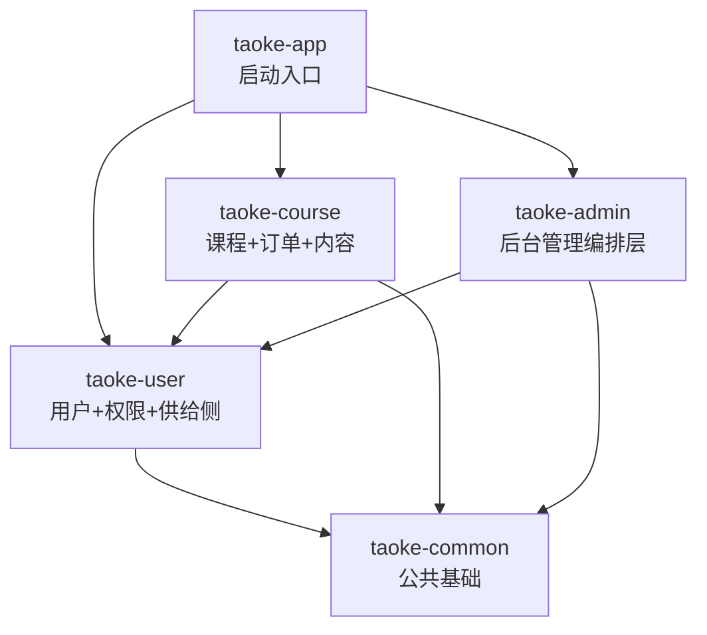

# 淘课网 v2 — 架构设计

## 1. 架构模式

采用 **模块化单体（Modular Monolith）** 架构：

- **单 JAR 部署**：所有业务模块编译为一个可执行 JAR，部署简单
- **编译期隔离**：通过 Maven Module 划分模块边界，模块间依赖在 `pom.xml` 中显式声明，防止越权访问
- **面向接口的跨模块通信**：业务模块通过 `api/` 包暴露 Service 接口，其他模块依赖接口而非实现类
- **未来可拆分**：每个 Maven Module 对应一个独立业务域，后续业务增长时可逐个提升为独立微服务

这种模式兼顾了单人开发的效率和未来扩展的灵活性。

## 2. 技术栈


| 层次         | 技术选型                                                   |
| ---------- | ------------------------------------------------------ |
| 后端框架       | Java 21 + Spring Boot 3.5 + Spring MVC (REST API)      |
| ORM        | Spring Data JPA                                        |
| 认证鉴权       | Spring Security + JWT                                  |
| 数据库        | MySQL 8.4                                              |
| 缓存         | Redis + Redisson                                       |
| 消息队列       | RabbitMQ                                               |
| 数据迁移       | Flyway                                                 |
| 接口文档       | springdoc-openapi (Swagger UI)                         |
| 前端框架（C 端）  | Next.js 16 + Tailwind CSS + shadcn-ui，图标库 lucide-react |
| 前端框架（管理后台） | Next.js 16 + Tailwind CSS + shadcn-ui + TanStack Table，图标库 @tabler/icons-react |
| 国际化        | next-intl                                              |


## 3. 模块清单与职责

```
backend/
├── pom.xml                  # 父 POM（依赖管理、插件管理）
├── taoke-common/            # 公共基础层
├── taoke-user/              # 用户域（认证 + 权限 + 各角色档案 + 供给侧）
├── taoke-course/            # 课程域（课程 + 订单 + 支付 + 需求 + 评价 + CMS + 消息）
├── taoke-admin/             # 后台管理编排层
└── taoke-app/               # 启动入口
```

### 3.1 taoke-common — 公共基础层

不包含任何业务逻辑，仅提供全局共享的基础设施：


| 分类   | 内容                                                                                |
| ---- | --------------------------------------------------------------------------------- |
| 基础实体 | `BaseEntity`（id + created_at + updated_at + JPA Auditing）                         |
| 统一响应 | `ApiResponse<T>`（code + message + data）                                           |
| 异常体系 | `ErrorCode`（枚举）、`BusinessException`、`GlobalExceptionHandler`                      |
| 分页封装 | `PageResult<T>`                                                                   |
| 安全注解 | `@Public`、`@RequireRole`、`@RequirePermission`、`SecurityUtils`                     |
| 事件总线 | `DomainEvent`、`EventPublisher`、`@DomainEventListener`、`TopicResolver`、RabbitMQ 适配 |
| 事件定义 | `events/` 下按模块拆分的领域事件类（所有模块共用）                                                    |
| 枚举   | `BusinessRole`（业务角色 + `Code` 编译期常量）                                               |
| 文件上传 | `StorageService`、`FileUploadService`、`UploadBizType`、`UploadController`           |
| 全局配置 | `JpaAuditingConfig`、`JacksonConfig`、`RedisConfig`、`AsyncConfig`                   |


### 3.2 taoke-user — 用户域

原 `taoke-supply` 已合并入此模块，统一管理所有用户身份和角色档案。


| 业务 PRD                  | 核心职责                                 |
| ----------------------- | ------------------------------------ |
| user.prd.md             | 注册登录（手机号/验证码/密码）、用户信息管理、密码管理、手机号变更   |
| permission.prd.md       | RBAC 角色权限体系（角色 CRUD、权限 CRUD、角色-权限分配） |
| trainer.prd.md          | 专家入驻审核、资质认证、个人主页                     |
| agent.prd.md            | 专家经纪人入驻、专家资源库管理                      |
| assistant.prd.md        | 专家助理绑定与确认                            |
| enterprise-agent.prd.md | 专家经纪公司入驻、多经纪人团队管理                    |
| institution.prd.md      | 机构入驻审核、师资团队管理、机构员工管理                 |


**模块内部结构**：

```
com.taoke.user/
├── api/                 # 对外暴露的 Service 接口（跨模块契约）
│   ├── UserService.java
│   ├── AuthService.java
│   ├── PermissionService.java
│   ├── RoleService.java
│   ├── RoleApplyService.java
│   ├── TrainerService.java
│   ├── AgentService.java
│   ├── ...（共 14 个接口）
├── service/             # 接口实现（XxxServiceImpl）
├── controller/          # REST 控制器
├── repository/          # JPA Repository（模块内部，不对外暴露）
├── entity/              # JPA 实体类
├── dto/                 # 请求/响应 DTO
├── mapper/              # MapStruct 映射器
├── security/            # JWT 过滤器、SecurityUser、DynamicAuthorizationManager
├── sms/                 # 短信发送
└── eventlistener/       # 领域事件监听器
```

技术要点：Spring Security + JWT 认证鉴权在此模块实现，通过 `api/` 包对外暴露接口供其他模块调用。

### 3.3 taoke-course — 课程域


| 业务 PRD          | 核心职责                           |
| --------------- | ------------------------------ |
| course.prd.md   | 四种课程类型的 CRUD、章节管理、排课、报名、学习进度   |
| order.prd.md    | 订单创建、支付对接（微信/支付宝/公对公）、退款、发票、提现 |
| recharge.prd.md | 账户充值、余额管理、充值折扣规则               |
| demand.prd.md   | 培训需求发布、AI 智能匹配、需求跟进            |
| case.prd.md     | 企业案例展示、案例图片、关联专家               |
| category.prd.md | 分类层级、标签库、热门搜索词                 |
| review.prd.md   | 评价/反馈的发表、审核、回复、申诉、评分统计         |
| cms.prd.md      | 首页内容运营（轮播图、推荐位、热门搜索词等）         |
| message.prd.md  | 消息模板、站内信、短信/微信通知               |


这是平台最核心的交易闭环模块，涵盖从"课程展示"到"下单支付"再到"需求匹配"和"内容运营"的完整链路。

### 3.4 taoke-admin — 后台管理编排层


| 职责             | 说明                                                                  |
| -------------- | ------------------------------------------------------------------- |
| Admin REST API | 后台管理系统的所有接口（用户管理、权限管理、角色管理等）                                        |
| 薄编排层           | 不直接访问 Repository，通过调用 `taoke-user`/`taoke-course` 的 `api/` 接口完成业务操作 |
| VO 映射          | 将领域实体/DTO 转换为后台管理所需的展示对象                                            |
| 展示逻辑           | 如权限树组装、复合分页查询等 Admin 特有的展示需求                                        |


**权限控制**：所有 Admin API 使用 `@RequireRole(BusinessRole.Code.SUPER_ADMIN)` 保护，后续可切换为 `@RequirePermission` 细粒度控制。

**Admin 模块边界规则**：

- **禁止直接注入 Repository**：所有数据访问必须通过 `api/` 接口，不得 import 任何 `*.repository.*` 类
- **Entity 只读不写**：可通过 `api/` 接口获取 Entity 并调用 getter 读取字段（用于 VO 映射），但**禁止调用 setter 或构造跨模块 Entity 对象**
- **写操作走 api 原始参数**：创建/更新操作传递原始参数（String / Integer 等）给 `api/` 接口，由目标模块内部构造 Entity 并持久化
- **复杂业务逻辑下沉**：如平台角色分配、分类引用检查等涉及多个 Repository 的逻辑，封装在目标模块的 Service 中，Admin 只做编排调用

### 3.5 taoke-app — 启动入口

- Spring Boot 主类（`TaokeApplication`），`scanBasePackages = "com.taoke"`
- 聚合所有业务模块的依赖
- 存放 `application.yaml` 等配置文件
- 存放 Flyway 迁移脚本（`db/migration/`）
- 存放全局过滤器（如 `CorsFilter`）
- 打包为最终可执行 JAR

## 4. 模块依赖关系




依赖方向严格单向，禁止出现循环依赖。`taoke-user` 作为最基础的业务模块，不依赖任何其他业务模块。

## 5. 模块间通信规则

### 5.1 同步调用 — Service 接口（面向接口）

模块间的同步数据查询通过对方 `api/` 包中暴露的 **接口** 完成：

- 接口定义在 `com.taoke.{module}.api` 包下（如 `com.taoke.user.api.PermissionService`）
- 实现类在 `com.taoke.{module}.service` 包下，命名为 `XxxServiceImpl`
- 调用方只依赖接口，不直接访问对方的 Repository 或 ServiceImpl
- 跨模块 Entity 允许只读（getter），禁止回写（setter / new）；写操作通过 api 接口传递原始参数

示例：

- `taoke-admin` 需要管理权限 → 注入 `com.taoke.user.api.PermissionService` 接口
- `taoke-course` 需要查询用户信息 → 注入 `com.taoke.user.api.UserService` 接口

### 5.2 异步解耦 — 领域事件 + RabbitMQ

跨模块的通知/副作用使用领域事件机制解耦：

- 事件基类 `DomainEvent` 定义在 `taoke-common`
- 具体事件类统一放在 `taoke-common/events/` 下按模块拆分
- 发布通过 `EventPublisher` 接口，底层适配 RabbitMQ
- 消费通过 `@DomainEventListener` 注解
- Topic 由 `TopicResolver` 自动从包名 + 类名解析

### 5.3 禁止事项

- 禁止模块 A 直接注入模块 B 的 Repository
- 禁止跨模块构造 Entity（`new XxxEntity()`）或调用 Entity 的 setter——写操作通过 api 接口传递原始参数
- 禁止反向依赖（如 `taoke-user` 依赖 `taoke-course`）
- 禁止在 `taoke-common` 中放业务逻辑
- 禁止跨模块直接引用 `ServiceImpl`，必须通过 `api/` 接口

## 6. 包结构约定

每个业务模块内部统一采用以下分层包结构：

```
com.taoke.{module}/
├── api/                 # 对外暴露的 Service 接口（跨模块契约）
├── controller/          # REST 控制器
├── service/             # 业务实现（XxxServiceImpl implements api.XxxService）
├── repository/          # JPA Repository（模块内部）
├── entity/              # JPA 实体类
├── dto/                 # 请求/响应 DTO （按实体子文件夹区分）
├── mapper/              # MapStruct 映射器
├── enums/               # 业务枚举
├── eventlistener/       # 领域事件监听器
├── security/            # 安全相关（仅 user 模块）
└── config/              # 模块级配置
```

其中 `{module}` 对应模块名：`user`、`course`、`admin`。

## 7. 自服务 API 路由规范

### 7.1 通用接口 vs 角色特有接口


| 路由           | 说明                             |
| ------------ | ------------------------------ |
| `/users/me`  | 通用用户资料（所有已登录用户），含头像、昵称、密码、手机号等 |
| `/{角色复数}/me` | 该角色特有的扩展信息和业务接口                |


`BUYER`（个人学员）是平台默认角色，所有用户注册时自动赋予。通用资料操作统一走 `/users/me`，BUYER 特有功能走 `/buyers/me`。

### 7.2 完整路由表


| 路由                          | Controller                    | 角色                   | 说明          |
| --------------------------- | ----------------------------- | -------------------- | ----------- |
| `/users/me`                 | UserController                | 所有用户                 | 通用资料、密码、手机号 |
| `/buyers/me`                | BuyerController               | BUYER                | 学员特有（学习标签等） |
| `/enterprise-buyers/me`     | EnterpriseBuyerController     | ENTERPRISE_BUYER     | 企业培训采购方扩展信息 |
| `/trainers/me`              | TrainerController             | TRAINER              | 专家扩展信息      |
| `/agents/me`                | AgentController               | AGENT                | 专家经纪人扩展信息   |
| `/assistants/me`            | AssistantController           | ASSISTANT            | 专家助理扩展信息    |
| `/enterprise-agents/me`     | EnterpriseAgentController     | ENTERPRISE_AGENT     | 专家经纪公司扩展信息  |
| `/institutions/me`          | InstitutionController         | INSTITUTION          | 机构扩展信息      |
| `/institution-employees/me` | InstitutionEmployeeController | INSTITUTION_EMPLOYEE | 机构员工扩展信息    |


所有角色扩展接口统一使用 `/{角色复数}/me` 顶级路由模式，不挂在 `/users/me/` 下，保持一致性。

### 7.3 后台管理 API 路由


| 路由                                  | Controller                | 说明           |
| ----------------------------------- | ------------------------- | ------------ |
| `GET /admin/users`                  | AdminUserController       | 分页查询用户列表     |
| `PUT /admin/users/{id}/status`      | AdminUserController       | 冻结/解冻用户      |
| `GET /admin/permissions`            | AdminPermissionController | 权限列表（平铺）     |
| `GET /admin/permissions/tree`       | AdminPermissionController | 权限树          |
| `POST /admin/permissions`           | AdminPermissionController | 新增权限         |
| `PUT /admin/permissions/{id}`       | AdminPermissionController | 编辑权限         |
| `DELETE /admin/permissions/{id}`    | AdminPermissionController | 删除权限         |
| `GET /admin/roles`                  | AdminRoleController       | 角色列表（含权限 ID） |
| `GET /admin/roles/{id}`             | AdminRoleController       | 角色详情         |
| `POST /admin/roles`                 | AdminRoleController       | 新增角色         |
| `PUT /admin/roles/{id}`             | AdminRoleController       | 编辑角色         |
| `DELETE /admin/roles/{id}`          | AdminRoleController       | 删除角色         |
| `PUT /admin/roles/{id}/permissions` | AdminRoleController       | 分配权限（全量替换）   |


## 8. 权限与角色注解规范

### 8.1 双层授权模型

平台采用 **业务角色 + RBAC 权限** 双层授权：


| 层次              | 注解                   | 数据来源                                       | 适用场景            |
| --------------- | -------------------- | ------------------------------------------ | --------------- |
| Layer 1：业务角色    | `@RequireRole`       | `sys_user_roles.role`（status=1）            | 自服务接口（操作自己的数据）  |
| Layer 2：RBAC 权限 | `@RequirePermission` | `sys_role_permissions` + `sys_permissions` | 管理后台接口（操作他人的数据） |


两个注解均定义在 `taoke-common` 的 `com.taoke.common.security` 包下，由 `DynamicAuthorizationManager` 统一拦截执行。

### 8.2 DynamicAuthorizationManager 判定优先级

```
1. @Public           → 放行（无需登录）
2. 未认证             → 拒绝
3. SUPER_ADMIN       → 放行（超管跳过一切校验）
4. @RequireRole      → 校验业务角色（满足其一即可，OR 逻辑；方法级优先，其次类级）
5. @RequirePermission → 校验 RBAC 权限
6. 已认证但无注解      → 放行（登录即可访问）
```

### 8.3 角色常量使用规范

角色编码统一通过 `BusinessRole.Code.XXX` 引用，**禁止使用字符串字面量**：

```java
// Controller 注解（编译期常量）
@RequireRole(BusinessRole.Code.TRAINER)
@GetMapping("/trainers/me")

// Service 方法参数
roleApplyService.apply(userId, BusinessRole.Code.TRAINER);
```

`BusinessRole.Code` 是 `BusinessRole` 枚举的内部常量类，满足 Java 注解对编译期常量的要求。新增角色时只需在 `BusinessRole` 中同步添加枚举值和对应的 `Code` 常量。

### 8.4 自服务 vs 管理后台注解用法


| 接口类型       | 路由示例                                | 注解                                        | 说明                  |
| ---------- | ----------------------------------- | ----------------------------------------- | ------------------- |
| 自服务-查看/编辑  | `GET/PUT /trainers/me`              | `@RequireRole(BusinessRole.Code.TRAINER)` | 操作自己的数据，角色已激活即可     |
| 自服务-申请入驻   | `POST /trainers/apply`              | 无注解                                       | 登录即可申请              |
| 自服务-查看申请状态 | `GET /trainers/apply/status`        | 无注解                                       | 登录即可查看              |
| 管理后台-编辑    | `PUT /admin/trainers/{id}`          | `@RequirePermission("trainer:edit")`      | 操作他人数据，需细粒度 RBAC 权限 |
| 管理后台-审核    | `POST /admin/trainers/{id}/approve` | `@RequirePermission("trainer:review")`    | 后台审核操作              |


核心原则：**自服务用 `@RequireRole`，管理后台用 `@RequirePermission`**，不叠加使用。

### 8.5 安全链路

```
JWT Token
  → JwtAuthenticationFilter 解析 userId
  → SecurityUserService.loadByUserId()
    → 仅加载 status=1 的业务角色写入 SecurityUser.businessRoles
    → 加载 RBAC 权限写入 SecurityUser.permissions
  → DynamicAuthorizationManager
    → 匹配 @RequireRole 时检查 businessRoles 集合（天然排除待审核/已驳回/已禁用角色）
    → 匹配 @RequirePermission 时检查 permissions 集合
```

因此 Controller 上标注 `@RequireRole` 后，Service 层**不需要**再手动校验角色状态，职责分离清晰。

## 9. 文件存储与上传

### 9.1 架构分层

```
UploadController（HTTP 入口）
  └─ FileUploadService（校验 + 拼路径）
       └─ StorageService（纯存储抽象）
            ├─ LocalStorageService（开发阶段）
            └─ AliOssStorageService（生产阶段）
```

- `StorageService` — 纯存储抽象，不感知业务类型，只关心路径 + 文件流
- `FileUploadService` — 上传业务层，负责校验（大小/MIME/扩展名）和路径拼接
- `UploadBizType` — 业务类型枚举，决定文件子目录（`images`、`avatars`、`files`、`certificates` 等）

### 9.2 目录结构与路径规则

物理目录：

```
./storage/                              (taoke.storage.base-dir)
└── uploads/                            (taoke.upload.base-dir)
    ├── images/202603/20260319/         (bizType + 日期分层)
    ├── avatars/202603/20260319/
    ├── files/202603/20260319/
    └── certificates/...
```

存储路径格式：`{upload.base-dir}/{bizType}/{yyyyMM}/{yyyyMMdd}/{uuid16}.{ext}`

### 9.3 URL 返回规则


| 配置                 | 返回 URL                                                            |
| ------------------ | ----------------------------------------------------------------- |
| `public-domain` 为空 | `/uploads/images/202603/20260319/abc123.jpg`                      |
| `public-domain` 有值 | `https://cdn.taoke.com/uploads/images/202603/20260319/abc123.jpg` |


Java 不做静态资源路由，由 Nginx / CDN 负责文件的 HTTP 访问。

### 9.4 配置项


| 配置                            | 说明                     | 默认值         |
| ----------------------------- | ---------------------- | ----------- |
| `taoke.storage.provider`      | 存储提供者                  | `local`     |
| `taoke.storage.base-dir`      | 物理根目录                  | `./storage` |
| `taoke.storage.public-domain` | CDN 域名（空=返回 / 开头路径）    | 空           |
| `taoke.upload.base-dir`       | 上传文件子目录（相对于 storage 根） | `uploads`   |
| `taoke.upload.max-file-size`  | 最大文件大小（字节）             | 10MB        |


### 9.5 上传接口


| 路由                      | 说明   | 权限   |
| ----------------------- | ---- | ---- |
| `POST /uploads/images`  | 上传图片 | 登录即可 |
| `POST /uploads/files`   | 上传文件 | 登录即可 |
| `POST /uploads/avatars` | 上传头像 | 登录即可 |


全部代码在 `taoke-common` 模块，各业务模块通过注入 `FileUploadService` 或 `StorageService` 使用。

## 10. 错误码编号规则

5 位数字，前两位为模块编号，后三位为错误序号：


| 区间    | 模块        |
| ----- | --------- |
| 100xx | 用户/认证     |
| 101xx | 权限        |
| 200xx | 专家/经纪人/机构 |
| 300xx | 课程        |
| 400xx | 订单/支付     |
| 500xx | 评价/互动     |
| 600xx | 内容/CMS    |
| 900xx | 通用/系统级    |


全部定义在 `taoke-common` 的 `ErrorCode` 枚举中，便于全局统一管理。

## 11. 前端架构

### 11.1 管理后台（admin-frontend）


| 层次     | 技术选型                     |
| ------ | ------------------------ |
| 框架     | Next.js 16 + TypeScript  |
| UI     | Tailwind CSS + shadcn-ui |
| 状态管理   | Zustand                  |
| 数据获取   | TanStack Query v5        |
| 表格     | TanStack Table           |
| URL 参数 | Nuqs                     |
| 命令面板   | KBar                     |


**BFF 模式**：Next.js Route Handlers（`/api/`*）作为 BFF 层代理请求到 Java 后端，JWT Token 存储在 httpOnly Cookie 中，不暴露给浏览器 JS。

### 11.2 已完成的管理后台页面


| 页面        | 路由                       | 功能                 |
| --------- | ------------------------ | ------------------ |
| 登录/注册     | `/login`、`/register`     | 左右分屏布局，左侧交互式猫头鹰动画  |
| Dashboard | `/dashboard/overview`    | 用户总数、新增数据概览        |
| 用户管理      | `/dashboard/users`       | 分页列表、搜索、状态筛选、冻结/解冻 |
| 权限管理      | `/dashboard/permissions` | 树形表格、CRUD          |
| 角色管理      | `/dashboard/roles`       | 列表、CRUD、分配权限（树形勾选） |


## 12. 未来微服务拆分路径

当业务增长到单体无法承载时，可按以下步骤渐进拆分：

1. **提取独立服务**：将 Maven Module 升级为独立的 Spring Boot 应用，拥有独立数据库
2. **引入服务注册**：使用 Nacos / Consul 做服务注册与发现
3. **替换通信方式**：
  - 同步调用：`api/` 接口 → OpenFeign / gRPC
  - 异步事件：RabbitMQ 领域事件已就绪，无需改动
4. **添加 DTO 防腐层**：`api/` 接口的入参/返回值从实体切换为 DTO，隔离持久层模型
5. **拆分优先级建议**：
  - 第一批：`taoke-user`（独立用户中心，所有服务依赖）
  - 第二批：`taoke-course`（交易核心，流量最大）

由于当前架构已通过 Maven Module + `api/` Service 接口实现了逻辑隔离，拆分时只需关注数据库拆分和通信方式替换，业务代码改动极小。