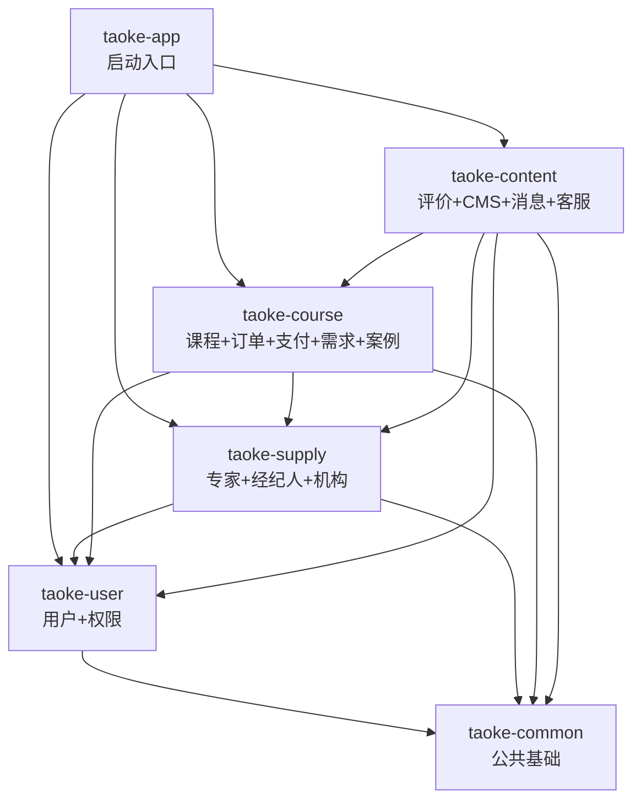

# 淘课网 v2 — 架构设计

## 1. 架构模式

采用 **模块化单体（Modular Monolith）** 架构：

- **单 JAR 部署**：所有业务模块编译为一个可执行 JAR，部署简单
- **编译期隔离**：通过 Maven Module 划分模块边界，模块间依赖在 `pom.xml` 中显式声明，防止越权访问
- **未来可拆分**：每个 Maven Module 对应一个独立业务域，后续业务增长时可逐个提升为独立微服务

这种模式兼顾了单人开发的效率和未来扩展的灵活性。

## 2. 技术栈

| 层次 | 技术选型 |
|------|----------|
| 后端框架 | Java 21 + Spring Boot 3.5 + Spring MVC (REST API) |
| ORM | Spring Data JPA |
| 认证鉴权 | Spring Security + JWT |
| 数据库 | MySQL 8.4 |
| 缓存 | Redis + Redisson |
| 消息队列 | RabbitMQ |
| 数据迁移 | Flyway |
| 接口文档 | springdoc-openapi (Swagger UI) |
| 前端框架 | Next.js 16 + Tailwind CSS + shadcn-ui |
| 国际化 | next-intl |

## 3. 模块清单与职责

```
backend/
├── pom.xml                  # 父 POM（依赖管理、插件管理）
├── taoke-common/            # 公共基础层
├── taoke-user/              # 用户 + 权限
├── taoke-supply/            # 专家 + 经纪人 + 助理 + 经纪公司 + 机构
├── taoke-course/            # 课程 + 订单 + 支付 + 充值 + 需求 + 案例
├── taoke-content/           # 评价 + 收藏 + CMS + 消息 + 客服
└── taoke-app/               # 启动入口
```

### 3.1 taoke-common — 公共基础层

不包含任何业务逻辑，仅提供全局共享的基础设施：

| 分类 | 内容 |
|------|------|
| 基础实体 | `BaseEntity`（id + created_at + updated_at + JPA Auditing） |
| 统一响应 | `ApiResponse<T>`（code + message + data） |
| 异常体系 | `ErrorCode`（枚举）、`BusinessException`、`GlobalExceptionHandler` |
| 分页封装 | `PageRequest`、`PageResponse<T>` |
| 通用工具 | 后续按需添加（如手机号校验注解、日期工具等） |

### 3.2 taoke-user — 用户 + 权限

| 业务 PRD | 核心职责 |
|----------|----------|
| user.prd.md | 注册登录（手机号/邮箱/第三方 OAuth）、用户信息管理、企业信息、个人信息、用户标签 |
| permission.prd.md | RBAC 角色权限体系、系统配置、操作日志 |

技术要点：Spring Security + JWT 认证鉴权在此模块实现，对外暴露 `UserService` 接口供其他模块查询用户信息。

### 3.3 taoke-supply — 专家 + 经纪人 + 助理 + 经纪公司 + 机构

| 业务 PRD | 核心职责 |
|----------|----------|
| trainer.prd.md | 专家入驻审核、资质认证与升级、个人主页、授课案例、精彩片段 |
| agent.prd.md | 专家经纪人入驻、专家资源库管理、资料文件上传、专家推荐 |
| assistant.prd.md | 专家助理绑定与确认、协助资料维护、教务管理、数据查看 |
| enterprise-agent.prd.md | 专家经纪公司入驻（企业实名）、多经纪人团队管理、批量内容运营、财务汇总 |
| institution.prd.md | 机构入驻审核（区分高校/非高校）、师资团队管理、机构资质、机构员工管理 |

供给侧角色共享"入驻审核"的业务模式，合为一个模块降低管理成本。对外暴露 `TrainerService`、`AgentService`、`OrganizationService` 等接口。

### 3.4 taoke-course — 课程 + 订单 + 支付 + 充值 + 需求 + 案例

| 业务 PRD | 核心职责 |
|----------|----------|
| course.prd.md | 四种课程类型的 CRUD、章节管理、排课、报名、学习进度 |
| order.prd.md | 订单创建、支付对接（微信/支付宝/公对公）、退款、发票、提现 |
| recharge.prd.md | 账户充值、余额管理、充值折扣规则 |
| demand.prd.md | 培训需求发布、AI 智能匹配、需求跟进 |
| case.prd.md | 企业案例展示、案例图片、关联专家 |
| category.prd.md | 分类层级、标签库、热门搜索词 |

这是平台最核心的交易闭环模块，涵盖从"课程展示"到"下单支付"再到"需求匹配"的完整链路。

### 3.5 taoke-content — 评价 + 收藏 + CMS + 消息 + 客服

| 业务 PRD | 核心职责 |
|----------|----------|
| review.prd.md | 评价/反馈的发表、审核、回复、申诉、评分统计 |
| cms.prd.md | 首页内容运营（轮播图、推荐位、热门搜索词等） |
| message.prd.md | 消息模板、站内信、短信/微信通知 |
| customer-service.prd.md | 在线客服聊天、知识库、工单、智能机器人 |

用户互动与平台内容运营的聚合模块，与核心交易无直接耦合。

### 3.6 taoke-app — 启动入口

- Spring Boot 主类（`TaokeApplication`），`scanBasePackages = "com.taoke"`
- 聚合所有业务模块的依赖
- 存放 `application.yaml` 等配置文件
- 存放 Flyway 迁移脚本（`db/migration/`）
- 打包为最终可执行 JAR

## 4. 模块依赖关系



依赖方向严格单向，禁止出现循环依赖。`taoke-user` 作为最基础的业务模块，不依赖任何其他业务模块。

## 5. 模块间通信规则

### 5.1 同步调用 — Service 接口

模块间的同步数据查询通过对方暴露的 Service 接口完成。例如：

- `taoke-course` 需要查询专家信息 → 调用 `taoke-supply` 的 `TrainerService.getById()`
- `taoke-content` 需要查询用户信息 → 调用 `taoke-user` 的 `UserService.getById()`

调用方只依赖接口，不直接访问对方的 Repository 或 Entity。

### 5.2 异步解耦 — Spring Application Event

跨模块的通知/副作用使用 Spring 事件机制解耦。例如：

- 用户下单成功 → `taoke-course` 发布 `OrderPaidEvent` → `taoke-content` 监听后发送消息通知
- 评价审核通过 → `taoke-content` 发布 `ReviewApprovedEvent` → `taoke-supply` 监听后更新专家平均评分

事件类统一放在发布方模块的 `event` 包下。后续迁移微服务时，将 Spring Event 替换为 RabbitMQ 消息即可。

### 5.3 禁止事项

- 禁止模块 A 直接注入模块 B 的 Repository
- 禁止反向依赖（如 `taoke-user` 依赖 `taoke-course`）
- 禁止在 `taoke-common` 中放业务逻辑

## 6. 包结构约定

每个业务模块内部统一采用以下分层包结构：

```
com.taoke.{module}/
├── controller/          # REST 控制器
├── service/             # 业务接口
│   └── impl/            # 业务实现
├── repository/          # JPA Repository
├── entity/              # JPA 实体类
├── dto/                 # 请求/响应 DTO
│   ├── request/         # 入参 DTO
│   └── response/        # 出参 VO
├── event/               # Spring 事件（供其他模块监听）
├── enums/               # 业务枚举
└── config/              # 模块级配置
```

其中 `{module}` 对应模块名：`user`、`supply`、`course`、`content`。

## 7. 自服务 API 路由规范

### 7.1 通用接口 vs 角色特有接口

| 路由 | 说明 |
|------|------|
| `/users/me` | 通用用户资料（所有已登录用户），含头像、昵称、密码、手机号等 |
| `/{角色复数}/me` | 该角色特有的扩展信息和业务接口 |

`BUYER`（个人学员）是平台默认角色，所有用户注册时自动赋予。通用资料操作统一走 `/users/me`，BUYER 特有功能走 `/buyers/me`。

### 7.2 完整路由表

| 路由 | Controller | 角色 | 说明 |
|------|------------|------|------|
| `/users/me` | UserController | 所有用户 | 通用资料、密码、手机号 |
| `/buyers/me` | BuyerController | BUYER | 学员特有（学习标签等） |
| `/enterprise-buyers/me` | EnterpriseBuyerController | ENTERPRISE_BUYER | 企业培训采购方扩展信息 |
| `/trainers/me` | TrainerController | TRAINER | 专家扩展信息 |
| `/agents/me` | AgentController | AGENT | 专家经纪人扩展信息 |
| `/assistants/me` | AssistantController | ASSISTANT | 专家助理扩展信息 |
| `/enterprise-agents/me` | EnterpriseAgentController | ENTERPRISE_AGENT | 专家经纪公司扩展信息 |
| `/institutions/me` | InstitutionController | INSTITUTION | 机构扩展信息 |
| `/institution-employees/me` | InstitutionEmployeeController | INSTITUTION_EMPLOYEE | 机构员工扩展信息 |

所有角色扩展接口统一使用 `/{角色复数}/me` 顶级路由模式，不挂在 `/users/me/` 下，保持一致性。

## 8. 权限与角色注解规范

### 8.1 双层授权模型

平台采用 **业务角色 + RBAC 权限** 双层授权：

| 层次 | 注解 | 数据来源 | 适用场景 |
|------|------|----------|----------|
| Layer 1：业务角色 | `@RequireRole` | `sys_user_roles.role`（status=1） | 自服务接口（操作自己的数据） |
| Layer 2：RBAC 权限 | `@RequirePermission` | `sys_role_permissions` + `sys_permissions` | 管理后台接口（操作他人的数据） |

两个注解均定义在 `taoke-common` 的 `com.taoke.common.security` 包下，由 `DynamicAuthorizationManager` 统一拦截执行。

### 8.2 DynamicAuthorizationManager 判定优先级

```
1. @Public           → 放行（无需登录）
2. 未认证             → 拒绝
3. SUPER_ADMIN       → 放行（超管跳过一切校验）
4. @RequireRole      → 校验业务角色（满足其一即可，OR 逻辑）
5. @RequirePermission → 校验 RBAC 权限
6. 已认证但无注解      → 放行（登录即可访问）
```

### 8.3 角色常量使用规范

角色编码统一通过 `BusinessRole.Code.XXX` 引用，**禁止使用字符串字面量**：

```java
// Controller 注解（编译期常量）
@RequireRole(BusinessRole.Code.TRAINER)
@GetMapping("/trainers/me")

// Service 方法参数
roleApplyService.apply(userId, BusinessRole.Code.TRAINER);
```

`BusinessRole.Code` 是 `BusinessRole` 枚举的内部常量类，满足 Java 注解对编译期常量的要求。新增角色时只需在 `BusinessRole` 中同步添加枚举值和对应的 `Code` 常量。

### 8.4 自服务 vs 管理后台注解用法

| 接口类型 | 路由示例 | 注解 | 说明 |
|----------|----------|------|------|
| 自服务-查看/编辑 | `GET/PUT /trainers/me` | `@RequireRole(BusinessRole.Code.TRAINER)` | 操作自己的数据，角色已激活即可 |
| 自服务-申请入驻 | `POST /trainers/apply` | 无注解 | 登录即可申请 |
| 自服务-查看申请状态 | `GET /trainers/apply/status` | 无注解 | 登录即可查看 |
| 管理后台-编辑 | `PUT /admin/trainers/{id}` | `@RequirePermission("trainer:edit")` | 操作他人数据，需细粒度 RBAC 权限 |
| 管理后台-审核 | `POST /admin/trainers/{id}/approve` | `@RequirePermission("trainer:review")` | 后台审核操作 |

核心原则：**自服务用 `@RequireRole`，管理后台用 `@RequirePermission`**，不叠加使用。

### 8.5 安全链路

```
JWT Token
  → JwtAuthenticationFilter 解析 userId
  → SecurityUserService.loadByUserId()
    → 仅加载 status=1 的业务角色写入 SecurityUser.businessRoles
    → 加载 RBAC 权限写入 SecurityUser.permissions
  → DynamicAuthorizationManager
    → 匹配 @RequireRole 时检查 businessRoles 集合（天然排除待审核/已驳回/已禁用角色）
    → 匹配 @RequirePermission 时检查 permissions 集合
```

因此 Controller 上标注 `@RequireRole` 后，Service 层**不需要**再手动校验角色状态，职责分离清晰。

## 9. 错误码编号规则

5 位数字，前两位为模块编号，后三位为错误序号：

| 区间 | 模块 |
|------|------|
| 100xx | 用户/认证 |
| 101xx | 权限 |
| 200xx | 专家/经纪人/机构 |
| 300xx | 课程 |
| 400xx | 订单/支付 |
| 500xx | 评价/互动 |
| 600xx | 内容/CMS |
| 900xx | 通用/系统级 |

全部定义在 `taoke-common` 的 `ErrorCode` 枚举中，便于全局统一管理。

## 10. 未来微服务拆分路径

当业务增长到单体无法承载时，可按以下步骤渐进拆分：

1. **提取独立服务**：将 Maven Module 升级为独立的 Spring Boot 应用，拥有独立数据库
2. **引入服务注册**：使用 Nacos / Consul 做服务注册与发现
3. **替换通信方式**：
   - 同步调用：Service 接口 → OpenFeign / gRPC
   - 异步事件：Spring Event → RabbitMQ / Kafka
4. **拆分优先级建议**：
   - 第一批：`taoke-user`（独立用户中心，所有服务依赖）
   - 第二批：`taoke-course`（交易核心，流量最大）
   - 第三批：`taoke-supply`、`taoke-content`（按需拆分）

由于当前架构已通过 Maven Module + Service 接口实现了逻辑隔离，拆分时只需关注数据库拆分和通信方式替换，业务代码改动极小。
