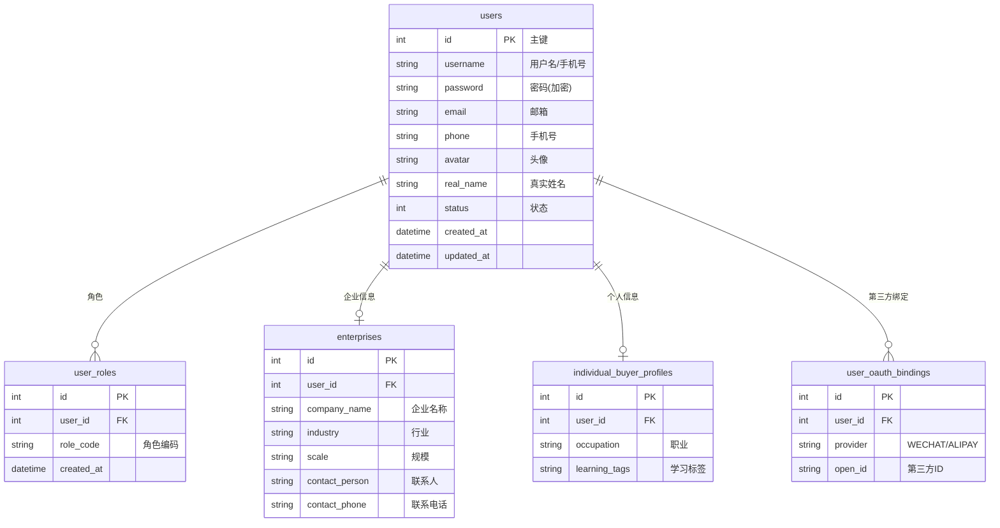
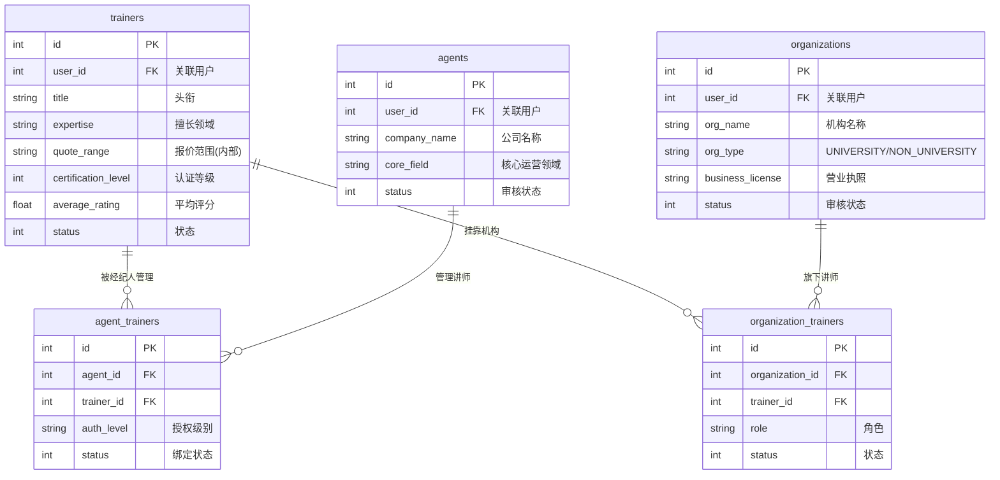
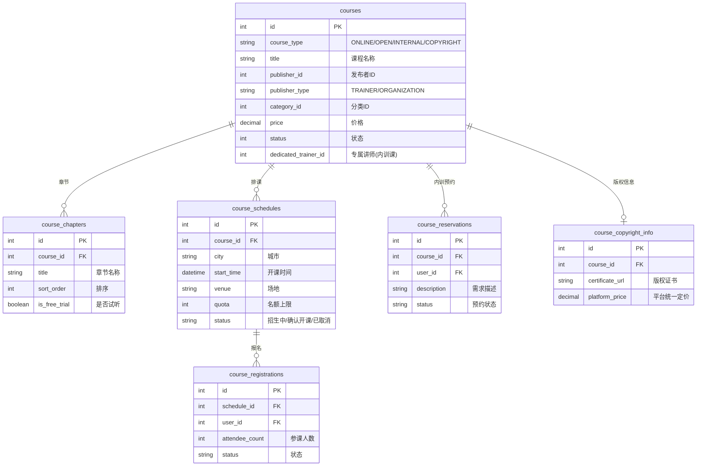
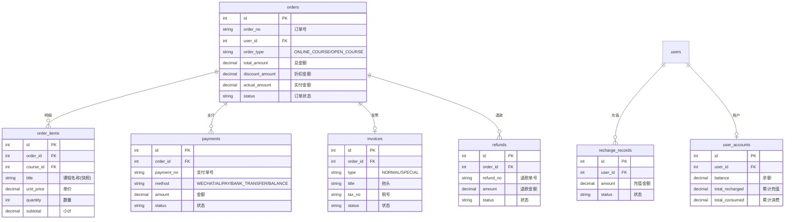
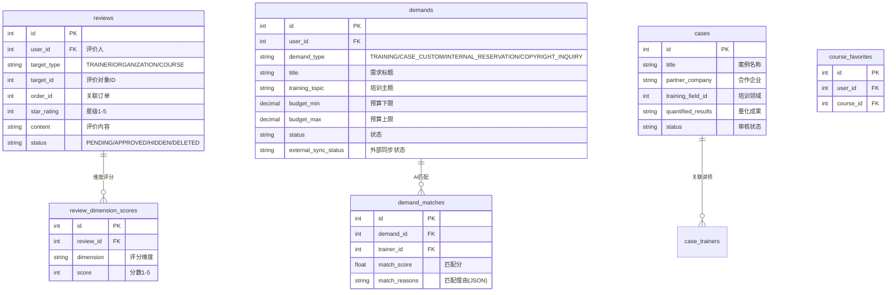

# 淘课网 v2 — 全局业务 ER 图

## 1. 全局 ER 总览

> 本图展示各核心业务实体之间的关联关系，省略了每张表内部的字段细节（字段详见各模块 PRD 文档）。

```mermaid
erDiagram
    %% ========== 用户与角色 ==========
    users ||--o{ user_roles : "拥有"
    users ||--o| enterprises : "企业信息"
    users ||--o| individual_buyer_profiles : "个人信息"
    users ||--o{ user_oauth_bindings : "第三方绑定"
    users ||--o{ user_sessions : "登录会话"
    users ||--o{ user_tags : "用户标签"

    %% ========== 讲师体系 ==========
    users ||--o| trainers : "讲师角色"
    trainers ||--o{ trainer_certifications : "资质认证"
    trainers ||--o{ trainer_cases : "授课案例"
    trainers ||--o{ courses : "发布课程"
    trainers ||--o{ trainer_case_files : "案例文件"

    %% ========== 经纪人体系 ==========
    users ||--o| agents : "经纪人角色"
    agents ||--o{ agent_trainers : "管理讲师"
    agent_trainers }o--|| trainers : "被管理"
    agent_trainers ||--o{ agent_trainer_files : "讲师资料"

    %% ========== 机构体系 ==========
    users ||--o| organizations : "机构角色"
    organizations ||--o{ organization_certifications : "机构资质"
    organizations ||--o{ organization_trainers : "旗下讲师"
    organization_trainers }o--|| trainers : "被挂靠"
    organizations ||--o{ courses : "发布课程"

    %% ========== 课程体系 ==========
    courses ||--o{ course_chapters : "课程章节"
    courses ||--o{ course_videos : "课程视频"
    courses ||--o{ course_materials : "课程资料"
    courses ||--o{ course_schedules : "公开课排课"
    courses ||--o| course_copyright_info : "版权信息"
    courses ||--o{ course_images : "课程图片"
    courses }o--|| categories : "所属分类"

    %% ========== 公开课报名与内训课预约 ==========
    course_schedules ||--o{ course_registrations : "报名记录"
    courses ||--o{ course_reservations : "内训课预约"
    users ||--o{ course_registrations : "报名"
    users ||--o{ course_reservations : "预约"

    %% ========== 学习行为 ==========
    users ||--o{ course_learning_progress : "学习进度"
    courses ||--o{ course_learning_progress : "被学习"
    users ||--o{ course_favorites : "收藏课程"

    %% ========== 订单与支付 ==========
    users ||--o{ orders : "创建订单"
    orders ||--o{ order_items : "订单明细"
    order_items }o--|| courses : "购买课程"
    orders ||--o{ payments : "支付记录"
    orders ||--o| invoices : "发票"
    orders ||--o{ refunds : "退款"
    users ||--o{ withdrawals : "提现申请"

    %% ========== 评价体系 ==========
    users ||--o{ reviews : "发表评价"
    reviews }o--|| courses : "评价课程"
    reviews }o--o| trainers : "评价讲师"
    reviews }o--o| organizations : "评价机构"
    reviews ||--o{ review_images : "评价图片"
    reviews ||--o{ review_dimension_scores : "维度评分"
    reviews ||--o{ review_replies : "评价回复"
    reviews ||--o| review_appeals : "评价申诉"

    %% ========== 问题反馈 ==========
    users ||--o{ feedbacks : "提交反馈"
    feedbacks ||--o{ feedback_images : "反馈图片"
    feedbacks ||--o{ feedback_replies : "反馈回复"

    %% ========== 企业案例 ==========
    cases ||--o{ case_images : "案例图片"
    cases ||--o{ case_trainers : "关联讲师"
    case_trainers }o--|| trainers : "执行讲师"

    %% ========== 培训需求 ==========
    users ||--o{ demands : "发布需求"
    demands ||--o{ demand_matches : "AI匹配结果"
    demand_matches }o--|| trainers : "匹配讲师"
    demands ||--o{ demand_follow_ups : "跟进记录"

    %% ========== 分类与标签 ==========
    categories ||--o{ categories : "父子层级"
    tags ||--o{ course_tags : "课程标签"
    courses ||--o{ course_tags : "标签关联"
    trainers ||--o{ trainer_categories : "擅长领域"

    %% ========== 充值与余额 ==========
    users ||--o{ recharge_records : "充值记录"
    users ||--o| user_accounts : "账户余额"

    %% ========== 权限 ==========
    roles ||--o{ role_permissions : "拥有权限"
    permissions ||--o{ role_permissions : "被分配"
    users ||--o{ user_roles : "角色分配"
    user_roles }o--|| roles : "关联角色"
```

## 2. 分域 ER 视图

### 2.1 用户域

### 2.2 供给方域（讲师 / 经纪人 / 机构）

### 2.3 课程域

### 2.4 交易域（订单 / 支付 / 充值）

### 2.5 互动域（评价 / 收藏 / 需求）

## 3. 模块间依赖关系矩阵

| 模块 | 依赖的模块 | 被依赖的模块 |
|------|-----------|-------------|
| **用户 (User)** | — | 所有模块 |
| **讲师 (Trainer)** | 用户 | 课程、案例、需求匹配、评价、经纪人、机构 |
| **经纪人 (Agent)** | 用户、讲师 | — |
| **机构 (Organization)** | 用户、讲师 | 课程、评价 |
| **课程 (Course)** | 用户、讲师、机构、分类 | 订单、评价、收藏、学习进度 |
| **订单 (Order)** | 用户、课程 | 支付、发票、退款、评价 |
| **评价 (Review)** | 用户、课程、讲师、机构、订单 | 客服审核 |
| **案例 (Case)** | 讲师 | 需求（定制入口） |
| **需求 (Demand)** | 用户、讲师 | 客服、外部系统同步 |
| **分类 (Category)** | — | 课程、讲师、案例 |
| **消息 (Message)** | 用户 | 所有业务事件触发 |
| **CMS** | 课程、讲师 | 首页展示 |
| **客服 (CS)** | 用户、需求、评价 | — |
| **充值 (Recharge)** | 用户 | 订单折扣 |
| **权限 (Permission)** | 用户 | 客服、后台 |

## 4. 数据表汇总索引

> 详细字段定义请查阅 `/docs/prds/` 下各模块 PRD 文件。

### 核心业务表

| PRD 文件 | 数据表 |
|---------|--------|
| user.prd.md | users, user_roles, enterprises, individual_buyer_profiles, user_oauth_bindings, user_sessions, user_operation_logs, user_tags, user_drafts, verification_codes |
| trainer.prd.md | trainers, trainer_certifications, trainer_cases, trainer_case_files, trainer_categories |
| agent.prd.md | agents, agent_trainers, agent_trainer_files |
| organization.prd.md | organizations, organization_certifications, organization_trainers |
| course.prd.md | courses, course_chapters, course_videos, course_materials, course_schedules, course_registrations, course_reservations, course_copyright_info, course_learning_progress, course_images, course_favorites |
| order.prd.md | orders, order_items, order_attendees, payments, refunds, invoices, withdrawals, order_operation_logs |
| review.prd.md | reviews, review_images, review_dimension_scores, review_replies, review_appeals, review_stats, feedbacks, feedback_images, feedback_replies |
| case.prd.md | cases, case_images, case_trainers |
| demand.prd.md | demands, demand_matches, demand_follow_ups, ai_match_dimensions |

### 平台支撑表（待各模块 PRD 细化）

| PRD 文件 | 数据表（预设） |
|---------|---------------|
| category.prd.md | categories, tags, course_tags, custom_fields |
| message.prd.md | message_templates, messages, message_logs |
| cms.prd.md | banners, hot_courses, recommended_resources, hot_search_words, page_sections |
| customer-service.prd.md | chat_sessions, chat_messages, knowledge_articles, work_orders, robot_configs |
| recharge.prd.md | recharge_records, user_accounts, account_transactions, discount_rules |
| permission.prd.md | roles, permissions, role_permissions, system_configs, operation_logs, cleanup_rules |
