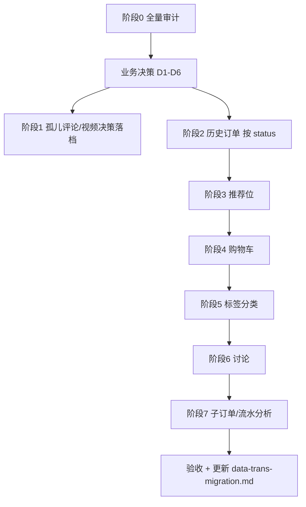

# 录播课剩余数据迁移 Implementation Plan

> **For agentic workers:** REQUIRED SUB-SKILL: Use superpowers:subagent-driven-development (recommended) or superpowers:executing-plans to implement this plan task-by-task. Steps use checkbox (`- [ ]`) syntax for tracking.

**Goal:** 在 `10.0.14.20` / `v3test` 上，将录播课域内**尚未迁入或仅部分迁入**的老站 `taoke` 数据，按业务优先级分批补全，并纳入可重复执行的 `data-trans/scripts/` 管道。

**Architecture:** 延续现有分层——Flyway 只管 schema；`data-trans/scripts/` 读 `taoke.*` 写新库；每阶段「审计 → dry-run → 实跑 → 验收」四步。脚本复用 `video_migrate_lib.py`（`.env` 连库、`sys_users` 校验、`[legacy-import]` 标记）。不重复已完成的包/供应商/已支付订单主流程，仅扩展新表/新状态映射。

**Tech Stack:** Python 3 + pymysql、`data-trans/.env`、老站 `taoke` schema、新库 `v3test`、现有实体 `Video` / `Cart` / `user_favorites` / `orders` 等。

**基线（2026-06-12 审计，迁移+backfill 后）：**

| 域 | 老站 | 新库 | 状态 |
|----|------|------|------|
| 视频包 labels/relations/groups | 1076 / 6913 / 998 | 满量 | ✅ |
| 供应商/分类/分类视频 | 9 / 1076 / 6718 | 满量 | ✅ |
| 已支付订单 (status=3) | 194 | 194 (`legacy-import`) | ✅ |
| 评论 (del=0, vid>0) | 376 | 595（含历史） | ✅ 内容覆盖 |
| 主视频 `tk_video` | 18263 | 18210（含 4 占位） | ⚠️ 差 53+4 |
| 非已支付订单 | 5853 | 0（无 `legacy-import`） | ❌ |
| 推荐位 `tk_video_recommend` | 145 | sticky≈2 | ❌ |
| 购物车 `tk_video_cart` | 1431 | VIDEO 购物车 1417 | ⚠️ 差 ~14 |
| 标签 `tk_video_tag` | 22063 | — | ❌ |
| 分类关联 `tk_videocate_relation` | 26764 | `videos.category_id` 部分 | ⚠️ |
| 讨论 `tk_video_talk` | 40 | — | ❌ |
| 支付流水 `tk_video_order_paylog` | 5081 | — | ❌ |
| 子订单/扩展单 | child 39 + basic 22702 等 | — | ❓ 待分析 |
| 历史发票 `tk_course_order_invoice` | 0 | — | ⏭️ 无数据 |
| 收藏 `tk_video_fav` | 1 | `user_favorites` VIDEO=2 | ✅ 可忽略 |

---

## 文件结构（本计划将新增/修改）

| 文件 | 职责 |
|------|------|
| `data-trans/scripts/_audit_video_remaining_scope.py` | 全量剩余域审计（输出 JSON） |
| `data-trans/scripts/run_video_order_history_migrate.py` | 非已支付历史订单（可选状态） |
| `data-trans/scripts/run_video_recommend_migrate.py` | 推荐位 → `videos.sticky_priority` |
| `data-trans/scripts/run_video_cart_backfill.py` | 购物车缺口补全 |
| `data-trans/scripts/run_video_tag_backfill.py` | 标签 → `videos.keywords` 或标签表 |
| `data-trans/scripts/run_video_talk_migrate.py` | 课程讨论 → `video_comments` 或归档 |
| `data-trans/scripts/run_video_paylog_archive.py` | 支付流水只读归档 JSON（可选） |
| `data-trans/scripts/_analyze_legacy_order_tables.py` | basic/child/relation 老表关系分析 |
| `data-trans/docs/guides/录播课剩余迁移操作手册.md` | 执行顺序与回滚说明 |
| 修改 `docs/guides/data-trans-migration.md` | 登记新脚本 |

---

## 阶段 0：剩余域全量审计（必须先做）

**目的：** 把「还有多少、为什么没迁、能不能迁」一次性量化，避免重复劳动。

### Task 0: 审计脚本

**Files:**
- Create: `data-trans/scripts/_audit_video_remaining_scope.py`
- Output: `data-trans/output/audit_video_remaining_scope.json`

- [ ] **Step 1: 实现审计项**

```python
SECTIONS = [
    "videos_gap",           # tk_video 不在 videos；区分 uid=0 / 无 sys_users / 可补迁
    "comments_orphan",      # 18 条 vid/uid 不存在
    "orders_by_status",     # 各 status 未带 legacy-import 的数量
    "carts_gap",            # tk_video_cart 不在 carts (VIDEO_COURSE)
    "recommend_active",     # is_delete=0 且 vid 存在
    "tags_coverage",        # tag 有但 keywords 空
    "talk_rows",
    "paylog_rows",
    "order_child_basic",    # 与 tk_video_order 重叠率
    "stub_videos",          # title 含占位标记
]
```

- [ ] **Step 2: dry-run 执行**

```bash
conda activate common-ai
cd d:/taokev2-mono
python data-trans/scripts/_audit_video_remaining_scope.py
```

Expected: 生成 JSON，`orders_by_status` 非 3 合计约 5853。

- [ ] **Step 3: 人工确认业务口径**

与产品/运营确认三张决策表（见下文「业务决策点」），写入 `data-trans/docs/guides/录播课剩余迁移操作手册.md` §决策。

---

## 阶段 1：残余小缺口（P1，1 天内）

### 1.1 无法自动迁的 18 条评论

**根因：** `vid` 或 `uid` 在新库不存在（视频已删 / 用户未迁入）。

**建议：** **归档不迁**——导出到 `data-trans/output/orphan_video_comments.json`，管理后台不提供展示；不在新库 INSERT 占位用户/视频。

### Task 1: 评论孤儿归档

**Files:**
- Create: `data-trans/scripts/_export_orphan_video_comments.py`

- [ ] **Step 1: 导出 SQL**

```python
cur.execute("""
    SELECT lc.* FROM taoke.tk_video_comment lc
    WHERE lc.del=0 AND lc.vid>0
      AND (lc.vid NOT IN (SELECT id FROM videos)
           OR lc.uid NOT IN (SELECT id FROM sys_users))
""")
write_json("orphan_video_comments.json", rows)
```

- [ ] **Step 2: 在验收脚本中标记为「已知豁免」**

修改 `data-trans/scripts/_audit_video_migration_verify.py`：`comments_orphan` 期望=18，ok=true。

---

### 1.2 主视频缺口 57 条（含 4 占位）

**根因（实测）：** 57 条 `tk_video` 不在 `videos`，且 **publisher `uid` 均不在 `sys_users` 或为 0**——`run_phase3_videos.py` 有意跳过。

| 子类 | 处理建议 |
|------|----------|
| 4 条幻影 ID（24067–24070） | 已用 `[legacy-import]` 占位 + 包关联；保持 `status=4` 下架 |
| 其余 53 条 | **默认不迁**；若运营需要，先补 `sys_users`/专家档案再跑 phase3 按 ID 段补迁 |

### Task 2: 视频缺口决策落档

- [ ] **Step 1:** 审计脚本输出 `videos_gap` 明细 CSV（id, uid, title, isapprove）
- [ ] **Step 2:** 若确认补迁：对「可恢复 uid」先走 `run_phase2_trainers` / 用户补全，再 `run_phase3_videos.py --chunk 500` 按 ID 段执行

---

## 阶段 2：历史非已支付订单（P0 业务价值，3–5 天）

**根因：** `run_video_order_migrate.py` 默认 `map_order_status` 仅 `status=3→已支付`；其余返回 `None` 跳过。

**老站存量（disable=0，无 legacy-import）：**

| status | 含义（老站） | 条数 | 建议新库映射 |
|--------|-------------|------|-------------|
| 0 | 待支付 | 834 | `orders.status=0`，无 `paid_at`，**不建 enrollment** |
| 1 | 处理中/待确认 | 494 | `status=0` 或单独「待确认」—需产品确认 |
| -1 | 作废/删除 | 4324 | **不迁** 或仅审计归档 |
| 4 | 退款 | 68 | `status=2`（已退款），保留 `pay_amount` |
| 5 | 关闭/取消 | 127 | `status=2` 或取消态 —需产品确认 |

### Task 3: 历史订单扩展脚本

**Files:**
- Create: `data-trans/scripts/run_video_order_history_migrate.py`
- Modify: `data-trans/scripts/video_migrate_lib.py`（扩展 `map_order_status(include_all=True)` 语义文档）

- [ ] **Step 1: 实现 CLI**

```bash
# 仅迁退款+关闭（低风险）
python data-trans/scripts/run_video_order_history_migrate.py --statuses 4,5 --dry-run

# 迁全部非作废（不含 -1）
python data-trans/scripts/run_video_order_history_migrate.py --statuses 0,1,4,5 --dry-run
```

- [ ] **Step 2: 规则**

- `order_no` 仍用 `order_code`，冲突加 `LV_` 前缀（与现网一致）
- `remark` 追加 `[legacy-import][status={legacy}]`
- **仅 status=3/4（已支付/已退款）** 写 `payments` + `video_enrollments`；待支付只写 `orders` + `order_items`
- 分批 `commit` 每 20 单（复用订单脚本模式）
- `clamp_money()` 处理异常金额

- [ ] **Step 3: dry-run 样本核对**

抽 10 条/状态，核对 `orders` / `order_items` / `payments` / `enrollments` 是否符合上表。

- [ ] **Step 4: 实跑 + 验收**

```bash
python data-trans/scripts/_audit_video_migration_gaps.py
python data-trans/scripts/_audit_video_migration_verify.py
```

Expected: `orders` 段新增 `gap_paid` 仍为 0；新增 `gap_history_by_status` 各为 0。

---

## 阶段 3：推荐位迁移（P1，1 天）

**根因：** `tk_video_recommend`（145 条）未映射到 `videos.sticky_priority`（V83：0=不限，1=列表推荐，2=列表置顶）。

**老表关键字段：** `vid`, `orderby`, `ishidden`, `is_delete`, `show_place`, `begin`/`end`（展示窗口）。

### Task 4: 推荐位脚本

**Files:**
- Create: `data-trans/scripts/run_video_recommend_migrate.py`

- [ ] **Step 1: 映射规则**

```python
# is_delete=1 或 ishidden=1 → 跳过
# orderby 极大或老站「置顶」标记 → sticky_priority=2
# 其余有效推荐 → sticky_priority=1
# 同步 sort_order = orderby（可选）
# 过期（end < now）→ sticky_priority=0 或跳过
```

- [ ] **Step 2: 幂等 UPDATE**

```sql
UPDATE videos SET sticky_priority = %s, sort_order = %s, updated_at = NOW()
WHERE id = %s AND sticky_priority < %s  -- 不覆盖更高优先级
```

- [ ] **Step 3: 验收**

审计：`tk_video_recommend` 有效条数 ≈ `videos.sticky_priority>0` 条数（允许过期剔除）。

---

## 阶段 4：购物车缺口（P2，0.5 天）

**根因：** 早期已有 `carts` 批量数据（1418 条），`tk_video_cart` 1431 条，约 **14 条** 未对齐（字段为 `video_id` 非 `vid`）。

### Task 5: 购物车补全

**Files:**
- Create: `data-trans/scripts/run_video_cart_backfill.py`

- [ ] **Step 1: 缺口查询**

```sql
SELECT c.* FROM taoke.tk_video_cart c
WHERE c.video_id > 0
  AND c.uid IN (SELECT id FROM sys_users)
  AND c.video_id IN (SELECT id FROM videos)
  AND NOT EXISTS (
    SELECT 1 FROM carts n
    WHERE n.user_id = c.uid
      AND n.product_type = 'VIDEO_COURSE'
      AND n.product_id = c.video_id
  )
```

- [ ] **Step 2: INSERT `carts`**

映射：`product_type='VIDEO_COURSE'`，快照字段从 `videos` 回填 title/cover/price。

- [ ] **Step 3: 验收** — 缺口为 0 或仅剩视频/用户不存在（归档列表）。

---

## 阶段 5：标签与分类关联（P2，2–3 天）

**根因：** 老站 `tk_video_tag`（22063）+ `tk_videocate_relation`（26764）未系统迁入；新站 `videos.keywords`（逗号分隔）+ `category_id`/`sub_category_id`（`sys_categories` type=VIDEO_COURSE）仅部分由 phase3 / V76 覆盖。

### Task 6: 标签审计

**Files:**
- Create: `data-trans/scripts/_audit_video_tags.py`

- [ ] 统计：有 tag 无 keywords、有 videocate 但 category_id=0 的视频数；输出 TOP 标签与一级分类对照表。

### Task 7: 标签回填

**Files:**
- Create: `data-trans/scripts/run_video_tag_backfill.py`

- [ ] **策略 A（推荐）：** `tk_video_tag` → 聚合为 `videos.keywords`（去重、长度≤500）
- [ ] **策略 B：** 若新站后续有 `video_tags` 关系表 Flyway，再改 INSERT 关系表（需单独立项）
- [ ] **分类：** `tk_videocate_relation` → 对照 `data-trans` 已有 `run_v76_video_categories.py` 映射表，只补 `category_id=0` 且老站有关系的行

---

## 阶段 6：课程讨论 tk_video_talk（P3，1 天）

**根因：** 老站 40 条「讨论/答疑」未映射；新站仅有 `video_comments`（点评审核流）。

### Task 8: 讨论迁移方案

- [ ] **Step 1:** `_inspect_legacy_video_tables.py` 读 `tk_video_talk` 字段样本
- [ ] **Step 2:** 若结构接近评论 → INSERT `video_comments`，`audit_status=1`，内容前缀 `[talk]`
- [ ] **Step 3:** 若结构差异大 → 仅归档 JSON，产品决定是否在 C 端展示

---

## 阶段 7：支付流水与子订单（P3，分析优先）

| 老表 | 条数 | 说明 |
|------|------|------|
| `tk_video_order_paylog` | 5081 | 支付尝试/回调流水，新站 `payments` 仅最终成功态 |
| `tk_video_order_child` | 39 | 子订单 |
| `tk_video_order_child_detail` | 82 | 子订单明细 |
| `tk_video_order_basic` | 22702 | 可能与主订单冗余或 B2B 批量单 |
| `tk_video_order_relation` | 6806 | 订单关联（套餐/赠送） |
| `tk_video_order_kuaike` | 15 | 快课渠道 |

### Task 9: 老订单表关系分析

**Files:**
- Create: `data-trans/scripts/_analyze_legacy_order_tables.py`

- [ ] 输出：各表与 `tk_video_order.order_code`  join 率、新库是否已有对应 `orders.order_no`
- [ ] 结论写入操作手册：哪些表**只归档**、哪些需要**扩展 order_items**

### Task 10: 支付流水归档（可选）

- [ ] 导出 `paylog` → `data-trans/output/video_order_paylog_archive.jsonl`（法务/对账用），**不入库**

---

## 阶段 8：收藏与发票（跳过）

- **收藏：** `tk_video_fav` 1 条，`user_favorites` VIDEO 已有 2 条 — **无需专阶段**
- **发票：** `tk_course_order_invoice` 0 条 — **无需迁移**；新站 `invoice_requests` 从新业务开始

---

## 业务决策点（实施前必须签字）

| # | 问题 | 选项 |
|---|------|------|
| D1 | 非已支付订单迁哪些 status？ | A) 仅 4+5  B) 0+1+4+5  C) 全部除 -1 |
| D2 | status=-1 作废单 4324 条 | A) 不迁  B) 仅 JSON 归档 |
| D3 | 57 条无 publisher 的 tk_video | A) 不迁  B) 补用户后迁 |
| D4 | 18 条孤儿评论 | A) 归档不迁（推荐）  B) 占位补迁 |
| D5 | tk_video_talk | A) 并入 comments  B) 仅归档 |
| D6 | paylog | A) 仅归档  B) 不入库也不导出 |

---

## 推荐执行顺序



**环境：** `DB_HOST=10.0.14.20`，`DB_NAME=v3test`，`LEGACY_DB_SCHEMA=taoke`（`data-trans/.env`）。

**回滚：** 按 `[legacy-import]` 与新增 remark 后缀 `[status=*]` 分批 DELETE；推荐位可 `sticky_priority=0` 回滚；购物车按 user_id+product_id 删除补全行。

---

## 验收标准（全局）

- [ ] `_audit_video_remaining_scope.json` 各节 `gap=0` 或列入「已知豁免」并附原因
- [ ] `_audit_video_migration_verify.py` → `passed=true`
- [ ] 管理后台：供应商/订单/评论/推荐列表抽测 10 条与老站一致
- [ ] C 端：视频详情、购物车、推荐位、播放权限抽测通过
- [ ] `docs/guides/data-trans-migration.md` 录播课章节更新脚本清单

---

## Self-Review（计划自检）

| 规格项 | 对应 Task |
|--------|-----------|
| 18 孤儿评论 | Task 1 |
| 57 视频缺口 | Task 2 |
| 5853 非已支付订单 | Task 3 |
| 145 推荐位 | Task 4 |
| ~14 购物车 | Task 5 |
| 标签/分类关联 | Task 6–7 |
| 40 讨论 | Task 8 |
| paylog/子订单 | Task 9–10 |
| 收藏/发票 | 阶段 8 明确跳过 |

无 TBD 占位；命令与文件路径已具体化。

---

**Plan complete and saved to `docs/superpowers/plans/2026-06-12-video-remaining-migration.md`.**

**两种执行方式：**

1. **Subagent-Driven（推荐）** — 按 Task 0→10 分派子 agent，每阶段审计后再实跑  
2. **Inline Execution** — 本会话按阶段连续执行，每阶段 checkpoint 给你确认

你确认 **D1–D6 业务决策** 后，即可从阶段 0 或阶段 2（历史订单）开始实施。
